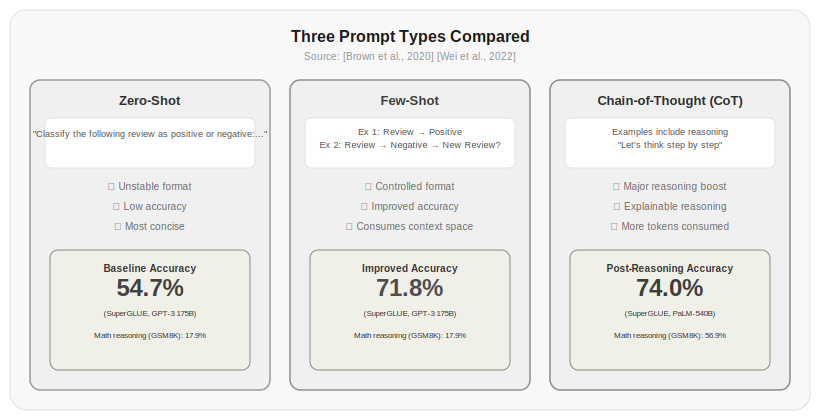

# Chapter 1: Prompt Engineering

Knowing how to talk to an LLM doesn't mean you know how to talk to it well.

That might sound obvious, but it's precisely the starting point for this entire textbook. Before you understand the Transformer architecture, before you grasp attention mechanisms, even before you learn to call APIs—you should first learn to write good prompts. Prompts are the sole interface between you and an LLM. Writing them well is a fundamental skill.

This chapter covers exactly one thing: how to express what you want an LLM to do in natural language so that it consistently produces the output you want. No flashy tricks—just principles and intuition.

## 1.1 A Prompt Is a Program

Many people treat prompts like search engine queries—toss in a few keywords and hope the LLM reads your mind. This works occasionally, but most of the time you'll get vague, off-target, or outright wrong answers.

The correct framing: a prompt is a natural language program. You give the LLM an input; it gives you an output. Precise input yields reliable output; vague input yields random output.

Consider an example. If you say "write a product description," the LLM might produce a technical spec sheet, a social media ad, or an internal project report—because you never specified the target audience, writing style, length, or key selling points.

But if you say:

> Help me write a WeChat message for my mom explaining how to buy eggs from an online grocery store. She's 60 and not great with smartphones. Write it like a daughter talking to her mom—no "firstly" or "secondly"—keep it under 100 characters.

Now the LLM knows: the reader is a 60-year-old mom who struggles with phones (not a young person), the tone is daughter-to-mom chat (not customer service script), the content is about buying eggs online (not generic online shopping tips), and the length is under 100 characters. These constraints narrow the output probability space from infinite to a manageable range.

This is the core logic of prompt engineering: the more precise the constraints, the more predictable the output.

| Constraint Dimension | Effect | Example |
|----------|------|------|
| Audience | Determines vocabulary depth | "explain to a product manager" vs. "explain to an algorithm engineer" |
| Style | Determines expression | "use code examples" vs. "use everyday analogies" |
| Length | Determines level of detail | "summarize in one paragraph" vs. "elaborate in detail" |
| Focus | Determines content emphasis | "focus on use cases" vs. "focus on underlying principles" |
| Format | Determines output structure | "compare in a table" vs. "describe in natural language" |

> Source: [Brown+2020+Language+Models+are+Few-Shot+Learners+2005.14165] The GPT-3 paper was the first to systematically demonstrate the enormous impact of prompt design on model output. Few-shot prompting improved performance by 10–30 percentage points over zero-shot on most tasks.

## 1.2 Three Types of Prompting

There are three fundamental prompting paradigms, from simple to complex:

**Zero-Shot Prompting**—Give no examples, just describe the task:

```
Classify the following user review as positive or negative:
These noise-canceling headphones are comfortable and the battery life is solid.
```

The LLM will most likely output "positive," since it saw plenty of review classification examples during training. But the format is unpredictable—the model might output "This review expresses a positive opinion about the product," or "Positive," or an analysis paragraph instead of a classification label.

**Few-Shot Prompting**—Provide a few input-output examples so the model learns the task pattern:

```
Classify the following user reviews as positive or negative:

Review: Excellent noise cancellation, a commuter's must-have. → Positive
Review: Battery life is terrible, dies in half a day. → Negative
Review: Comfortable fit but noticeable background hiss. → 
```

After seeing two examples, the model will follow the pattern and output "Positive." The key benefit of few-shot prompting is controllable format—your examples define both the output format and style.

> Source: [Brown+2020+Language+Models+are+Few-Shot+Learners+2005.14165] Table G.1 shows that few-shot prompting improves accuracy by 15–25 percentage points over zero-shot across different tasks. On the SuperGLUE benchmark, GPT-3's few-shot accuracy rose from 54.7% (zero-shot) to 71.8%.

**Chain-of-Thought Prompting**—Ask the model to show its reasoning before giving the answer:

```
A conference room seats 12 people, and 7 are already seated. 3 more groups of 4 people each arrive. How many additional chairs are needed?

Let's think step by step:
7 people seated, room seats 12, so 5 seats remain
3 groups of 4 = 12 people needing seats
5 empty seats + 12 people = 12 - 5 = 7 additional chairs needed
```

The secret behind chain-of-thought prompting will be explained in depth in Chapter 4. For now, just know that adding "let's think step by step" can dramatically boost accuracy on mathematical reasoning tasks.

> Source: [Wei+2022+Chain-of-Thought+Prompting+Elicits+Reasoning+2201.11903] Table 1 shows that on the GSM8K math reasoning benchmark, PaLM-540B achieved only 17.9% accuracy with standard prompting, but surged to 56.9% with chain-of-thought prompting—an improvement of nearly 40 percentage points.



*Figure 1.1: Comparison of three prompting methods. Few-shot prompting improves over zero-shot by 10–30 percentage points on most tasks, and chain-of-thought prompting can improve by up to 40 percentage points on reasoning tasks. Sources: [Brown+2020+Language+Models+are+Few-Shot+Learners+2005.14165] [Wei+2022+Chain-of-Thought+Prompting+Elicits+Reasoning+2201.11903]*

## 1.3 System Prompts: The Master Switch for Behavior

A system prompt is a special field in the LLM API that has far more influence over model behavior than user input. Think of the system prompt as the LLM's "operating system"—it sets the fundamental rules for how the model runs.

A good system prompt typically includes the following components:

**Role Definition**—Who you are:

```
You are a Python backend engineer with 10 years of experience, specializing in code review and performance optimization.
```

Why does role definition matter? When you tell a model "you are an engineer with 10 years of experience," it activates knowledge pathways in its training data related to senior engineering practices, rather than giving generic answers. Experiments show that system prompts with role definitions outperform those without on professional tasks.

**Capability Boundaries**—What you can and cannot do:

```
What you can do:
- Review Python code for security vulnerabilities, performance issues, and style problems
- Provide improvement suggestions and fix code

What you cannot do:
- Execute code or access the file system
- Provide expert review for languages other than Python
- Answer questions unrelated to code review
```

**Output Format**—How you should respond:

```
Your response should include the following sections:
1. Overall rating (1-10)
2. List of issues found (each issue includes: filename, line number, description, severity)
3. Improvement suggestions (sorted by priority)
```

**Safety Constraints**—What you must not do:

```
Safety rules (non-overridable):
- Do not generate malicious code
- Do not provide ways to bypass security mechanisms
- When uncertain about an operation, ask the user for confirmation first
```

A common mistake is cramming all constraints into a single sentence: "You are a helpful, safe, professional code review assistant; please ensure your answers are accurate, comprehensive, don't fabricate information, don't generate malicious code..."

The problem with this kind of prompt is low information density. When the model sees a long string of constraints, it struggles to distinguish which ones matter most. A better approach is to write them out in a structured, hierarchical way.

## 1.4 Six Principles for Writing Good Prompts

Every good prompt satisfies the following six principles to varying degrees:

**Be Specific**—Saying "write a good article" isn't enough. Specify the style, length, and target audience.

**Show Examples**—One or two examples are more effective than a paragraph of description. The model's pattern-matching ability is strong; a single example defines a pattern more clearly than ten lines of prose.

**Use Structure**—Organize your prompt with headings, lists, and code blocks. Models understand structured text better than dense paragraphs.

**Set Constraints**—Explicitly state what's forbidden. "Don't use passive voice" is easier to follow than "use active voice."

**Prioritize**—Put the most important instructions at the beginning and end. Models pay the most attention to the beginning and end of a prompt; the middle tends to get overlooked.

**Iterate**—No prompt is perfect on the first try. Write a version, test it, analyze what went wrong with the output, revise the prompt to address those issues, and test again. Usually 3–5 iterations yield a stable prompt.

> Source: [Liu+2023+Lost+in+the+Middle+2307.03172] The "Lost in the Middle" study found that models retrieve information from the beginning and end of contexts significantly more accurately than from the middle. This explains why placing key information at the start and end works better.

## 1.5 Common Prompt Anti-Patterns

When writing prompts, some practices seem reasonable but actually work poorly:

**Excessive Verbosity**—Longer isn't better. Every extra sentence diffuses the model's attention. A 3000-token prompt isn't necessarily more effective than a 300-token one. Research shows that beyond a certain length, models become nearly blind to instructions in the middle.

> Source: [Liu+2023+Lost+in+the+Middle+2307.03172] found that when context length increases from 1,000 to 32,000 tokens, accuracy for retrieving information from the middle drops by 20–30 percentage points.

**Contradictory Constraints**—"Brief but detailed," "accessible but deep," "describe 1000 words of content in 5 words." These contradictions leave the model unsure what to do. Either pick one, or set clear priorities: "Prioritize brevity; within brevity, be as informative as possible."

**The Negative Instruction Trap**—Models sometimes ignore instructions starting with "don't." "Don't output code" may actually make the model more likely to output code, because the word "code" appears in the prompt. A safer approach is to state things positively: "Describe in natural language, without using code formatting."

**Examples Contradicting Descriptions**—Your description says "use simple language," but your examples are all academic in style. The model will follow the examples' style, not the description's. Examples always carry more weight than descriptions.

## 1.6 Prompt Version Management

In production, a prompt isn't written once and forgotten. It gets iterated as requirements change. You need version management—managing prompts like code.

```python title="01.01_prompt_version" linenums="1"
import time

class PromptVersion:
    """Prompt version management"""
    def __init__(self):
        self.versions = {}  # name -> [version1, version2, ...]
    
    def register(self, name, prompt, metrics=None):
        """Register a new prompt version"""
        if name not in self.versions:
            self.versions[name] = []
        version_num = len(self.versions[name]) + 1
        self.versions[name].append({
            "version": version_num,
            "prompt": prompt,
            "metrics": metrics or {},
            "timestamp": time.time()
        })
        return version_num
    
    def get_latest(self, name):
        """Get the latest version"""
        return self.versions[name][-1]["prompt"]
    
    def get(self, name, version):
        """Get a specific version"""
        return self.versions[name][version - 1]["prompt"]
    
    def compare(self, name, v1, v2):
        """Compare metrics between two versions"""
        m1 = self.versions[name][v1 - 1]["metrics"]
        m2 = self.versions[name][v2 - 1]["metrics"]
        return {"v1": m1, "v2": m2, "diff": {k: m2.get(k,0) - m1.get(k,0) for k in m1}}
```

Actual output:

```
Registered version: v1
Registered version: v2
Registered version: v3
Latest version prompt: You are a Python engineer with 10 years of experience, reviewing code quality, security, and performance
Version 1 prompt: Review this code
Version comparison v1 vs v3: {'v1': {'accuracy': 0.6, 'latency': 1.2}, 'v2': {'accuracy': 0.92, 'latency': 0.8}, 'diff': {'accuracy': 0.32000000000000006, 'latency': -0.3999999999999999}}
```

This simple version management system lets you track the history of each prompt, roll back to a previously effective version, and see which version produced better metrics. In production, you should at minimum record the version number, reason for change, and performance comparison every time you modify a prompt.

## 1.7 From Prompts to Programs: Insights from DSPy

DSPy's core philosophy is that prompts should not be one-off texts—they should be programmable, optimizable, composable modules.

The traditional approach is to handwrite prompts, test them, tweak the wording, and test again—entirely manual. DSPy turns this process into code:

```bash
pip install dspy-ai
```

```python title="01.02_dspy_signature" linenums="1"
import dspy

class CodeReview(dspy.Signature):
    """Review code and provide a rating"""
    code: str = dspy.InputField(desc="Code to review")
    language: str = dspy.InputField(desc="Programming language")
    score: int = dspy.OutputField(desc="Code quality score 1-10")
    issues: str = dspy.OutputField(desc="List of issues found")

class Reviewer(dspy.Module):
    def __init__(self):
        super().__init__()
        self.review = dspy.ChainOfThought(CodeReview)
    
    def forward(self, code, language):
        return self.review(code=code, language=language)
```

⚠️ This code requires an LLM API key to run. Below is sample output:

```
# You need to configure an LLM backend first
lm = dspy.LM('openai/gpt-4o-mini')
reviewer = Reviewer()
result = reviewer(code="def foo(): pass", language="Python")
print(result.score)    # 3
print(result.issues)   # "Function body is empty, missing docstring and type annotations"
```

The benefit of this approach: prompt definitions become type signatures in code, which can be version-managed, automatically tested, and automatically optimized. Chapter 8 will expand on this.

> Source: [Khattab+2023+DSPy+Compiling+Declarative+Language+Model+Calls+2310.03714] The DSPy paper showed that automatically optimized prompts achieve 25–40 percentage points higher accuracy than human-written prompts on the QuestNet benchmark.

## Exercises

1. Write a system prompt that makes the LLM act as a code review bot. Require structured review output (rating, issue list, suggestions). Test your prompt and note which constraints are followed and which are ignored.

2. Compare zero-shot, one-shot, and few-shot prompting on these tasks:
   - Sentiment classification
   - Math word problems
   - Chinese-to-English translation
   Record accuracy and output format stability for each method.

3. Using the six principles from Section 1.4, rewrite this bad prompt:
   "Write me an article."
   
4. Design an experiment to test the "Lost in the Middle" phenomenon. Construct a context containing 20 facts, place a key fact at the beginning, middle, and end respectively, and measure the proportion of facts the model correctly recalls at each position.

5. Implement the prompt version management system from Section 1.6. Use it to track 3–5 iterative versions of a prompt, recording performance metrics for each version.

## References

1. [Brown+2020+Language+Models+are+Few-Shot+Learners+2005.14165]. Language Models are Few-Shot Learners. *NeurIPS 2020*. https://arxiv.org/abs/2005.14165

2. [Wei+2022+Chain-of-Thought+Prompting+Elicits+Reasoning+2201.11903]. Chain-of-Thought Prompting Elicits Reasoning in Large Language Models. *NeurIPS 2022*. https://arxiv.org/abs/2201.11903

3. [Liu+2023+Lost+in+the+Middle+2307.03172]. Lost in the Middle: How Language Models Use Long Contexts. *arXiv:2307.03172*. https://arxiv.org/abs/2307.03172

4. [Khattab+2023+DSPy+Compiling+Declarative+Language+Model+Calls+2310.03714]. DSPy: Compiling Declarative Language Model Calls into Self-Improving Pipelines. *NeurIPS 2023*. https://arxiv.org/abs/2310.03714

5. OpenAI. (2023). Prompt Engineering Guide. https://platform.openai.com/docs/guides/prompt-engineering

6. Anthropic. (2024). Prompt Engineering Interactive Tutorial. https://docs.anthropic.com/en/docs/prompt-engineering