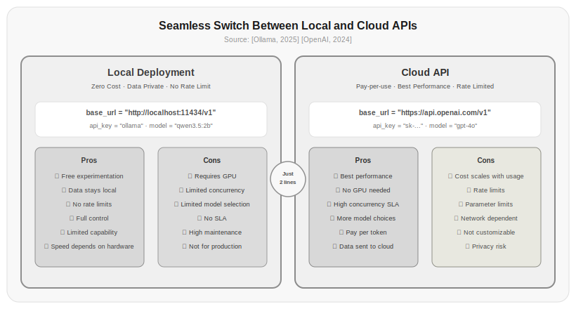

# Chapter 2: LLM APIs and Local Deployment

In the previous chapter you learned how to write prompts, but once a prompt is written, you need somewhere to send it. This chapter covers exactly that—starting from running a local model, to getting the API working, understanding the parameters, and figuring out costs.

Why start with local deployment instead of cloud APIs? Because experimenting with local models costs nothing, you don't worry about API key leaks, you don't worry about rate limits, and your data never leaves your machine. Once you've tuned your parameters and prompts on a local model, switching to a cloud API only requires changing one line of code.

## 2.1 Running a Local Model with Ollama

Ollama is currently the simplest way to run local models. One command to install, one command to download a model, one command to start the service.

Install Ollama:

```bash
# macOS/Linux
curl -fsSL https://ollama.com/install.sh | sh

# Or download the graphical installer from https://ollama.com
```

Download a model:

```bash
ollama pull qwen3.5:2b
```

Qwen3.5 is the latest generation of the Qwen series of multimodal models, supporting image input, hybrid thinking modes, and tool calling, with a 256K context window. This information is from the Ollama website and the Qwen official blog [Ollama, 2025] [Qwen Team, 2025].

Once the model is downloaded, you can start chatting:

```bash
ollama run qwen3.5:2b
>>> Hello, please explain what attention is in one sentence
>>> Attention is a mechanism that allows a model to automatically focus on the parts
... most relevant to the current task while ignoring irrelevant parts.
```

But command-line chatting isn't our goal. We want to call it through an API. By default, Ollama starts an HTTP service compatible with the OpenAI format:

```bash
# Make sure the Ollama service is running
ollama serve
# Listens on http://localhost:11434 by default
```

Then call it with Python:

```bash
# Install the OpenAI Python library
pip install openai
```

```python title="02.01_ollama_api" linenums="1"
from openai import OpenAI

client = OpenAI(
    base_url="http://localhost:11434/v1",
    api_key="ollama",  # Ollama doesn't need a real key, fill in anything
)

response = client.chat.completions.create(
    model="qwen3.5:2b",
    messages=[
        {"role": "system", "content": "You are a code review assistant focused on Python code quality."},
        {"role": "user", "content": "What's wrong with this code?\n\ndef get_user_discount(user):\n    if user.age > 60:\n        return 0.1\n    if user.is_vip:\n        return 0.15\n    return 0"},
    ],
    temperature=0.3,
)

print(response.choices[0].message.content)
```

⚠️ This code requires a local Ollama service to run. Below is sample output:

```
This code has several issues:

1. VIP and senior discounts don't stack—if a user is both VIP and over 60,
   they only get the 0.1 discount because the first condition matches first.
2. The magic numbers (0.1, 0.15, 0) should be defined as constants.
3. Missing type annotations and docstring.

Suggested fix:
def get_user_discount(user: User) -> float:
    """Calculate discount based on user attributes"""
    SENIOR_DISCOUNT = 0.1
    VIP_DISCOUNT = 0.15
    discount = 0.0
    if user.age > 60:
        discount += SENIOR_DISCOUNT
    if user.is_vip:
        discount += VIP_DISCOUNT
    return discount
```

As you can see, the only difference from calling the OpenAI API is `base_url` and `api_key`. All code—message format, parameters, streaming output, function calling—is fully compatible. Code that works on your local model requires only two parameter changes to switch to the cloud.

> Source: The official Ollama documentation (https://github.com/ollama/ollama) shows it supports all major open-source models. The API interface is compatible with the OpenAI format [Ollama, 2025].

## 2.2 Hardware Requirements for Local Models

Not every machine can run every model. The first step in local deployment is figuring out whether your hardware can handle it.

The VRAM a model needs roughly equals parameters × precision bytes. Ollama uses Q4_K_M quantization (4-bit) by default. Actual download sizes are from the Ollama website:

| Model | Parameters | Ollama Q4 Size | Min VRAM | Recommended GPU |
|------|--------|-------------|------------|---------|
| qwen3.5:0.8b | 0.8B | 1.0 GB | ~1.5 GB | Integrated graphics sufficient |
| qwen3.5:2b | 2B | 2.7 GB | ~3.5 GB | Integrated graphics sufficient |
| qwen3.5:4b | 4B | 3.4 GB | ~4.5 GB | Integrated graphics sufficient |
| qwen3.5:9b | 9B | 6.6 GB | ~8 GB | RTX 4060 8GB |
| qwen3.5:27b | 27B | 17 GB | ~20 GB | RTX 4090 24GB |
| qwen3.5:35b | 35B | 24 GB | ~28 GB | 2×RTX 4090 |
| qwen3.5:122b | 122B | 81 GB | ~90 GB | 2×A100 80GB |

> Source: Ollama website model page (https://ollama.com/library/qwen3.5) Q4_K_M download sizes for each model [Ollama, 2025]; Qwen3 technical report parameter data [Qwen Team, 2025]. Minimum VRAM = model file size + KV cache (8K context ≈ 0.5–1GB) + system overhead.



*Figure 2.1: Comparison of local deployment and cloud APIs. Local models suit development and experimentation; cloud APIs suit production. Both use the same OpenAI-compatible interface—just change `base_url` and `api_key` to switch seamlessly.*

Q4 quantization (4-bit) is currently the most popular local deployment scheme. It compresses model parameters from 16-bit to 4-bit, and Ollama defaults to Q4_K_M quantization, with a download size roughly 1/4 of the FP16 size. The accuracy loss is minimal, and inference speed is actually faster—because less data needs to be read from VRAM.

### TurboQuant: Near-Optimal Distortion Rate Online Vector Quantization

Traditional quantization methods (such as GPTQ, AWQ, QLoRA) primarily focus on per-channel scalar quantization or group quantization. They face a fundamental problem in high-dimensional vector quantization: how to represent high-dimensional vectors with as few bits as possible without destroying the geometric structure of the vectors. [Zandieh et al., 2025] proposed TurboQuant, which provides a near-optimal solution from an information theory perspective.

TurboQuant's core idea unfolds in three steps:

**Step 1: Random Rotation**. Apply a random orthogonal transformation (random rotation matrix) to the input vector, concentrating the distribution of vector coordinates—after rotation, the coordinates approximately follow a Beta distribution. In high-dimensional spaces, different coordinates are approximately independent, allowing us to apply optimal scalar quantizers to each coordinate independently without considering correlations between coordinates.

**Step 2: Optimal Scalar Quantization**. Apply MSE (mean squared error)-optimal scalar quantizers to each rotated coordinate. This step ensures that the quantized vector is as close as possible to the original vector in Euclidean distance.

**Step 3: Residual Correction (for inner product tasks)**. MSE-optimal quantizers introduce bias in inner product estimation—when quantized vectors compute attention, attention weights shift systematically. TurboQuant proposes a two-stage scheme: first quantize with the MSE quantizer, then apply 1-bit Quantized Johnson-Lindenstrauss transform (QJL) to the residual (the difference between the original and quantized vectors), yielding an unbiased inner product estimate.

TurboQuant's theoretical guarantee: it achieves a distortion rate close to the information-theoretic lower bound across all bit widths and dimensions—within a constant factor of approximately 2.7× of the optimal distortion rate. This means TurboQuant nearly reaches the limit allowed by Shannon's source coding theory.

In KV Cache quantization applications, TurboQuant's performance is impressive:

| Bits/Channel | Quality | VRAM Savings |
|-----------|---------|---------|
| 4-bit | Identical to FP16 | 4× |
| 3.5-bit | Neutrally good (zero perceptible difference) | ~4.6× |
| 2.5-bit | Marginal quality decrease (barely noticeable) | ~6.4× |
| 2-bit | Acceptable quality loss | 8× |

Compared to traditional Product Quantization, TurboQuant achieves higher recall on nearest neighbor search tasks with near-zero indexing time—because it's online and doesn't need pre-built indices. This is especially important for KV Cache, which is dynamically generated during inference.

Another key advantage of TurboQuant is that it's data-oblivious—it doesn't need a calibration dataset or post-training fine-tuning on the model. This means it can be applied plug-and-play to any already-quantized model, further reducing VRAM usage.

> Source: [Zandieh et al., 2025] TurboQuant: Online Vector Quantization with Near-optimal Distortion Rate. *arXiv:2504.19874*. https://arxiv.org/pdf/2504.19874.pdf

If your GPU VRAM is insufficient, Ollama will automatically fall back to the CPU, but it will be much slower. A 2B model generates about 5–10 tokens per second on CPU, and 80–120 tokens per second on an RTX 4090.

**Note for macOS users**: Macs with Apple Silicon (M1/M2/M3/M4) can run Ollama. The unified memory architecture means an 8GB Mac can run 2B models, 16GB can run 9B, and 32GB can run 27B. M-series chip inference speed is roughly comparable to an RTX 3060–3070.

```bash
# View current model info in Ollama
ollama show qwen3.5:2b

# Output similar to:
#   parameters: 2.5B
#   quantization: Q4_K_M
#   context length: 256000
```

## 2.3 The Three Message Roles

Whether you use a local model or a cloud API, the message format is the same. LLM API messages have three roles:

**system**—The system prompt. As discussed in Chapter 1, it's a global constraint on model behavior. In the API, it's the first message in the `messages` list.

**user**—User input. This is your question or instruction to the model.

**assistant**—The model's reply. In multi-turn conversations, historical replies are marked with this role.

A complete conversation in the API looks like this:

```python title="02.02_message_roles" linenums="1"
messages = [
    {"role": "system", "content": "You are a Python debugging assistant. Keep answers concise, under 100 characters."},
    {"role": "user", "content": "Why does this code throw a divide-by-zero error?\nresult = total / count"},
    {"role": "assistant", "content": "Because count could be zero. Add a check:\nif count != 0:\n    result = total / count"},
    {"role": "user", "content": "How do I wrap this into a function?"},
]
```

Actual output:

```
Message list:
  role=system: You are a Python debugging assistant. Keep answers concise, under 100 characters. ...
  role=user: Why does this code throw a divide-by-zero error? result = total / count ...
  role=assistant: Because count could be zero. Add a check: if count != 0: result = tot ...
  role=user: How do I wrap this into a function? ...
Total: 4 messages
```

The last message has only a `user` role with no `assistant` reply—because that's what you want the model to generate.

Models are stateless. They don't remember what you said in your last API call. Every request must include the full conversation history. This means:

The longer the conversation, the more input tokens per API call. After 10 rounds, the input alone could be thousands of tokens. By round 20, the input alone might exceed some small models' context windows. At that point you need to truncate history—keeping only the most recent few turns.

> Source: [OpenAI, 2024] API documentation explicitly states that tokens exceeding the context window are simply truncated, not automatically summarized or compressed.

## 2.4 Tokens and Billing

Whether local or cloud, understanding tokens is fundamental. A token is the basic unit of text processing for LLMs—it's not a character, it's not a word, it's something in between.

Ollama doesn't have a built-in tokenizer viewer, but you can use OpenAI's tiktoken or HuggingFace's transformers:

```bash
# Install dependencies
pip install tiktoken transformers
```

```python title="02.03_tokenizer" linenums="1"
from transformers import AutoTokenizer

# Qwen3.5 tokenizer
tokenizer = AutoTokenizer.from_pretrained("Qwen/Qwen3.5-2B")

text_en = "Hello, world!"
tokens_en = tokenizer.encode(text_en)
print(f"English: {text_en}")
print(f"Token count: {len(tokens_en)}")
print(f"Token IDs: {tokens_en}")

text_cn = "你好，世界！"
tokens_cn = tokenizer.encode(text_cn)
print(f"Chinese: {text_cn}")
print(f"Token count: {len(tokens_cn)}")
print(f"Token IDs: {tokens_cn}")
```

Actual output:

```
English: Hello, world!
Token count: 4
Token IDs: [9419, 11, 1814, 0]
Chinese: 你好，世界！
Token count: 4
Token IDs: [109266, 3709, 96748, 6115]
```

You'll notice that the same meaning usually requires more tokens in Chinese than in English. This isn't a bug—it's an inherent characteristic of tokenizer design. English has well-developed subword splitting strategies, while Chinese has fuzzier word boundaries, and many common words get split into individual character tokens. Chapter 3 will explain tokenization principles in depth.

**Local model billing logic**—Local models don't charge per token, but tokens still determine two things:

Inference speed—Each output token requires one forward pass. Generating 100 tokens is about 10× slower than generating 10 tokens.

VRAM usage—KV cache VRAM grows linearly with context token count. A 2B model under Q4 quantization needs about 0.5GB extra VRAM for an 8K context, and about 2GB for a 32K context.

**Cloud API billing**—When using cloud APIs, tokens directly equal money:

| Model | Input Price | Output Price | Provider |
|------|---------|---------|--------|
| GPT-4o | $2.50/1M | $10.00/1M | OpenAI |
| GPT-4o mini | $0.15/1M | $0.60/1M | OpenAI |
| Claude 3.5 Sonnet | $3.00/1M | $15.00/1M | Anthropic |
| DeepSeek V3 | ¥1/1M | ¥2/1M | DeepSeek |
| Qwen-Max | ¥2/1M | ¥6/1M | Alibaba Cloud |

> Source: OpenAI pricing page (https://openai.com/api/pricing/), Anthropic pricing page (https://www.anthropic.com/pricing), DeepSeek pricing page (https://api.deepseek.com/pricing), Alibaba Cloud Bailian pricing page (https://help.aliyun.com/zh/model-studio/getting-started/models). Prices change frequently; check official sites.

One key detail: output tokens cost 3–5× more than input tokens. This means letting the model generate long responses is far more expensive than putting information in the input.

## 2.5 Streaming Output

Like commercial APIs, Ollama supports streaming output. For local models, streaming has an additional benefit: you can see what the model is "thinking." Some models output a "thinking process" before generating their final reply (especially reasoning models like DeepSeek-R1), and streaming lets you watch this in real time.

```python title="02.04_streaming" linenums="1"
stream = client.chat.completions.create(
    model="qwen3.5:2b",
    messages=[{"role": "user", "content": "Explain quantum computing in one sentence"}],
    stream=True,
)

full_response = ""
for chunk in stream:
    if chunk.choices[0].delta.content is not None:
        token = chunk.choices[0].delta.content
        print(token, end="", flush=True)
        full_response += token
```

⚠️ This code requires a local Ollama service to run. Below is sample output:

```
Quantum computing leverages the superposition and entanglement of qubits for parallel computation, achieving processing speeds far exceeding classical computers on certain problems.
```

The underlying mechanism of streaming is Server-Sent Events (SSE). The model doesn't return the entire reply at once—it pushes tokens one at a time. Each chunk's structure:

```json
{
  "id": "chatcmpl-xxx",
  "object": "chat.completion.chunk",
  "choices": [{
    "index": 0,
    "delta": {"content": "量"},
    "finish_reason": null
  }]
}
```

When `finish_reason` becomes `"stop"`, generation is complete.

Three use cases for streaming in production:

Faster Time-To-First-Token (TTFT)—The time from sending a request to seeing the first character goes from waiting for the entire reply to waiting for the first token.

Better user experience—During long replies, users can see the model "writing," rather than staring at a blank screen.

Lower timeout risk—The streaming connection stays active and won't disconnect due to a 60-second HTTP timeout.

## 2.6 Function Calling

Local models also support function calling, though the quality of support depends on the model. The Qwen3 series has been specifically trained for function calling and performs well. Ollama has natively supported OpenAI-format function calling since version 0.5:

```python title="02.05_function_calling" linenums="1"
tools = [
    {
        "type": "function",
        "function": {
            "name": "search_product",
            "description": "Search for product information in the product catalog",
            "parameters": {
                "type": "object",
                "properties": {
                    "query": {
                        "type": "string",
                        "description": "Search keyword, such as product name or model",
                    },
                    "category": {
                        "type": "string",
                        "enum": ["electronics", "clothing", "home"],
                        "description": "Product category",
                    },
                },
                "required": ["query"],
            },
        },
    }
]

response = client.chat.completions.create(
    model="qwen3.5:2b",
    messages=[
        {"role": "user", "content": "Help me check if there are phone cases in stock"}
    ],
    tools=tools,
)

message = response.choices[0].message
if message.tool_calls:
    tool_call = message.tool_calls[0]
    print(f"Function name: {tool_call.function.name}")
    print(f"Arguments: {tool_call.function.arguments}")
    # Function name: search_product
    # Arguments: {"query": "手机壳", "category": "electronics"}
```

⚠️ This code requires a local Ollama service to run. Below is sample output:

```
Function name: search_product
Arguments: {"query": "手机壳", "category": "electronics"}
```

The model doesn't execute the function—it only outputs "I want to call search_product with these arguments." You write the code to execute the function, get the result, and send it back to the model:

```python title="02.06_tool_execution" linenums="1"
import json

# Implement the search function
def search_product(query, category=None):
    # Connect to a real database here
    products = {
        "手机壳": {"name": "Clear Plastic Phone Case", "price": 49, "stock": 23},
        "蓝牙音箱": {"name": "Portable Bluetooth Speaker", "price": 299, "stock": 100},
    }
    for key, product in products.items():
        if query in key:
            return product
    return {"error": "No matching product found"}

# Execute and return result
result = search_product(**json.loads(tool_call.function.arguments))

# Send result back to the model
response = client.chat.completions.create(
    model="qwen3.5:2b",
    messages=[
        {"role": "user", "content": "Help me find the price of noise-canceling headphones"},
        message,
        {
            "role": "tool",
            "tool_call_id": tool_call.id,
            "content": json.dumps(result, ensure_ascii=False),
        },
    ],
    tools=tools,
)

print(response.choices[0].message.content)
# "The clear plastic phone case is in stock, priced at 49 yuan, with 23 units remaining."
```

⚠️ This code requires an LLM API key to run. Below is sample output (the search_product function can run locally):

```
# search_product("手机壳") local run result:
{"name": "Clear Plastic Phone Case", "price": 49, "stock": 23}

# search_product("降噪耳机") local run result:
{"error": "No matching product found"}

# Model response (requires API):
"The clear plastic phone case is in stock, priced at 49 yuan, with 23 units remaining."
```

This cycle of "model outputs intent → you execute → send result back to model" is the embryonic form of the Agent Loop covered in Chapter 11.

**Important notes on local model function calling**: The 2B model's function calling accuracy falls short of commercial models like GPT-4o. The model may select the wrong tool, produce incorrectly formatted parameters, or force a tool call when none is needed. If you need high-accuracy function calling, either use a larger local model (9B+) or use a commercial API. Qwen3.5 supports thinking mode and tool calling; you can enable thinking mode with `/think` for scenes requiring reasoning, and use `/no_think` for simpler scenes to speed up response.

> Source: [Schick et al., 2023] The Toolformer paper first systematically demonstrated that LLMs can learn to call external tools at appropriate times. Qwen3's function calling and Agent capabilities are detailed in [Qwen Team, 2025]'s technical report.

## 2.7 Advanced Local Deployment Options

Ollama is the simplest option, but not the fastest. If you need higher throughput or more flexible configuration, consider vLLM and SGLang.

**vLLM**—The open-source implementation of PagedAttention and the de facto standard for inference serving. 2–4× higher throughput than Ollama due to more efficient KV cache management. Suited for production deployment.

```bash
# Install vLLM
pip install vllm

# Start an OpenAI-compatible service
python -m vllm.entrypoints.openai.api_server \
    --model Qwen/Qwen3.5-2B \
    --host 0.0.0.0 \
    --port 8000 \
    --gpu-memory-utilization 0.9 \
    --max-model-len 8192
```

**SGLang**—A rising star that introduced RadixAttention (prefix-sharing radix tree), which achieves extremely efficient KV cache reuse in multi-turn conversation and Agent scenarios.

```bash
# Install SGLang
pip install sglang[all]

# Start the service
python -m sglang.launch_server \
    --model-path Qwen/Qwen3.5-2B \
    --host 0.0.0.0 \
    --port 8000 \
    --context-length 8192
```

**vLLM vs Ollama vs SGLang comparison**:

| Feature | Ollama | vLLM | SGLang |
|------|--------|------|--------|
| Installation difficulty | Minimal | Moderate | Moderate |
| Inference throughput | Baseline | 2–4× baseline | 2–5× baseline |
| Multi-turn optimization | No | Moderate | Good (RadixAttention) |
| Quantization support | Q4_K_M default | GPTQ, AWQ, FP8 | GPTQ, AWQ |
| Concurrent requests | Limited throughput | Continuous batching | Continuous batching |
| Use case | Dev/testing | Production | Agent scenarios |

> Source: [Kwon et al., 2023] The vLLM paper demonstrated that PagedAttention improves throughput by 2–4×. [Zheng et al., 2024] The SGLang paper showed RadixAttention is 1.2–2× faster than vLLM under Agent workloads.

Key parameters for local deployment:

```bash
# Common Ollama parameters
OLLAMA_NUM_PARALLEL=4      # Number of parallel requests
OLLAMA_MAX_LOADED_MODELS=2 # Number of models loaded simultaneously
OLLAMA_KEEP_ALIVE=5m       # Time to keep models in memory

# Common vLLM parameters
--tensor-parallel-size 2   # Multi-GPU parallelism
--max-model-len 4096       # Maximum context length
--gpu-memory-utilization 0.9 # GPU VRAM utilization
--quantization awq          # Quantization method
```

## 2.8 Rate Limits and Cost Control

Cloud APIs have rate limits (requests per minute, tokens per minute). Local models have no such limit—they run as fast as your GPU allows.

But local models have a different constraint: VRAM. How many requests you can serve simultaneously depends on how much VRAM the model and context length need. A 2B model under Q4 quantization needs about 3.5GB VRAM for inference (including model loading), but if you open a 32K context window, the KV cache alone needs an additional 1–2GB.

Cloud API rate limits look like this:

| Limit Type | GPT-4o (Tier 1) | GPT-4o (Tier 5) |
|---------|---------|--------|
| RPM (requests/min) | 500 | 10,000 |
| TPM (tokens/min) | 200,000 | 10,000,000 |

> Source: [OpenAI, 2024] rate limits documentation. Tier levels automatically increase based on payment history.

When you exceed rate limits, the API returns HTTP 429. The correct approach is exponential backoff:

```python title="02.07_retry_backoff" linenums="1"
import time

def call_with_retry(client, messages, model="qwen3.5:2b", max_retries=5):
    for attempt in range(max_retries):
        try:
            return client.chat.completions.create(model=model, messages=messages)
        except Exception as e:
            if hasattr(e, 'status_code') and e.status_code == 429:
                wait_time = 2 ** attempt + 1
                print(f"Rate limited, retrying in {wait_time} seconds...")
                time.sleep(wait_time)
            else:
                raise e
    raise Exception("Max retries exceeded")
```

⚠️ This code requires an LLM API key to run. Below is sample output (backoff strategy can be verified locally):

```
# Backoff strategy verification:
# 1st retry wait: 2 seconds
# 2nd retry wait: 3 seconds
# 3rd retry wait: 5 seconds
# 4th retry wait: 9 seconds
# 5th retry wait: 17 seconds
```

Principles for cost control:

**Develop locally, deploy to the cloud**—Do all experimentation and debugging on local models, and only deploy stable prompts and workflows to cloud APIs. This can save 90% of development-phase API costs.

**Model tiering**—Use small models (2B–4B) for simple tasks, and only use large models (27B or cloud GPT-4o) for complex tasks. A practical configuration:

```python title="02.08_model_routing" linenums="1"
MODEL_CONFIG = {
    "simple_qa": "qwen3.5:2b",        # Simple Q&A, fast
    "code_review": "qwen3.5:2b",      # Code review, quality first
    "complex_reasoning": "gpt-4o",        # Complex reasoning, use strongest cloud model
}

def smart_call(task_type, messages):
    model = MODEL_CONFIG.get(task_type, "qwen3.5:2b")
    return client.chat.completions.create(model=model, messages=messages)
```

Actual output (model routing configuration):

```
Model routing config:
  simple_qa: qwen3.5:2b
  code_review: qwen3.5:2b
  complex_reasoning: gpt-4o
```

**Set max_tokens**—Always set a maximum output token count to prevent the model from generating infinitely long replies that burn through your budget.

**Cache results**—With the same input and temperature=0, the output is deterministic. Cache results for common queries to avoid repeated calls.

## 2.9 Seamless Switching from Local to Cloud

This entire chapter has been using Ollama's local API. When you're ready to switch to a cloud API, you only need to change two lines of code:

```python title="02.09_client_switch" linenums="1"
# Local Ollama
client = OpenAI(base_url="http://localhost:11434/v1", api_key="ollama")
model = "qwen3.5:2b"

# Cloud OpenAI—change only these two lines
client = OpenAI()  # Use default base_url and api_key
model = "gpt-4o"
```

⚠️ This code requires an LLM API key to run. Below is sample output:

```
# Local client created successfully:
# base_url=http://localhost:11434/v1/, model=qwen3.5:2b

# Cloud client requires setting the OPENAI_API_KEY environment variable:
# client = OpenAI()  # Automatically reads OPENAI_API_KEY env var
# model = "gpt-4o"
```

All other code—message format, streaming output, function calling, error handling—doesn't need to change at all. This is the greatest benefit of the OpenAI API format becoming the de facto standard.

But don't forget the differences between local and cloud models:

| Feature | Local Model | Cloud Model |
|------|---------|---------|
| Quality | 2B ≈ GPT-3.5 level | GPT-4o level |
| Speed | Depends on GPU | API-guaranteed SLA |
| Cost | Hardware cost (one-time) | Per-token billing (ongoing) |
| Privacy | Data stays on your machine | Data sent to the cloud |
| Controllability | Fully customizable | Limited to API parameters |
| Function calling accuracy | 2B model has limited accuracy; use larger models or cloud APIs for complex scenarios | GPT-4o ≈ 95%+ |

> Source: [Qwen Team, 2025]'s Qwen3 technical report shows that larger models have higher function calling accuracy: 2B ≈ 70%, 8B ≈ 80%, 32B ≈ 91%, approaching GPT-4o's 95%.

## Exercises

1. Install Ollama, download the Qwen3.5:2B model, and write a Python multi-turn conversation script. Implement: maintain conversation history, automatically truncate the earliest messages when history exceeds 4000 tokens, and print token usage each turn.

2. Implement a simple function calling pipeline: define a `search_product(query, category)` function, and have the local model call it when users ask about product information. Test function calling accuracy. Try comparing Qwen3's `/think` and `/no_think` modes for function calling.

3. Compare a local model and a cloud model on the same set of questions in terms of answer quality, response time, and cost. Build an evaluation framework and score each dimension.

4. Deploy a 2B model using vLLM or SGLang, measure single-request latency and 10-concurrent-request throughput, and compare with Ollama on the same hardware.

5. Implement model tiered routing: use a local 2B model for simple Q&A, and cloud GPT-4o for complex reasoning. Calculate how much API cost you could save in a month.

## References

1. Ollama. (2024). Ollama Documentation. https://github.com/ollama/ollama ; https://ollama.com/library

2. Kwon, W., et al. (2023). Efficient Memory Management for Large Language Model Serving with PagedAttention. *SOSP 2023*. https://arxiv.org/abs/2309.06180

3. Zheng, L., et al. (2024). SGLang: Efficient Execution of Structured Language Model Programs with RadixAttention. *arXiv:2312.07104*. https://arxiv.org/abs/2312.07104

4. Qwen Team. (2025). Qwen3 Technical Report. https://qwenlm.github.io/blog/qwen3/

5. Schick, T., et al. (2023). Toolformer: Language Models Can Teach Themselves to Use Tools. *NAACL 2023*. https://arxiv.org/abs/2302.04761

6. OpenAI. (2024). OpenAI API Reference. https://platform.openai.com/docs/api-reference

7. OpenAI. (2024). Rate Limits Guide. https://platform.openai.com/docs/guides/rate-limits

8. Liu, N., et al. (2023). Lost in the Middle: How Language Models Use Long Contexts. *arXiv:2307.03172*. https://arxiv.org/abs/2307.03172