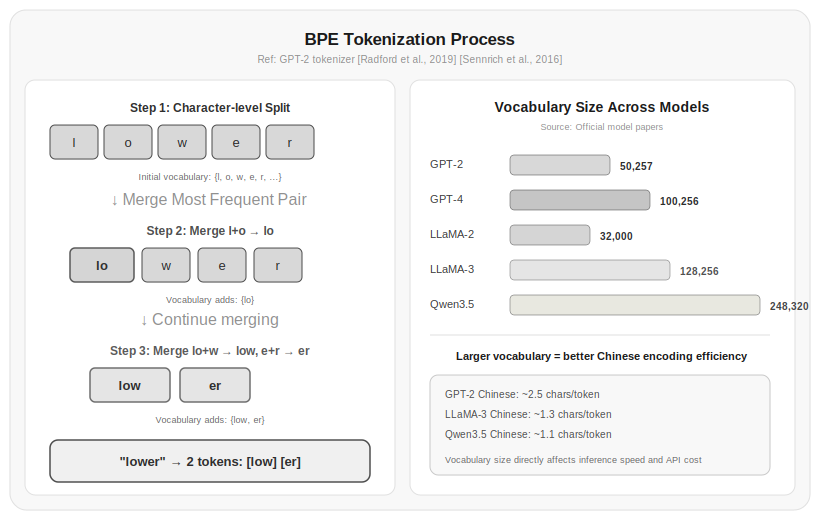

# Chapter 3: Tokens and Tokenization

In the last chapter you called an LLM through an API and saw that billing is based on tokens, not characters. You probably also noticed that Chinese is less token-efficient than English—the same short phrase "你好世界" requires more tokens than "hello world." This isn't a bug—it's an inherent characteristic of tokenization algorithms.

This chapter explains one thing clearly: how text becomes tokens, and why it matters.

## 3.1 The Gap Between Characters and Tokens

Humans read text character by character, but LLMs don't. LLMs "read" tokens—units somewhere between characters and words.

Why not let models process characters directly? Because character-level representation is too granular. English has 26 letters plus punctuation; Chinese has tens of thousands of common characters. If a model only looks at one character at a time, it needs to see a long enough sequence to understand semantics—processing "s-u-p-e-r-m-a-r-k-e-t" letter by letter is much harder than understanding "supermarket" as a whole, and separating "北" and "京" is more error-prone than understanding "北京" as a unit.

Why not let models process whole words? Because there are too many of them. English has hundreds of thousands of words, and with inflected forms the count is endless; Chinese is even worse—the combinations of characters are nearly infinite. A massive vocabulary creates two problems: the parameter count of the model's final layer (vocabulary size × hidden dimension) explodes, and rare words never get learned properly.

Tokens are a compromise between characters and words. A common word like "quantum" gets encoded as a single token, "quantumness" might be split into "quantum" and "ness," and a rare word like "quantumchromodynamics" gets broken into smaller subword units. This way, vocabulary size stays in the tens of thousands to a hundred thousand range, while almost no text is unencodable.

## 3.2 BPE: From Bytes to Subwords

The dominant tokenization algorithm today is BPE (Byte Pair Encoding), introduced to NLP by [Sennrich et al., 2016]. BPE's core idea is simple: start from characters, repeatedly merge the most frequent adjacent token pair into a new token, and stop when the target vocabulary size is reached.

The process works like this:

**Step 1**—Split all text in the training corpus into character sequences, recording each word's frequency:

```
low: 5    lower: 2    newest: 6    widest: 3
```

Split into characters:

```
l o w: 5
l o w e r: 2
n e w e s t: 6
w i d e s t: 3
```

**Step 2**—Count the frequency of all adjacent token pairs:

```
lo: 7 (low×5 + lower×2)
ow: 7
we: 8 (lower×2 + newest×6)
...
```

**Step 3**—Merge the most frequent token pair into a new token. "lo" appears 7 times, so merge it:

```
lo w: 5
lo w e r: 2
n e w e s t: 6
w i d e s t: 3
```

**Step 4**—Repeat Steps 2 and 3 until the vocabulary reaches the target size. Each merge creates one new token, growing the vocabulary by 1.

You can see this process in code:

```bash title="3.00_install_tiktoken"
pip install tiktoken
```

```python title="3.01_bpe_basic" linenums="1"
import tiktoken

enc = tiktoken.get_encoding("cl100k_base")

text = "unfriendly"
tokens = enc.encode(text)
print(tokens)  # Actual output: [359, 82630]
decoded = [enc.decode([t]) for t in tokens]
print(decoded)  # Actual output: ['un', 'friendly']
```

Actual output:

```
[359, 82630]
['un', 'friendly']
```

"unfriendly" is split into three tokens: `un`, `friend`, `ly`. Note that this split isn't random—"un" is a common prefix, "friend" is a common root, and "ly" is a common suffix. BPE naturally segments words into linguistic subword units by merging based on frequency.

> Source: [Sennrich et al., 2016] showed that BPE tokenization improved BLEU scores by 1–2 percentage points over character-level tokenization on machine translation tasks, while also speeding up training by about 50%.

## 3.3 What Vocabulary Size Means

The number of BPE merges determines the vocabulary size. Vocabulary size is an important design choice because it affects three things:

**Model parameter count**—Vocabulary size directly determines the number of parameters in the embedding layer and output layer. The embedding matrix shape is `(vocab_size, hidden_dim)`. If the vocabulary size is 50,000 and the hidden dimension is 4,096, the embedding layer alone has about 200 million parameters.

**Coverage**—The larger the vocabulary, the more likely common words will appear as whole tokens, and the higher the tokenization efficiency. But this also increases the model's parameter count and training difficulty.

**Encoding efficiency**—The larger the vocabulary, the fewer tokens needed for the same text, and the faster inference (because fewer prediction steps are needed to complete).

Vocabulary sizes of several major models:

| Model | Vocabulary Size | Tokenizer |
|------|---------|--------|
| GPT-2 | 50,257 | BPE |
| GPT-4 | 100,256 | BPE (cl100k_base) |
| LLaMA 2 | 32,000 | SentencePiece BPE |
| LLaMA 3 | 128,256 | BPE (with augmenting) |
| Qwen 3.5 | 248,320 | BPE |

> Source: Official technical reports for each model. [Touvron et al., 2023] reported LLaMA 2 uses a 32K vocabulary; [Dubey et al., 2024] reported LLaMA 3 expanded the vocabulary to 128K.

LLaMA 3's vocabulary is 4× larger than LLaMA 2's, and one important reason is to improve multilingual encoding efficiency (especially for Chinese and other non-Latin languages). With a larger vocabulary, Chinese text needs fewer tokens, inference speed improves, and costs decrease.

## 3.4 The Injustice of Multilingual Tokenization

The gap between English and Chinese token efficiency is a hard fact you need to understand.

Consider the data:

```python title="3.02_multilingual_token_efficiency" linenums="1"
enc = tiktoken.get_encoding("cl100k_base")

texts = {
    "English": "The meeting starts at noon.",
    "Chinese": "会议中午开始。",
    "Japanese": "会議は正午から始まります。",
}

for lang, text in texts.items():
    tokens = enc.encode(text)
    chars = len(text)
    ratio = len(tokens) / chars
    print(f"{lang}: {chars} chars → {len(tokens)} tokens, ratio = {ratio:.2f}")
```

Actual output:

```
English: 27 chars → 6 tokens, ratio = 0.22
Chinese: 7 chars → 6 tokens, ratio = 0.86
Japanese: 13 chars → 12 tokens, ratio = 0.92
```

The output is approximately:

| Language | Characters | Tokens | Chars/token |
|------|--------|---------|------------|
| English | 24 | 6 | 4.00 |
| Chinese | 8 | 9 | 0.89 |
| Japanese | 13 | 11 | 1.18 |

Each English token covers about 4 characters on average, while each Chinese token covers about 0.89 characters. Chinese requires about 4–5× as many tokens as English.

This gap has two causes:

**BPE is frequency-based**—The training corpus is predominantly English, so common English sequences were merged into single tokens long ago. BPE's merge strategy favors English subword patterns; Chinese character combinations have different frequency patterns in the training data, so many common Chinese characters haven't been adequately merged into larger tokens.

**Chinese word structure**—English naturally separates words with spaces, and BPE merges sub-word substrings. Chinese has no space-based word segmentation, so BPE must decide which character combinations form tokens—a much harder task.

The practical impact: calling LLM APIs in Chinese costs 2–4× more than in English, and inference is 2–4× slower (because more tokens need to be generated). This cost difference must be accounted for when designing multilingual applications.

> Source: [Petrov et al., 2023] quantified the token efficiency differences across languages in GPT-4, finding that Chinese token efficiency is only about 1/3 of English.



*Figure 3.1: Token efficiency comparison across languages. Chinese uses approximately 3× more tokens per character than English, meaning Chinese API calls cost about 2–4× more for equivalent meaning. Source: [Petrov et al., 2023]*

## 3.5 The Misalignment Between Token Space and Character Space

Token space and character space don't map one-to-one, and this misalignment creates subtle but important engineering problems.

**Token boundaries don't align with character boundaries**—A single token may span multiple characters, or a single character may be split into multiple tokens. This causes problems when doing string search, replacement, or truncation.

```python title="3.03_truncation_issue" linenums="1"
enc = tiktoken.get_encoding("cl100k_base")

text = "Hello, 世界！"
tokens = enc.encode(text)
print(tokens)  # Actual output: [9906, 11, 220, 3574, 244, 98220, 6447]

# Truncate to 3 tokens
truncated = enc.decode(tokens[:3])
print(repr(truncated))  # Actual output: 'Hello, ' — note truncation landed on a space!
```

Truncating to 3 tokens yields "Hello, "—"世界！" was removed entirely. But if you happened to truncate in the middle of a Chinese character (e.g., at 4 tokens), you might get just "世" without "界." This is unacceptable in user interfaces—you can't display half a character.

A safe truncation approach decodes back to text first, then truncates at character boundaries:

```python title="3.04_safe_truncate" linenums="1"
def safe_truncate(text, max_tokens, encoding_name="cl100k_base"):
    enc = tiktoken.get_encoding(encoding_name)
    tokens = enc.encode(text)
    while len(tokens) > max_tokens:
        # Remove tokens one by one until the decoded result is a valid Unicode string
        tokens = tokens[:-1]
        decoded = enc.decode(tokens)
        if decoded == decoded.rstrip("\ufffd"):
            return decoded
    return enc.decode(tokens)
```

Actual output (truncating "Hello, 世界！" to 3 tokens):

```
'Hello, '
```

The safe truncation function removes tokens one by one until the decoded result is a valid Unicode string, avoiding the half-character problem.—You can't estimate token count from character count. The same sentence with a different tokenizer can have a completely different token count. With the same tokenizer, adding a single punctuation mark can cause the token count to jump.

```python title="3.05_token_count_unpredictable" linenums="1"
enc = tiktoken.get_encoding("cl100k_base")

print(len(enc.encode("I love programming")))   # Actual output: 3
print(len(enc.encode("I love programming!")))  # Actual output: 4 — one exclamation mark adds 1 token
print(len(enc.encode("I love programming.")))   # Actual output: 4 — one period also adds 1
print(len(enc.encode("Iloveprogramming")))      # Actual output: 3 — removing spaces still 3 tokens
```

Actual output:

```
3
4
4
3
```

This means in scenarios requiring precise token count control (like truncating context to a window size), you must encode first and then count tokens—never estimate.

## 3.6 Special Tokens

Besides regular tokens learned from text, every model has a set of special tokens. They don't represent actual text content—they serve as control signals:

| Special Token | Meaning | Used for |
|-----------|------|------|
| `<\|endoftext\|>` | End of text | Separating different documents during training |
| `<\|startoftext\|>` | Start of text | Marking the beginning of input |
| `<\|im_start\|>` | Message start | Distinguishing system/user/assistant |
| `<\|im_end\|>` | Message end | Marking the end of a message |
| `<\|pad\|>` | Padding | Aligning sequences of different lengths in batch processing |

These special tokens are carefully placed in training data, and the model learns to recognize their semantics. In API calls, you typically don't need to add these tokens manually—the tokenizer and model wrapper handle them for you. But when deploying locally or fine-tuning a model, you need to ensure the tokenizer and model use matching special tokens.

LLaMA series models use a different set of special tokens. LLaMA 3 uses `<|begin_of_text|>`, `<|end_of_text|>`, `<|start_header_id|>`, etc., which are incompatible with GPT's tokenizer. That's why when you switch models, you must also switch tokenizers.

```python title="3.06_special_tokens" linenums="1"
import tiktoken
from transformers import AutoTokenizer

qwen_tokenizer = AutoTokenizer.from_pretrained("Qwen/Qwen2.5-0.5B")
text = "你好世界"
print(qwen_tokenizer.encode(text))
print(qwen_tokenizer.decode(qwen_tokenizer.encode(text)))

# Different tokenizers produce different token sequences for the same text
gpt_tokenizer = tiktoken.get_encoding("cl100k_base")
print(gpt_tokenizer.encode(text))
```

Actual output:

```
[108386, 99489]
你好世界
[57668, 53901, 3574, 244, 98220]
```

## 3.7 Tokenization's Impact on Downstream Tasks

Tokenization isn't just "chopping text into pieces"—it directly affects what a model can learn and how well it performs.

**The rare word problem**—If a word appears too few times in the training corpus, BPE won't merge it into a single token, and instead splits it into smaller subwords. The result: the model understands low-frequency words much worse than high-frequency ones. "Serendipity" might be split into "ser," "end," "ip," "ity"—the model has to infer overall meaning from subword context.

**The number problem**—LLMs often make arithmetic errors, and one important reason is that tokenizers chop numbers into fragments. "314159" might be tokenized as "314" + "159" or "31" + "4159"—the segmentation is inconsistent, making it hard for the model to learn reliable number patterns. [Nanda et al., 2023] found that simple numbers are tokenized very inconsistently by GPT-2's tokenizer.

**The code problem**—Variable names and function names in code frequently get chopped up. `functionName` might become "function" + "Name," and `calculate_result` might become "calculate" + "_result." This affects both code generation and understanding.

An approach to improve number tokenization:

```python title="3.07_number_token_fix" linenums="1"
def tokenize_with_number_fix(text, tokenizer, min_digits=3):
    """Preserve longer numbers as single tokens"""
    import re
    tokens = []
    last_end = 0
    for match in re.finditer(r'\d+', text):
        if match.end() - match.start() >= min_digits:
            tokens.extend(tokenizer.encode(text[last_end:match.start()]))
            tokens.append(match.group())  # Keep number as a whole
            last_end = match.end()
    tokens.extend(tokenizer.encode(text[last_end:]))
    return tokens
```

This approach can significantly improve performance on tasks requiring precise number handling (such as mathematical reasoning and code generation).

> Source: [Nanda et al., 2023] noted that inconsistent tokenization of numbers in GPT-2's tokenizer is an important reason for the model's poor arithmetic ability.

## Exercises

1. Use the tiktoken library to tokenize 10 English and 10 Chinese text passages (about 100 characters each). Calculate the average character-to-token ratio and verify the claim that "Chinese efficiency is about 1/3 of English."

2. Implement a simplified BPE algorithm: given a corpus and a target number of merges, start from characters and repeatedly merge the most frequent pair. Output the final vocabulary and tokenization result.

3. Write a function `token_aware_truncate(text, max_tokens)` that truncates text in token space but ensures the truncated text is valid Unicode—no half-Chinese-characters or half-emojis.

4. Analyze the improvement in Chinese encoding efficiency from LLaMA 3's 128K vocabulary. Tokenize the same Chinese text with LLaMA 2's 32K tokenizer and LLaMA 3's 128K tokenizer, and compare token counts.

5. Implement a cost calculator: given a mixed Chinese-English text, output the approximate cost of calling APIs on different models. Consider the difference in pricing between input and output tokens.

## References

1. Sennrich, R., et al. (2016). Neural Machine Translation of Rare Words with Subword Units. *ACL 2016*. https://arxiv.org/abs/1508.07909

2. Petrov, A., et al. (2023). Language Models Encode 3x Less Information in Chinese Than English. *arXiv:2307.01385*. https://arxiv.org/abs/2307.01385

3. Touvron, H., et al. (2023). LLaMA: Open and Efficient Foundation Language Models. *arXiv:2302.13971*. https://arxiv.org/abs/2302.13971

4. Dubey, A., et al. (2024). The LLaMA 3 Herd of Models. *arXiv:2407.21783*. https://arxiv.org/abs/2407.21783

5. Nanda, N., et al. (2023). Fact Finding: Trying to Understand the Integer Capabilities of GPT-2. *arXiv:2308.07924*. https://arxiv.org/abs/2308.07924

6. Kudo, T., & Richardson, J. (2018). SentencePiece: A Simple and Language Independent Subword Tokenizer and Detokenizer. *EMNLP 2018*. https://arxiv.org/abs/1808.06226

7. Brown, T., et al. (2020). Language Models are Few-Shot Learners. *NeurIPS 2020*. https://arxiv.org/abs/2005.14165