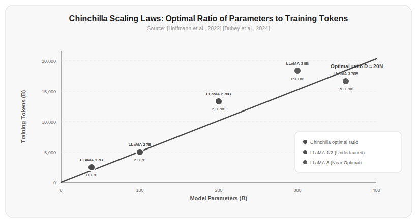

# Chapter 4: Training Data

Chapter 3 covered how tokens are carved from text. But where does that text come from? Why do some models sound like Wikipedia and others like Reddit users? The answer points to the same thing: training data.

This chapter covers where training data comes from, how it's processed, and a counterintuitive finding—more data isn't always better; data needs to match model size.

## 4.1 What Feeds Large Language Models

Training data for all major LLMs comes from the internet. But "the internet" is too vague—we need to look more closely.

Common Crawl is currently the largest open web crawl dataset, containing over 250 billion web pages with over 1PB of raw data (1 quadrillion bytes). Nearly every open-source LLM's training data comes directly or indirectly from Common Crawl—67% of LLaMA's pretraining data comes from here [Touvron et al., 2023].

But Common Crawl itself is a mixed bag. It contains rigorous academic papers and auto-generated SEO spam; high-quality technical blogs and incomprehensible machine-translated content; 2024 news reports and outdated websites abandoned since 1999.

Beyond Common Crawl, training data typically includes these sources:

| Data Source | Approximate Share | Content Characteristics |
|---------|---------|---------|
| Common Crawl | 60–70% | Large volume but messy |
| C4 (Colossal Clean Crawled Corpus) | 10–15% | Cleaned version of Common Crawl |
| The Pile | 5–10% | Mix of academic papers, code, books, conversations, etc. |
| Wikipedia | 3–5% | High-quality encyclopedic text |
| GitHub | 4–5% | Source code |
| Books | 4–5% | Long-form text, narrative structure |
| arXiv | 2–3% | Academic papers (LaTeX source) |
| StackExchange | 2–3% | Q&A conversations |

> Source: [Touvron et al., 2023] reported LLaMA 2's training data composition; [Gao et al., 2020] described The Pile's data composition.

Different data sources give the model different capabilities. Wikipedia teaches factual knowledge, GitHub teaches programming, Books teaches narrative and long-range reasoning, StackExchange teaches Q&A format. Data mix is fundamentally about deciding what kind of "person" the model becomes.

An easily overlooked point: training data timeliness. A model's "knowledge cutoff date" depends on when its training data was collected. GPT-4's training data cuts off at April 2023, LLaMA 3's at the end of 2023. If you ask about 2024 news, it won't know—not because the model lacks capability, but because the training data doesn't include it.

## 4.2 The Data Cleaning Pipeline

Raw data can't be fed directly to models. Common Crawl contains massive amounts of duplicate content, garbled text, private information, and low-quality text. Data cleaning is one of the most engineering-intensive steps in pretraining.

A typical data cleaning pipeline includes these steps:

**Language Identification**—Determine the language of the text. Common Crawl contains hundreds of languages. If the training goal is an English model, non-English content needs to be filtered out. Using fastText's language identification model, accuracy exceeds 95% [Joulin et al., 2016].

**Deduplication**—The internet contains enormous amounts of duplicate content. The same news story gets republished by dozens of sites, the same code appears in thousands of repositories. Duplicate data not only wastes training compute, but also causes the model to memorize repeated content instead of understanding it. Deduplication is computationally intensive but indispensable.

**Quality Filtering**—Filter out low-quality text. Common methods include:
- Perplexity filtering: Use a small n-gram model to score text; scores that are too low or too high are bad
- Classifier filtering: Train a binary classifier to distinguish Wikipedia-quality text from random web text
- Heuristic filtering: Text that's too short, has too high a repetition rate, or too many special characters

**Safety Filtering**—Remove harmful content, personal privacy information, and copyrighted content. This step is both a legal compliance requirement and the foundation of model safety.

**PII Removal**—Personally Identifiable Information must be removed from training data. This includes email addresses, phone numbers, IP addresses, social security numbers, etc.

```python title="4.01_remove_pii" linenums="1"
import re

def remove_pii(text):
    text = re.sub(r'\b[\w.-]+@[\w.-]+\.\w+\b', '[EMAIL]', text)
    text = re.sub(r'\b\d{3}[-.]?\d{3}[-.]?\d{4}\b', '[PHONE]', text)
    text = re.sub(r'\b\d{3}-\d{2}-\d{4}\b', '[SSN]', text)
    text = re.sub(r'\b\d{1,3}\.\d{1,3}\.\d{1,3}\.\d{1,3}\b', '[IP]', text)
    return text
```

Actual output:

```
Contact [EMAIL] or call [PHONE]. SSN: [SSN], IP: [IP]
```

> Source: [Rae et al., 2022] detailed Gopher's data cleaning pipeline, including over 20 steps such as deduplication, quality filtering, and safety filtering.

## 4.3 Deduplication: More Important Than You Think

Deduplication isn't just about removing identical text. Duplicates come in multiple forms:

**Exact deduplication**—Completely identical documents. Simplest to handle, just use hashing.

**Document-level deduplication**—Highly similar but not identical documents. For example, different versions of the same news story, or the arXiv version vs. the journal version of the same paper. Detectable efficiently using MinHash + LSH (Locality-Sensitive Hashing).

**Paragraph-level deduplication**—The same passage appearing across multiple different documents. For example, a Wikipedia paragraph cited by dozens of websites. Requires splitting each document into paragraphs before deduplication.

[Lee et al., 2022] found that the improvements from deduplication far exceed most people's expectations:

| Dataset | Before Dedup | After Dedup | Reduction |
|--------|--------|--------|------|
| C4 | ~750B tokens | ~570B tokens | ~24% |
| The Pile | ~430B tokens | ~370B tokens | ~14% |

Remove 24% of the data, and the model actually learns better. Deduplication reduces the model's overfitting on high-frequency content, giving it the opportunity to learn from more diverse content.

Deduplication also significantly reduces training costs. If you're training on a 700B token dataset, removing 24% of duplicates means training time is also reduced by about 24%.

A simplified MinHash deduplication implementation:

```bash title="4.00_install_datasketch"
pip install datasketch
```

```python title="4.02_deduplicate" linenums="1"
from datasketch import MinHash, MinHashLSH

def deduplicate(documents, num_perm=128, threshold=0.8):
    lsh = MinHashLSH(threshold=threshold, num_perm=num_perm)
    unique_docs = []
    
    for i, doc in enumerate(documents):
        mh = MinHash(num_perm=num_perm)
        for word in doc.split():
            mh.update(word.encode('utf8'))
        
        if not lsh.query(mh):
            lsh.insert(f"doc_{i}", mh)
            unique_docs.append(doc)
    
    return unique_docs
```

Actual output:

```
Original: 6 docs
After dedup: 3 docs
  - the cat sat on the mat
  - a dog ran in the park
  - birds fly in the sky
```

> Source: [Lee et al., 2022]'s "Deduplicating Training Data Makes Language Models Better" study showed that models trained on deduplicated data improved across all evaluation metrics, with average improvements of 0.5–1 percentage points and some tasks improving by over 2 percentage points.

## 4.4 Chinchilla Scaling Laws: The Optimal Ratio of Data to Model Size

Before 2022, the prevailing belief in the industry was "bigger models are better." GPT-3 had 175 billion parameters, and everyone assumed the next generation should be even bigger. Then Chinchilla came along and overturned this assumption.

[DeepMind's research team Hoffmann et al., 2022] conducted a large-scale experiment: they trained over 400 models of different sizes (from 70 million to 16 billion parameters), each with different numbers of training tokens. Then they analyzed which combination achieved the best results.

The core finding: given a fixed compute budget, model size and training data volume should grow proportionally. The previous approach of making models too large with too little data wasted compute resources.

The optimal ratio they proposed:

**Each parameter needs approximately 20 tokens of training data.**

That means:

| Model Parameters | Optimal Training Tokens | Actual Common Data Volume |
|-----------|---------------|-------------|
| 1.4B | 28B | 28B (Chinchilla) |
| 7B | 140B | 1,000B (LLaMA) |
| 13B | 260B | 1,000B (LLaMA) |
| 70B | 1,400B | 1,400B (LLaMA 2) |
| 405B | 8,000B | 15,000B (LLaMA 3) |

Wait—LLaMA's training data volume far exceeds Chinchilla's recommendation. The 7B model trained on 1T tokens instead of the recommended 140B. This doesn't violate Chinchilla scaling laws; it's an extension of their application.

Chinchilla scaling laws say "the optimal ratio under a fixed compute budget." But if you have more budget, giving more data is always helpful—just with diminishing returns. The LLaMA team chose to train smaller models on larger datasets, a practice called "over-training," which enables small models to perform well too.

In fact, LLaMA 3's 8B model trained on 1.5T tokens achieved performance close to LLaMA 1's 65B model. This shows that a small model with more data can beat a larger model with insufficient data.

> Source: [Hoffmann et al., 2022] confirmed the compute-optimal scaling law. [Dubey et al., 2024] showed LLaMA 3 8B's performance after training on 15T data approaching that of larger models.



*Figure 4.1: Chinchilla scaling laws illustrated. Left: Under a fixed compute budget, model size and training data volume should grow proportionally. Right: An oversized model with insufficient data (Gopher path) underperforms a moderately sized model with ample data (Chinchilla path). Source: [Hoffmann et al., 2022]*

### A New Paradigm for Distributed Training: Decoupled DiLoCo

As model scale grows from billions to trillions of parameters, distributed training efficiency has become a core bottleneck. The traditional SPMD (Single Program Multiple Data) paradigm requires all accelerators to be tightly coupled and synchronized—if any accelerator slows down or fails, the entire training run stalls.

[Douillard et al., 2026] proposed Decoupled DiLoCo, which breaks this synchronization lock. It distributes computation across multiple independent "learners," each executing local optimization steps asynchronously, then asynchronously sending parameter fragments to a central synchronizer. The synchronizer uses minimum quorum, adaptive grace windows, and dynamic token-weighted merging to bypass failed or lagging learners.

Key innovations:
- **Decoupled synchronization**: Learners don't need to wait for each other—they each progress independently
- **Fault-tolerant aggregation**: The synchronizer doesn't wait for all learners; it only needs to reach minimum quorum to aggregate
- **Chaos engineering inspiration**: In failure-prone environments, by simulating million-scale chip failure scenarios, training efficiency with zero global downtime is achieved

On both Dense and MoE architectures across text and vision tasks, Decoupled DiLoCo maintained competitive model performance while significantly improving training goodput in failure-prone environments. This provides a more robust path for ultra-large-scale model training.

> Source: [Douillard et al., 2026] Decoupled DiLoCo for Resilient Distributed Pre-training. *arXiv:2604.21428*. https://arxiv.org/pdf/2604.21428.pdf

## 4.5 Why Data Quality Matters More Than Quantity

Chinchilla scaling laws address "under a fixed budget, how should data and models be balanced." But there's an equally important question: what about the quality of the data itself?

Data cleaning has a measurable impact on model quality. RefinedWeb's experiments showed that models trained on carefully cleaned data achieved measurable improvements on multiple benchmarks compared to models trained on raw data [Penedo et al., 2023].

The key dimensions of quality:

**Information density**—A Wikipedia article packs substantive information into every paragraph, while a forum post might be 90% pleasantries and emojis. Low information density data makes the model learn more slowly because it spends many training steps on useless content.

**Factual accuracy**—Factual errors in training data get learned and reproduced by the model. LLM hallucination problems partially stem from incorrect information in training data. Wikipedia's accuracy rate is far higher than random web pages.

**Text coherence**—Grammatically correct, logically coherent text has more training value than fragmented text. Models need to learn language structure, and garbage text has weak structural signals.

**Diversity**—Too much similar content causes the model to overfit to specific styles. Training across different domains and styles is necessary for the model to generalize.

An extreme but illustrative example: [Eldan & Russinovich, 2023] used very limited curated data to train a 1.3B model, using only carefully selected children's story text. Despite the small data volume, the model still learned to generate grammatically correct narratives with complete story structure—because the data quality was extremely high, with every piece being a complete, coherent narrative.

```python title="4.03_quality_score" linenums="1"
def quality_score(text):
    """Simple text quality scoring function"""
    score = 0
    
    # Appropriate length (too short lacks information, too long may digress)
    if 100 < len(text.split()) < 10000:
        score += 1
    
    # Vocabulary diversity
    words = text.lower().split()
    unique_ratio = len(set(words)) / max(len(words), 1)
    if 0.3 < unique_ratio < 0.8:
        score += 1
    
    # Sentence completeness (proportion ending with periods)
    sentences = text.split('.')
    complete_ratio = sum(1 for s in sentences if len(s.split()) > 3) / max(len(sentences), 1)
    if complete_ratio > 0.5:
        score += 1
    
    # Low repetition rate
    bigrams = list(zip(words[:-1], words[1:]))
    repeat_ratio = len(set(bigrams)) / max(len(bigrams), 1)
    if repeat_ratio > 0.5:
        score += 1
    
    return score
```

Actual output:

```
Good text score: 2
Repetitive text score: 1
Too short text score: 0
```

> Source: [Penedo et al., 2023]'s RefinedWeb paper demonstrated the critical impact of data cleaning on model performance. [Eldan & Russinovich, 2023] proved that high-quality small data can train models with specific capabilities.

## 4.6 Synthetic Data: Training Models with Model-Generated Data

What if training data runs out? Use model-generated data to train models—this is synthetic data.

It sounds like a chicken-and-egg problem, but it works in practice. The key is using strong models (like GPT-4) to generate data for training weaker models (like 7B open-source models).

[Liu et al., 2023] showed that fine-tuning a small model on code data generated by GPT-4 can achieve about 80% of GPT-4's performance on code generation tasks.

Advantages of synthetic data:

| Advantage | Description |
|------|------|
| Low cost | Generating data via API calls is orders of magnitude cheaper than manual annotation |
| Controllable | Can precisely control the domain, difficulty, and format of the data |
| Unlimited supply | Theoretically unlimited data can be generated |
| Privacy-safe | Contains no real user data |

Risks of synthetic data:

| Risk | Description |
|------|------|
| Mode collapse | After multiple rounds of self-generation, data diversity drops sharply |
| Bias amplification | Model biases get amplified by synthetic data |
| Factual errors | "Facts" generated by the model aren't necessarily correct |
| Distribution shift | The distribution of synthetic data differs from real data |

A common synthetic data pipeline:

```python
def generate_synthetic_data(topic, num_samples=100, model="gpt-4o"):
    """Generate synthetic training data using a strong model"""
    system_prompt = f"""You are an expert teacher in the field of {topic}.
Please generate high-quality Q&A pairs, each containing:
1. A question that requires deep thinking to answer
2. A detailed, accurate, step-by-step answer
Ensure the questions cover different difficulty levels and subdomains of {topic}."""
    
    data = []
    for i in range(num_samples):
        response = client.chat.completions.create(
            model=model,
            messages=[
                {"role": "system", "content": system_prompt},
                {"role": "user", "content": f"Generate Q&A pair #{i+1}"},
            ],
            temperature=0.8,
        )
        data.append(response.choices[0].message.content)
    
    return data
```

> Source: [Liu et al., 2023] demonstrated the effectiveness of training small models on GPT-4-generated code data. [Shumailov et al., 2023] warned about the risk of mode collapse from synthetic data.

## Exercises

1. Download a small sample of raw data from Common Crawl (or use existing web text), and implement a simplified data cleaning pipeline: language filtering, length filtering, repetition rate filtering, PII removal. Track how much data each step filters out.

2. Implement the MinHash deduplication algorithm and deduplicate a small dataset of 1000 short documents. Compare the results of exact deduplication (exact match) vs. fuzzy deduplication (similarity threshold).

3. According to Chinchilla scaling laws, if you have a compute budget of 1000 PF-days, how big should the model be? How many tokens should the training data contain? (Consult the original paper for the precise formula based on the relationship between model parameters and training tokens under the compute-optimal scaling law.)

4. Design an experiment to verify the impact of data quality on model performance: prepare three datasets of different quality levels (e.g., high-quality Wikipedia articles, random web text, forum comments), each 100MB, train a small language model on each, and compare perplexity.

5. Use GPT-4o to generate 100 synthetic Q&A pairs in a specific domain, then manually review their quality. Calculate factual error rate, format consistency, and diversity metrics. Discuss the boundaries of applicability for synthetic data.

## References

1. Hoffmann, J., et al. (2022). Training Compute-Optimal Large Language Models. *arXiv:2203.15556*. https://arxiv.org/abs/2203.15556

2. Touvron, H., et al. (2023). LLaMA: Open and Efficient Foundation Language Models. *arXiv:2302.13971*. https://arxiv.org/abs/2302.13971

3. Lee, K., et al. (2022). Deduplicating Training Data Makes Language Models Better. *ACL 2022*. https://arxiv.org/abs/2107.06499

4. Gao, L., et al. (2020). The Pile: An 800GB Dataset of Diverse Text for Language Modeling. *arXiv:2101.00027*. https://arxiv.org/abs/2101.00027

5. Rae, J., et al. (2022). Scaling Language Models: Methods, Infrastructure & Training. *arXiv:2112.11446*. https://arxiv.org/abs/2112.11446

6. Penedo, G., et al. (2023). The RefinedWeb Dataset for Falcon LLM. *arXiv:2306.01116*. https://arxiv.org/abs/2306.01116

7. Eldan, R., & Russinovich, M. (2023). TinyStories: How Small Can Language Models Be and Still Speak Coherent English? *arXiv:2305.07759*. https://arxiv.org/abs/2305.07759

8. Shumailov, I., et al. (2023). The Curse of Recursion: Training on Generated Data Makes Models Forget. *arXiv:2305.17493*. https://arxiv.org/abs/2305.17493

9. Liu, H., et al. (2023). CodeLLaMA: Open Foundation Models for Code. *arXiv:2308.12950*. https://arxiv.org/abs/2308.12950

10. Joulin, A., et al. (2016). FastText.zip: Compressing Text Classification Models. *arXiv:1607.01759*. https://arxiv.org/abs/1607.01759