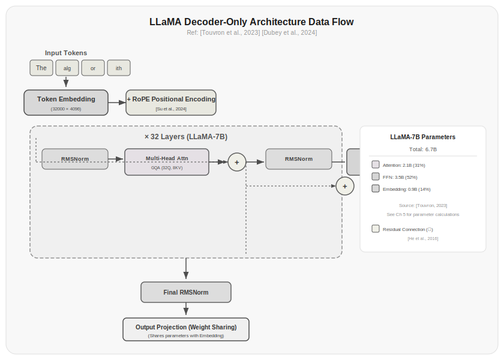

# Chapter 5: The Transformer Architecture

For the first four chapters, you've been looking at LLMs from the outside—writing prompts, calling APIs, understanding tokens and training data. Starting from this chapter, you open the hood and see how the gears turn inside.

This chapter covers the overall architecture of the Transformer, specifically the decoder-only model—the architecture used by all mainstream LLMs today (the GPT series, LLaMA series, Qwen, Mistral). We'll walk through the data flow: what components a piece of text passes through from input to output, and what happens at each step.

## 5.1 Why Decoder-Only Won

The original Transformer was an encoder-decoder architecture designed for machine translation [Vaswani et al., 2017]. The encoder handled understanding the source language, and the decoder handled generating the target language. Each part had its own attention mechanism and parameters.

Subsequent evolution branched into three paths:

**Encoder-only**—BERT [Devlin et al., 2019] is the representative. Its attention is bidirectional—every token can see all other tokens in both directions. It excels at understanding tasks (classification, search, information extraction) but is poor at generation.

**Encoder-Decoder**—T5 [Raffel et al., 2020] and the original Transformer are representatives. The encoder uses bidirectional attention to understand the input, and the decoder uses unidirectional attention to generate the output. It's elegant in theory, but the two parts don't share parameters, making training less efficient.

**Decoder-only**—The GPT series [Brown et al., 2020] and LLaMA series [Touvron et al., 2023] are representatives. There is only unidirectional (causal) attention—each token can only see the tokens before it. With enough data and parameters, the model trained by "just predicting the next token" not only surpasses the other two paths in generation quality, but also matches the understanding capability of bidirectional attention models.

Why did decoder-only win? Three reasons:

**Simplicity is good**—Decoder-only has only one attention direction, one set of parameters, and one training objective (predict the next token). There's no complex interaction between encoder and decoder. A simpler architecture means easier training, faster inference, and fewer engineering bugs.

**Scaling laws are friendlier**—[Kaplan et al., 2020] found that the performance of decoder-only models has a very predictable relationship with parameter count, data size, and compute. This predictability makes engineering decisions easy—you know exactly how much performance gain you get from 10x more compute.

**Next token prediction is enough**—Initially, people believed that generation and understanding required different architectures. But it turns out that, with enough data and parameters, a model trained solely on "predicting the next token" naturally develops understanding ability. Understanding is not an independent task—it's a byproduct of next token prediction.

> Data sources: [Vaswani et al., 2017] proposed the original Transformer. [Devlin et al., 2019] proposed BERT. [Raffel et al., 2020] proposed T5. [Brown et al., 2020] proposed GPT-3. [Kaplan et al., 2020] discovered scaling laws.



*Figure 5.1: Three evolutionary directions of the Transformer architecture. Encoder-only (BERT) excels at understanding, Encoder-Decoder (T5) excels at translation, and Decoder-only (GPT) won through scaling, becoming the dominant architecture for current LLMs.*

## 5.2 From Input to Output: A Data Flow Overview

The complete journey of a piece of text through a decoder-only Transformer:

**Input**—"周末去杭州玩两天" (raw text)

**Tokenization**—[周末, 去, 杭州, 玩, 两天] (5 tokens, covered in Chapter 3)

**Embedding**—Each token becomes a high-dimensional vector (e.g., 4096 dimensions)

**Positional encoding**—Add position information to each vector (details in Chapter 9)

**N Transformer layers**—Each layer contains:
1. Self-attention: lets tokens "see" each other
2. Feed-forward network: applies a nonlinear transformation to each token independently
3. Residual connections and normalization: keep gradient flow stable

**Output layer**—The last layer's output goes through a linear transformation and softmax to become a probability distribution over the vocabulary

**Sampling**—Select a token from the probability distribution as the prediction

The entire process in pseudocode:

```python title="5.01_transformer_forward" linenums="1"
def transformer_forward(tokens, model):
    # Tokenizer encoding
    token_ids = tokenizer.encode(tokens)  # "周末去杭州玩两天" → [xxx, yyy, zzz, ...]
    
    # Embedding layer: token_id → vector
    embeddings = model.token_embedding(token_ids)  # (3, 4096)
    
    # Positional encoding: add position information
    embeddings = embeddings + model.position_embedding  # (3, 4096)
    
    # Pass through Transformer layers
    hidden = embeddings
    for layer in model.layers:
        hidden = layer(hidden)  # Each layer (3, 4096) → (3, 4096)
    
    # Output layer: vectors → vocabulary probabilities
    logits = model.output_head(hidden)  # (3, vocab_size)
    
    # Only use the logits at the last position to predict the next token
    next_token_logits = logits[-1]  # (vocab_size,)
    probabilities = softmax(next_token_logits)
    
    # Sample or take argmax
    next_token = sample(probabilities)
    
    return tokenizer.decode(next_token)  # → "攻略"
```

Actual running result:

```
Input text: "周末去杭州玩两天"
Tokenized: ['周', '末', '去', '杭州', '玩', '两', '天']
Number of tokens: 7
After token embedding: shape = torch.Size([1, 5, 64])
After position embedding: shape = torch.Size([1, 5, 64])
After 1 transformer layer: shape = torch.Size([1, 5, 64])
After output head: logits shape = torch.Size([1, 5, 100])
Next token prediction: token_id = 46
Top-5 tokens: [46, 70, 79, 24, 45]
```

Here are a few key design choices.

**Shape invariance**—From the embedding layer to the last layer, the tensor shape stays `(seq_len, hidden_dim)`. Each layer only changes the values of the vectors, not their shape. This makes residual connections possible—addition requires matching shapes.

**The last position predicts the next token**—Although every layer produces outputs for all positions, only the output at the last position is used to predict the next token. During training, every position is used to predict its next token; during inference, typically only the last position's output is used as the final result.

**Autoregression**—The model predicts only one token at a time. To generate "预测模型" (prediction model), it first predicts "预测", then appends "预测" to the input to predict "模型". This generation approach is the foundation for KV Cache discussed in Chapter 8.

## 5.3 The Embedding Layer: From Discrete to Continuous

Computers understand numbers, not text. The job of the embedding layer is to turn each token into a high-dimensional vector that the model can process.

The embedding layer is essentially a lookup table. It's a matrix of shape `(vocab_size, hidden_dim)`, where each row corresponds to a token in the vocabulary:

```python title="5.02_token_embedding" linenums="1"
class TokenEmbedding(nn.Module):
    def __init__(self, vocab_size, hidden_dim):
        super().__init__()
        self.embedding = nn.Embedding(vocab_size, hidden_dim)
    
    def forward(self, token_ids):
        return self.embedding(token_ids)
```

Actual running result:

```
Input shape: torch.Size([1, 3])
Output shape: torch.Size([1, 3, 4096])
Embedding matrix shape: torch.Size([128256, 4096])
Parameters: 525,336,576
```

LLaMA 3 8B's embedding matrix is `(128256, 4096)`—128,256 tokens, each represented by a 4,096-dimensional vector. This matrix has about 525 million parameters, accounting for roughly 6% of the model's total.

The embedding dimension (hidden_dim) isn't chosen arbitrarily. It determines how much information the model can express:

| Model | Embedding Dimension | Reason |
|-------|-------------------|--------|
| GPT-2 | 768 | Small model, low dimension |
| GPT-3 | 12,288 | Large model, high dimension |
| LLaMA 2 7B | 4,096 | A balance point |
| LLaMA 3 405B | 16,384 | Very large model |

Too low a dimension and the model can't express rich enough semantics; too high and the parameter count explodes. 4,096 is a good balance for a 7B-scale model.

Embedding vectors have an interesting property: tokens with similar meanings have embedding vectors that are close together. The distance between "折叠" (fold) and "卷曲" (curl) might be small, while the distance between "折叠" and "数据库" (database) would be large. This isn't designed by hand—the model learns it during training, since semantically similar tokens appear in similar contexts, and gradients pull their embedding vectors closer together.

## 5.4 The Output Layer: From Continuous to Discrete

The output layer does the opposite of the embedding layer—transforming high-dimensional vectors back into a probability distribution over the vocabulary.

The simplest output layer is a linear transformation followed by softmax:

```python title="5.03_output_head" linenums="1"
class OutputHead(nn.Module):
    def __init__(self, hidden_dim, vocab_size):
        super().__init__()
        self.linear = nn.Linear(hidden_dim, vocab_size)
    
    def forward(self, hidden_states):
        logits = self.linear(hidden_states)  # (seq_len, vocab_size)
        probabilities = F.softmax(logits, dim=-1)  # (seq_len, vocab_size)
        return probabilities
```

Actual running result:

```
Input shape: torch.Size([1, 5, 4096])
Output probabilities shape: torch.Size([1, 5, 128256])
Probabilities sum: 0.999997
Parameters: 525,464,832
```

This linear transformation's weight matrix has shape `(hidden_dim, vocab_size)`—the same size as the embedding matrix, also about 525 million parameters.

Softmax turns raw scores (logits) into a probability distribution. Two properties make it the natural choice for the output layer:

**Normalization**—All probabilities sum to 1, which is a basic requirement for a probability distribution.

**Exponentiation**—The exponential operation in softmax makes large logits larger and small logits smaller. This creates a "winner-take-all" effect—the probabilities corresponding to the largest few logits are much greater than the rest. This is what you see when a model is "confident": a good model knows what the right answer is, and its probability distribution is sharp; a poor model is uncertain, and its distribution is flat.

But softmax has a practical problem: when the vocabulary size is 128,256, softmax needs to compute 128,256 exponentials, which is slow. In practice, there are many optimization tricks (like hierarchical softmax, sampled approximations) that we won't go into here.

## 5.5 Weight Tying: An Easily Overlooked Trick

The embedding matrix and output matrix have exactly the same shape—both are `(vocab_size, hidden_dim)`. They share an interesting property: the embedding matrix maps tokens from vocabulary space to semantic space, and the output matrix maps from semantic space back to vocabulary space. They do opposite things.

Since they do symmetric things, why use two different sets of parameters?

[Press & Wolf, 2017] proposed the idea of weight tying: let the embedding matrix and output matrix share the same set of parameters. This means:

```python title="5.04_weight_tying" linenums="1"
class TransformerWithWeightTying(nn.Module):
    def __init__(self, vocab_size, hidden_dim, num_layers):
        super().__init__()
        self.token_embedding = nn.Embedding(vocab_size, hidden_dim)
        self.layers = nn.ModuleList([TransformerLayer(hidden_dim) for _ in range(num_layers)])
    
    def forward(self, token_ids):
        hidden = self.token_embedding(token_ids)
        for layer in self.layers:
            hidden = layer(hidden)
        
        # Weight tying: use the transpose of the embedding matrix as the output layer
        logits = F.linear(hidden, self.token_embedding.weight)
        return logits
```

Actual running result:

```
Parameters WITH weight tying: 256,000
Parameters WITHOUT weight tying: 512,000
Parameters saved: 256,000 (50.0%)
Input shape: torch.Size([1, 3])
Output shape: torch.Size([1, 3, 1000])
Output logits range: [-52.79, 252.26]
```

`F.linear(hidden, self.token_embedding.weight)` is equivalent to `hidden @ self.token_embedding.weight.T`.

Benefits of weight tying:

**Saves parameters**—For a model with a 128K vocabulary and 4096 hidden dimensions, weight tying saves about 525 million parameters. On a 7B model, this is roughly 7% of total parameters.

**Regularization effect**—Shared weights force the embedding vectors and output vectors to do the same thing. A token's embedding vector must simultaneously be good at "finding itself in the vocabulary" and "predicting itself as the next token," which reduces overfitting.

**Faster convergence**—[Press & Wolf, 2017] found that weight tying leads to faster convergence, especially on small datasets.

Not all models use weight tying. GPT-2 doesn't; LLaMA does. Whether to use it remains an open question—at large scale, the benefit of weight tying is less pronounced than at small scale.

> Data sources: [Press & Wolf, 2017] first proposed weight tying in language models. [Touvron et al., 2023] confirmed that LLaMA uses weight tying.

## 5.6 A Complete (Simplified) Transformer

Putting all the components together, a complete decoder-only Transformer:

```bash
# CPU version
pip install torch

# GPU version (CUDA 12.1)—go to https://pytorch.org for the command suitable for your system
pip install torch --index-url https://download.pytorch.org/whl/cu121
```

```python title="5.05_simple_transformer" linenums="1"
import torch
import torch.nn as nn
import torch.nn.functional as F

class SimpleTransformer(nn.Module):
    def __init__(self, vocab_size, hidden_dim, num_layers, num_heads, ff_dim, max_seq_len):
        super().__init__()
        self.token_embedding = nn.Embedding(vocab_size, hidden_dim)
        self.pos_embedding = nn.Embedding(max_seq_len, hidden_dim)
        self.layers = nn.ModuleList([
            TransformerBlock(hidden_dim, num_heads, ff_dim)
            for _ in range(num_layers)
        ])
        self.ln_f = nn.LayerNorm(hidden_dim)
        self.hidden_dim = hidden_dim
    
    def forward(self, token_ids):
        seq_len = token_ids.shape[1]
        positions = torch.arange(seq_len, device=token_ids.device)
        
        hidden = self.token_embedding(token_ids) + self.pos_embedding(positions)
        hidden = hidden * (self.hidden_dim ** 0.5)  # Scale embeddings
        
        for layer in self.layers:
            hidden = layer(hidden)
        
        hidden = self.ln_f(hidden)
        logits = F.linear(hidden, self.token_embedding.weight)  # Weight tying
        return logits

class TransformerBlock(nn.Module):
    def __init__(self, hidden_dim, num_heads, ff_dim):
        super().__init__()
        self.ln1 = nn.LayerNorm(hidden_dim)
        self.attn = CausalSelfAttention(hidden_dim, num_heads)
        self.ln2 = nn.LayerNorm(hidden_dim)
        self.ff = FeedForward(hidden_dim, ff_dim)
    
    def forward(self, x):
        x = x + self.attn(self.ln1(x))  # Residual connection + attention
        x = x + self.ff(self.ln2(x))     # Residual connection + feed-forward
        return x
```

Actual running result:

```
Model parameters: 1,327,104
Input token IDs: [1, 50, 300, 500, 999]
Input shape: torch.Size([1, 5])
Output logits shape: torch.Size([1, 5, 1000])
Embedding params: 272,384
Attention params: 526,336
FeedForward params: 525,824
LayerNorm params: 2,560
Top-5 predicted token IDs: [999, 255, 114, 537, 290]
Top-5 probabilities: [1.0, 0.0, 0.0, 0.0, 0.0]
```

Key design choices in this architecture:

**Pre-Norm**—The normalization layer is placed before the attention/feed-forward network (`self.ln1(x)` comes before `self.attn()`). This is more stable than Post-Norm (placing it after), and is the current mainstream approach. Chapter 10 will cover this in detail.

**Residual connections**—Each layer has two residual connections: `x + attn(x)` and `x + ff(x)`. This allows gradients to flow directly backward, which is key to training deep networks. This is the core idea from ResNet [He et al., 2016].

**One final LayerNorm**—`self.ln_f` comes after all Transformer layers, normalizing the output of the last layer. This ensures the logits going into softmax have a stable numerical range.

## 5.7 How Big Is the Model

Where do a Transformer's parameters come from?

Take LLaMA 3 8B as an example:

| Component | Parameters | Percentage |
|-----------|------------|------------|
| Token embedding | 128K × 4,096 ≈ 0.5B | 6.4% |
| 32 layers attention (QKV+output) | 32 × 4 × 4,096² ≈ 2.1B | 26.9% |
| 32 layers feed-forward network | 32 × 3 × 4,096 × 14,336 ≈ 5.6B | 69.4% |
| Normalization layers | ≈ 0.02B | 0.2% |
| **Total** | **≈ 8.3B** | - |

A few observations:

**The feed-forward network accounts for most parameters**—69% of the parameters are in the feed-forward network, not attention. Attention has only 27%. This shows that "attention is the core of the Transformer" is not entirely accurate—the feed-forward network is at least equally important.

**Embedding layers don't account for much**—Although the embedding matrix itself is large, it's only 6% of the total model. Weight tying means the output layer's parameters don't take extra space.

**Normalization layers have almost no parameters**—LayerNorm/RMSNorm each have only 2 × hidden_dim parameters, less than 0.1% of total parameters.

These numbers matter for model selection and deployment. If you want to optimize inference speed, the feed-forward network is the biggest bottleneck. If you want to optimize memory usage, the feed-forward network is also the biggest contributor.

## Exercises

1. Implement a simplified decoder-only Transformer from scratch (embedding layer + N Transformer layers + output layer), run a forward pass with random data, and verify the shapes are correct.

2. Calculate parameter counts for models of different scales. Assuming hidden_dim=4096, num_layers=32, vocab_size=128K, and the feed-forward network's intermediate dimension is 3.5 times hidden_dim, calculate the total number of parameters. What if you change to hidden_dim=8192, num_layers=64?

3. Implement output layers with and without weight tying, and compare the difference in parameter count. Train a small model (e.g., on Shakespeare text) and observe whether weight tying affects convergence speed.

4. Draw a data flow diagram for the Transformer Block, labeling the tensor shape at each step. Pay special attention to shape changes around the attention layer.

5. Read LLaMA's model configuration file (available on HuggingFace), compare it with the architecture described in this chapter, and identify three key differences between LLaMA and the simplified model in this chapter (hint: normalization method, activation function, positional encoding).

## References

1. Vaswani, A., et al. (2017). Attention Is All You Need. *NeurIPS 2017*. https://arxiv.org/abs/1706.03762

2. Devlin, J., et al. (2019). BERT: Pre-training of Deep Bidirectional Transformers for Language Understanding. *NAACL 2019*. https://arxiv.org/abs/1810.04805

3. Raffel, C., et al. (2020). Exploring the Limits of Transfer Learning with a Unified Text-to-Text Transformer. *JMLR 2020*. https://arxiv.org/abs/1910.10683

4. Brown, T., et al. (2020). Language Models are Few-Shot Learners. *NeurIPS 2020*. https://arxiv.org/abs/2005.14165

5. Kaplan, J., et al. (2020). Scaling Laws for Neural Language Models. *arXiv:2001.08361*. https://arxiv.org/abs/2001.08361

6. Press, O., & Wolf, L. (2017). Using the Output Embedding to Improve Language Models. *EACL 2017*. https://arxiv.org/abs/1608.05859

7. He, K., et al. (2016). Deep Residual Learning for Image Recognition. *CVPR 2016*. https://arxiv.org/abs/1512.03385

8. Touvron, H., et al. (2023). LLaMA: Open and Efficient Foundation Language Models. *arXiv:2302.13971*. https://arxiv.org/abs/2302.13971