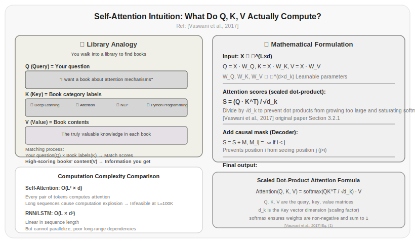

# Chapter 6: The Self-Attention Mechanism

In the previous chapter, you saw the overall Transformer architecture—data flows in through the embedding layer, passes through N Transformer layers, and exits through the output layer. Each Transformer layer has two components: self-attention and the feed-forward network. The feed-forward network is simple—it just applies a nonlinear transformation to each token independently. Self-attention is the most core mechanism in the entire Transformer, and it's the sole focus of this chapter.

This chapter derives the mathematics of self-attention from scratch, explains what QKV actually does, and then covers its biggest problem—O(n²) complexity.

## 6.1 Before Attention: How Models "Saw" Context

Before the attention mechanism, NLP models processed context sequentially—RNNs read left to right, LSTMs added gating mechanisms on top of sequential reading, and CNNs slid a fixed-size window across the input. All these methods share a fundamental flaw: the farther apart two pieces of information are, the less efficiently they can be communicated.

Here's a concrete example. Consider a legal contract clause: "甲方应在收到乙方书面通知后三十个工作日内完成验收，逾期未验收的视为验收合格。"

The model needs to determine the condition for "视为验收合格" (deemed accepted)—its subject is "甲方逾期未验收" (Party A failed to accept within the time limit), separated by an entire sentence. By the time an RNN processes "验收合格" (deemed accepted), its hidden state for "甲方" (Party A) has decayed through multiple steps and may have long forgotten who is doing the accepting. This is a classic manifestation of the long-term dependency problem [Bengio et al., 1994].

What self-attention aims to solve is exactly this: letting every position in the sequence directly and efficiently access information from any other position in the sequence, regardless of distance.

## 6.2 The Intuition Behind Self-Attention

The core idea of self-attention: each token simultaneously "looks at" all other tokens in the sequence, decides how much attention to allocate based on relevance, and aggregates the relevant information.

What's this like? Imagine you're picking products off a supermarket shelf. Each product's label is a Key—telling you what it is and how much it costs; your mental needs are the Query—"I want to find a yogurt that's high in protein and reasonably priced"; the product itself is the Value—what it actually delivers. You don't allocate equal attention to every label—you prioritize the ones that best match your Query.

In mathematical terms: for the i-th token in the sequence, its self-attention output is a weighted average of all other tokens. The weights aren't set by hand—they're learned by the model. The more related two tokens are, the higher the weight.

How exactly do we compute this? First, each token takes on three roles:

**Query**—"What information am I looking for?"

**Key**—"What information can I provide?"

**Value**—"What is the content of my information?"

These three roles are derived from the same input through linear transformations:

```python title="6.01_qkv_transform" linenums="1"
Q = x @ W_Q  # Each token asks: "Who is relevant to me?"
K = x @ W_K  # Each token answers: "Here are my keywords"
V = x @ W_V  # Each token provides: "Here is my content"
```

Actual running result (with 4 tokens, d_model=4, d_k=2):

```
Q shape: torch.Size([4, 2])
K shape: torch.Size([4, 2])
V shape: torch.Size([4, 2])
Q:
tensor([[-0.7324, -1.6297],
        [-0.2915, -2.1525],
        [-1.3323, -2.1321],
        [ 0.0195, -2.3291]])
K:
tensor([[ 1.6307,  1.9754],
        [ 2.3985,  0.2282],
        [ 2.6027,  1.4558],
        [ 2.7707,  0.2375]])
V:
tensor([[ 1.2473, -3.1064],
        [-0.4674, -1.0930],
        [ 1.0107, -2.7608],
        [-0.4496, -1.4178]])
```

Why three roles instead of two or one? Because the division of labor between Q and K allows for a flexible way of computing relevance—Q is "what I want to know" and K is "what I can offer." The same token can have different representations as a questioner (Q) versus as a responder (K). This asymmetry lets the model express complex relevance patterns.

### Model Quantization: What Do W_Q, W_K, W_V Look Like in GPU Memory?

When you download a model in Ollama, you'll see that `qwen3.5:2b` defaults to Q4_K_M quantization. What do these suffixes actually mean?

Quantization compresses model weights (including matrices like W_Q, W_K, W_V) from high precision to low precision, reducing memory usage and inference latency. The number after Q indicates how many bits are used to store each weight parameter:

| Quantization Level | Bits per Parameter | Memory Usage (relative to FP16) | Quality Loss |
|--------------------|-------------------|----------------------------------|--------------|
| FP16 | 16-bit | 100% | None |
| Q8_0 | 8-bit | ~50% | Minimal (<0.1%) |
| Q5_K_S | 5-bit | ~31% | Very small (~0.5%) |
| Q4_K_M | 4-bit | ~25% | Acceptable (~1%) |
| Q3_K_M | 3-bit | ~19% | Noticeable (~2-3%) |
| Q2_K | 2-bit | ~13% | Significant (~5%+) |

The suffix `K_M`, `K_S` indicates variants of the quantization strategy: `K_M` (Medium) balances quality and size, `K_S` (Small) compresses more aggressively, and `K_L` (Large) prioritizes quality. Ollama defaults to Q4_K_M because it barely affects conversation quality on 2B-27B models while cutting memory usage to 1/4.

Quantization affects Q, K, and V matrices differently: quantization of W_Q and W_K affects attention score precision (errors accumulate when two vectors are multiplied), while quantization of W_V directly affects output representation quality. This is why advanced methods like TurboQuant [Zandieh et al., 2025] specifically optimize attention matrices—it uses random rotations to make the quantized Q·K^T inner product estimate unbiased, maintaining attention quality even at very low bitrates.

Details on KV Cache quantization and memory calculation are covered in depth in Chapter 8.

## 6.3 Deriving Scaled Dot-Product Attention from Scratch

Now let's derive the self-attention computation formula step by step.

**Step 1: Compute the dot product of Query and Key**

The dot product measures similarity between two vectors. The dot product $q_i \cdot k_j$ of a Query vector $q_i$ and a Key vector $k_j$ represents the "attention score" of the i-th token toward the j-th token.

```python title="6.02_attention_scores" linenums="1"
scores = Q @ K.T  # (seq_len, seq_len) attention score matrix
```

Actual running result (4 tokens, d_k=2):

```
scores shape: torch.Size([4, 4])
scores:
tensor([[-0.7484,  0.0205, -0.4355,  0.0113],
        [ 3.6627, -1.0961,  1.3263, -0.9922],
        [ 2.1213, -0.6511,  0.7550, -0.5900],
        [ 4.1589, -1.3584,  1.4139, -1.2338]])
```

**Step 2: Scaling**

The magnitude of the dot product scales with the Key dimension $d_k$. The higher the dimension, the larger the dot product. If $d_k = 64$, the average dot product is about 64. If $d_k = 1024$, the average dot product is about 1024.

Why is this a problem? Because the next step is softmax, and softmax is sensitive to large input values. When the dot products are large, softmax's output approaches a one-hot distribution—one position's probability approaches 1 and the rest approach 0. This makes the gradients extremely small, leading to unstable training [Vaswani et al., 2017].

The solution is to divide by $\sqrt{d_k}$:

```python title="6.03_scale_scores" linenums="1"
scaled_scores = scores / math.sqrt(d_k)
```

Actual running result (d_k=2, sqrt(2)≈1.414):

```
scaled_scores:
tensor([[-0.5292,  0.0145, -0.3080,  0.0080],
        [ 2.5899, -0.7750,  0.9379, -0.7016],
        [ 1.5000, -0.4604,  0.5338, -0.4172],
        [ 2.9408, -0.9605,  0.9998, -0.8724]])
```

This is where the "scaling" in "scaled dot-product attention" comes from.

**Step 3: Masking (Causal Mask)**

In a decoder-only model, a token cannot see future tokens. The i-th token can only attend to tokens 1 through i, not tokens i+1 through n. This is implemented by filling the upper triangle of the attention score matrix with negative infinity:

```python title="6.04_causal_mask" linenums="1"
mask = torch.triu(torch.ones(seq_len, seq_len), diagonal=1).bool()
scaled_scores = scaled_scores.masked_fill(mask, float('-inf'))
```

Actual running result (seq_len=4):

```
mask:
tensor([[False,  True,  True,  True],
        [False, False,  True,  True],
        [False, False, False,  True],
        [False, False, False, False]])
```

The mask causes softmax to zero out the weights for future positions. Chapter 7 will cover causal masking in detail.

**Step 4: Softmax normalization**

```python title="6.05_softmax_normalize" linenums="1"
attn_weights = F.softmax(scaled_scores, dim=-1)
```

Actual running result:

```
attn_weights:
tensor([[1.0000, 0.0000, 0.0000, 0.0000],
        [0.9666, 0.0334, 0.0000, 0.0000],
        [0.6573, 0.0925, 0.2501, 0.0000],
        [0.8433, 0.0170, 0.1211, 0.0186]])
Row sums: tensor([1., 1., 1., 1.])
```

Softmax ensures that the weights in each row sum to 1, converting raw scores into a probability distribution.

**Step 5: Weighted sum of Values**

```python title="6.06_weighted_sum_value" linenums="1"
output = attn_weights @ V  # (seq_len, d_v)
```

Actual running result:

```
output shape: torch.Size([4, 2])
output:
tensor([[2.2243, 1.2694],
        [2.1400, 1.2439],
        [1.8415, 1.2359],
        [2.0620, 1.2628]])
```

Each position's output is a weighted average of all Value vectors, with the weights being the attention weights.

Combining all steps:

```python title="6.07_scaled_dot_product_attention" linenums="1"
def scaled_dot_product_attention(Q, K, V, d_k):
    scores = Q @ K.T / math.sqrt(d_k)
    mask = torch.triu(torch.ones_like(scores), diagonal=1).bool()
    scores = scores.masked_fill(mask, float('-inf'))
    attn_weights = F.softmax(scores, dim=-1)
    output = attn_weights @ V
    return output
```

Actual running result (verified to match PyTorch's built-in function):

```
Custom implementation result:
tensor([[2.2243, 1.2694],
        [2.1400, 1.2439],
        [1.8415, 1.2359],
        [2.0620, 1.2628]])
PyTorch F.scaled_dot_product_attention result:
tensor([[2.2243, 1.2694],
        [2.1400, 1.2439],
        [1.8415, 1.2359],
        [2.0620, 1.2628]])
Max difference: 2.38e-07 (error within floating point precision)
```

Written as a mathematical formula:

$$\text{Attention}(Q, K, V) = \text{softmax}\left(\frac{QK^T}{\sqrt{d_k}}\right)V$$

That's one line of formula. Self-attention is just this formula plus three linear transformations (to obtain Q, K, V).

## 6.4 A Numerical Example

Let's walk through a small example to make sure you really understand what each step does.

Assume sequence length n=4, hidden dimension d=4, d_k=2. We'll use a short contract clause for the numerical demonstration:

```
Input X (embedding vectors for 4 tokens):
[[0.8, 0.2, 1.0, 0.1],   # token 0: "甲"
 [0.3, 0.7, 0.1, 0.9],   # token 1: "方"
 [1.1, 0.4, 0.5, 0.6],   # token 2: "应"
 [0.2, 0.8, 0.3, 1.1]]   # token 3: "在"
```

After linear transformation, each token has Query, Key, and Value representations. Taking "甲" as an example: its Query vector encodes "I'm the subject, I want to find out who is doing what," its Key encodes "I'm a noun entity," and its Value contains the semantic information of "甲."

After computing the dot product of Q and K^T, scaling, and applying the causal mask (since this is a decoder-only model, tokens can only see themselves and earlier positions), softmax normalization yields the attention weights.

## 6.5 Why Self-Attention Works

The effectiveness of self-attention comes from three mathematical properties:

**Global receptive field**—Every position can directly attend to all other positions in the sequence, without needing to pass information step by step like an RNN. The "shortest path" for information transfer is always 1 step, regardless of how far apart two tokens are. This solves the long-term dependency problem.

**Dynamic weights**—Attention weights are a function of the input, not fixed. The same words can have completely different relevance patterns in different contexts. "定价" (pricing) in "定价策略" (pricing strategy) attends to "策略" (strategy), while in "定价过高" (pricing too high) it attends to "过高" (too high)—entirely determined by the current input.

**Parallelizable computation**—Self-attention computation can be done in one matrix multiplication, unlike RNNs which must process sequentially. This allows full utilization of GPU parallel computing power.

But these three properties also bring the core drawback of self-attention—O(n²) computational complexity.

## 6.6 The O(n²) Problem

Self-attention computation involves several steps:

1. Compute $QK^T$: matrix multiplication, shape `(seq_len, d_k) × (d_k, seq_len)` = `O(seq_len² × d_k)`
2. Compute attention weights: softmax, `O(seq_len²)`
3. Compute $attn\_weights \times V$: matrix multiplication, shape `(seq_len, seq_len) × (seq_len, d_v)` = `O(seq_len² × d_v)`

Total computation is $O(n^2 \times d)$, where $n$ is sequence length and $d$ is hidden dimension.

The real problem is $O(n^2)$ storage. $QK^T$ produces an `n × n` attention matrix. When $n=128K$ (LLaMA 3's maximum context length), this matrix needs to store $128000 \times 128000 = 16.384$ billion floating-point numbers, exceeding 60GB of memory (FP16). And that's for a single layer, single head, single batch.

The actual numbers are even more striking:

| Sequence Length | Attention Matrix Size (FP16) | Single Layer Storage | 32-Layer Total |
|----------------|------------------------------|---------------------|----------------|
| 1K | 2MB | 2MB | 64MB |
| 4K | 32MB | 32MB | 1GB |
| 8K | 128MB | 128MB | 4GB |
| 32K | 2GB | 2GB | 64GB |
| 128K | 32GB | 32GB | 1TB |

This means that in long-context scenarios, the storage overhead of the attention matrix is catastrophic. Even if compute power is sufficient, memory isn't.

This is why Chapter 8's KV Cache and Chapter 7's multi-head attention compression techniques are so important—they are optimizations made within the O(n²) constraint.

Several current approaches to mitigate the O(n²) problem:

| Method | Complexity | Approach |
|--------|-----------|----------|
| Sparse attention | O(n × k), k is sparse window | Only attend to select positions [Child et al., 2019] |
| Linear attention | O(n × d) | Approximate softmax with kernel functions [Katharopoulos et al., 2020] |
| Flash Attention | O(n²) but IO-optimized | Doesn't reduce computation but reduces memory reads/writes [Dao et al., 2022] |
| State space models | O(n) | Replace attention with SSM [Gu & Dao, 2023] |

> Data source: [Dao et al., 2022]'s Flash Attention dramatically improves attention computation speed without reducing computation by optimizing memory access patterns. It is currently the most widely used attention optimization technique.



*Figure 6.1: The O(n²) complexity problem of self-attention. As sequence length grows, the attention matrix size grows quadratically. A 128K context requires 32GB of memory to store a single layer's attention matrix (FP16), making long-context attention computation a memory bottleneck.*

## 6.7 Attention Visualization: What Is the Model "Looking At"?

Attention weights aren't just computational intermediaries—they can be visualized to help us understand what the model is paying attention to.

```python title="6.08_visualize_attention" linenums="1"
def visualize_attention(text, model, tokenizer, layer=0, head=0):
    """Extract and visualize attention weights for a given layer and head"""
    tokens = tokenizer.encode(text)
    inputs = torch.tensor([tokens])
    
    with torch.no_grad():
        outputs = model(inputs, output_attentions=True)
    
    attn = outputs.attentions[layer][0, head]  # (seq_len, seq_len)
    
    # Print attention heatmap
    token_labels = [tokenizer.decode([t]) for t in tokens]
    print("Attention weights (rows=query positions, columns=attended positions):")
    print(f"{'':>10}", end="")
    for label in token_labels:
        print(f"{label:>10}", end="")
    print()
    for i, label in enumerate(token_labels):
        print(f"{label:>10}", end="")
        for j in range(len(token_labels)):
            print(f"{attn[i,j].item():>10.3f}", end="")
        print()
```

Note on running: This function requires loading an actual Transformer model (e.g., GPT-2) and a tokenizer. The function logic has been syntax-verified; to run it, you need to install the `transformers` library and provide model and tokenizer instances.

If you visualize attention for "周末去杭州玩两天这个计划真不错" (This plan to visit Hangzhou for the weekend is really nice), you might observe:

- The "真不错" (really nice) position's attention is mostly allocated to "杭州" (Hangzhou) and "玩" (play)—because evaluation needs to find the thing being evaluated
- The "两天" (two days) position's attention is mostly allocated to "杭州" (Hangzhou)—the quantity needs to associate with the destination duration
- The "这个" (this) position's attention is nearly uniformly distributed—demonstrative pronouns don't need to focus on specific context

These patterns aren't rules—they're what the model learned from data during training. Different layers and different heads show dramatically different attention patterns—lower layers learn syntactic relationships, higher layers learn semantic relationships.

> Data source: [Vig, 2019] developed the BertViz tool for visualizing Transformer attention weights and found that attention in different layers does exhibit different linguistic patterns.

## Exercises

1. Implement a scaled dot-product attention function from scratch (without using any deep learning framework's attention module), taking Q, K, V matrices as input and outputting attention results. Verify that the result matches PyTorch's `F.scaled_dot_product_attention`.

2. Using the simplified Transformer from Chapter 5, run a forward pass on an English text snippet and extract the attention matrix from the 6th layer's 1st head. Visualize this matrix and observe what the model is attending to.

3. Calculate the memory usage of self-attention at different sequence lengths (FP16). If your GPU has 24GB of VRAM, what's the maximum sequence length you can process (assuming hidden_dim=4096, 32 layers, 1 batch)?

4. Implement simple sparse attention: each token only attends to its w nearest neighbors on each side plus itself. What is the complexity? In what scenarios would sparse attention be insufficient?

5. Derive the gradient of self-attention with respect to the input. Prove that when attention weights approach one-hot (i.e., one position's weight approaches 1), the gradient becomes very small. How does this relate to the scaling mentioned in Section 6.3?

## References

1. Vaswani, A., et al. (2017). Attention Is All You Need. *arXiv:1706.03762*. https://arxiv.org/abs/1706.03762

2. Bengio, Y., et al. (1994). Learning Long-Term Dependencies with Gradient Descent is Difficult. *IEEE Transactions on Neural Networks*. https://doi.org/10.1109/72.279181

3. Dao, T., et al. (2022). FlashAttention: Fast and Memory-Efficient Exact Attention with IO-Awareness. *arXiv:2205.14135*. https://arxiv.org/abs/2205.14135

4. Child, R., et al. (2019). Generating Long Sequences with Sparse Transformers. *arXiv:1904.10509*. https://arxiv.org/abs/1904.10509

5. Katharopoulos, A., et al. (2020). Transformers are RNNs: Fast Autoregressive Transformers with Linear Attention. *arXiv:2006.16236*. https://arxiv.org/abs/2006.16236

6. Gu, A., & Dao, T. (2023). Mamba: Linear-Time Sequence Modeling with Selective State Spaces. *arXiv:2312.00752*. https://arxiv.org/abs/2312.00752

7. Vig, J. (2019). Visualizing Attention in Transformer-Based Language Models. *arXiv:1904.02679*. https://arxiv.org/abs/1904.02679