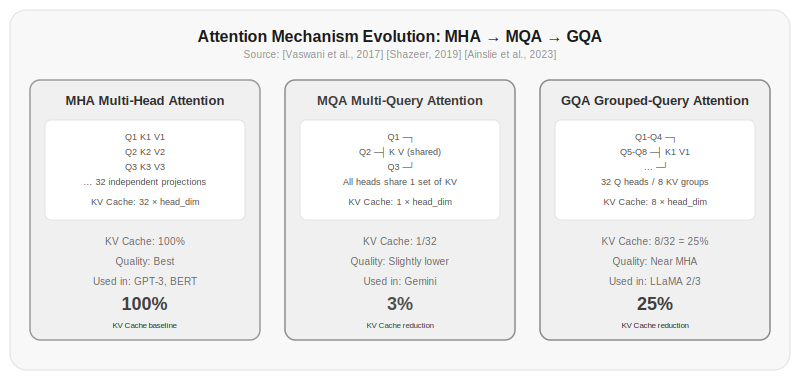

# Chapter 7: Multi-Head Attention and Causal Masking

Chapter 6 covered the computation of self-attention—how each token establishes connections with all other tokens through the QKV mechanism. But there's an unresolved problem: if all tokens use a single set of QKV, attention can only capture one type of relevance pattern. Relevance in language is diverse—syntactic relationships are one kind, semantic relationships are another, and coreference relationships are yet another. A single sentence needs to handle multiple kinds of relationships simultaneously.

This chapter explains how multi-head attention solves this problem, and how causal masking prevents the model from "peeking at the future."

## 7.1 One Head Is Not Enough

Imagine you're reviewing a technical proposal document. To judge whether the proposal is feasible, you need to simultaneously consider:

1. **Technical consistency**—whether the technology stack referenced in the proposal is internally coherent
2. **Logical coherence**—whether the requirements described earlier align with the design decisions that follow
3. **Completeness**—whether there are missing edge cases or exception handlers

If there's only one set of QKV, the model can only learn one attention pattern. It might learn to focus on technical terminology correlations and miss logical coherence; or learn logical coherence and miss completeness checks.

Multi-head attention's solution is straightforward: since one set of QKV can only learn one pattern, use multiple sets. Each independent set of QKV learns a different attention pattern, and finally concatenate the results from all patterns.

It's like examining a painting through different filters—a red filter for composition, a green filter for color tone, a blue filter for details. Each filter represents a "head," and all filters overlaid together give the complete technical assessment.

## 7.2 The Mathematics of Multi-Head Attention

Multi-head attention computation has three steps:

**Step 1: Each head computes attention independently**

The $h$-th head has its own QKV projection matrices $W_Q^{(h)}, W_K^{(h)}, W_V^{(h)}$. Each head's computation is exactly the same as single-head attention from Chapter 6:

$$\text{head}_h = \text{Attention}(Q W_Q^{(h)}, K W_K^{(h)}, V W_V^{(h)})$$

**Step 2: Concatenate all heads' outputs**

$$\text{MultiHead} = \text{Concat}(\text{head}_1, \text{head}_2, \ldots, \text{head}_H)$$

If each head's dimension is $d_k = d/H$ ($d$ is the hidden dimension, $H$ is the number of heads), the concatenated dimension is $H \times d_k = d$—exactly matching the original hidden dimension.

**Step 3: Linear transformation**

$$\text{output} = \text{MultiHead} \times W_O$$

$W_O$ is a $(d, d)$ projection matrix that maps the concatenated multi-head results to the final representation space.

```python title="7.01_multihead_attention" linenums="1"
class MultiHeadAttention(nn.Module):
    def __init__(self, hidden_dim, num_heads):
        super().__init__()
        self.num_heads = num_heads
        self.head_dim = hidden_dim // num_heads
        
        self.q_proj = nn.Linear(hidden_dim, hidden_dim)
        self.k_proj = nn.Linear(hidden_dim, hidden_dim)
        self.v_proj = nn.Linear(hidden_dim, hidden_dim)
        self.o_proj = nn.Linear(hidden_dim, hidden_dim)
    
    def forward(self, x):
        batch_size, seq_len, _ = x.shape
        
        # Split into heads
        Q = self.q_proj(x).view(batch_size, seq_len, self.num_heads, self.head_dim).transpose(1, 2)
        K = self.k_proj(x).view(batch_size, seq_len, self.num_heads, self.head_dim).transpose(1, 2)
        V = self.v_proj(x).view(batch_size, seq_len, self.num_heads, self.head_dim).transpose(1, 2)
        
        # Compute attention independently per head
        attn_weights = torch.matmul(Q, K.transpose(-2, -1)) / math.sqrt(self.head_dim)
        
        # Causal mask
        mask = torch.triu(torch.ones(seq_len, seq_len, device=x.device), diagonal=1).bool()
        attn_weights = attn_weights.masked_fill(mask, float('-inf'))
        attn_weights = F.softmax(attn_weights, dim=-1)
        
        attn_output = torch.matmul(attn_weights, V)
        
        # Concatenate all heads
        attn_output = attn_output.transpose(1, 2).contiguous().view(batch_size, seq_len, -1)
        
        # Output projection
        return self.o_proj(attn_output)
```

Actual running result (hidden_dim=64, num_heads=4, seq_len=4):

```
Input shape: torch.Size([1, 4, 64])
Output shape: torch.Size([1, 4, 64])
Parameters: 16640

Changing the number of heads, parameter count stays the same:
Heads=4,  Parameters=16640
Heads=8,  Parameters=16640
Heads=16, Parameters=16640
Heads=32, Parameters=16640
```

Notable design choices:

**Hidden dimension stays the same**—Multi-head attention has the same total parameter count as single-head attention. Single-head attention's $W_Q$ has shape $(d, d)$, while multi-head attention has $H$ projection matrices of $(d, d/H)$ each, with the same total parameter count of $d \times d$. This shows that multi-head attention doesn't use more parameters to gain more capability—it uses the same parameters to learn more diverse patterns.

**Each head's dimension is smaller**—Each head only looks at a $d/H$-dimensional subspace. But when all heads are concatenated, the dimension is back to $d$. This "divide and conquer" strategy lets each head focus on a subspace of the information.

## 7.3 Parameter Count of Multi-Head Attention

Multi-head attention parameters come from four projection matrices $W_Q, W_K, W_V, W_O$:

| Matrix | Shape | Parameters |
|--------|-------|------------|
| $W_Q$ | $(d, d)$ | $d^2$ |
| $W_K$ | $(d, d)$ | $d^2$ |
| $W_V$ | $(d, d)$ | $d^2$ |
| $W_O$ | $(d, d)$ | $d^2$ |
| **Total** | - | $4d^2$ |

If $d=4096$, a single layer of multi-head attention has $4 \times 4096^2 \approx 67M$ parameters. One layer is 67M, and 32 layers is about 2.1B. This accounts for roughly 26% of LLaMA 3 8B's total parameters.

Note, however, that regardless of the number of heads, the total parameter count of these four matrices remains the same. 8 heads and 32 heads have exactly the same parameter count—the difference is only in the tensor shapes during computation.

## 7.4 Causal Masking: Don't Look at the Future

When a decoder-only model generates text, it does so autoregressively—one token at a time. The i-th token can only predict the (i+1)-th token based on tokens 1 through i. If the i-th token could see tokens after i+1, it would be "peeking at the future," and the model's training objective would be meaningless.

Causal masking implements this by filling the upper triangle of the attention matrix with negative infinity.

Why negative infinity and not zero? Because softmax's formula is:

$$\text{softmax}(x_i) = \frac{e^{x_i}}{\sum_j e^{x_j}}$$

If the masked positions had a value of zero instead of negative infinity, $e^0 = 1$, and these positions would still contribute to the softmax denominator, diluting the weights of visible positions. Setting masked positions to negative infinity makes $e^{-\infty} = 0$, so these positions have zero effect on normalization.

```python title="7.02_causal_mask" linenums="1"
def apply_causal_mask(attn_scores):
    """Apply causal mask"""
    seq_len = attn_scores.shape[-1]
    # Upper triangular matrix (excluding diagonal) is True
    mask = torch.triu(torch.ones(seq_len, seq_len), diagonal=1).bool()
    # Set True positions to negative infinity
    attn_scores = attn_scores.masked_fill(mask, float('-inf'))
    return attn_scores
```

Actual running result (4×4 random attention matrix):

```
Original attention scores:
tensor([[ 1.9269,  1.4873,  0.9007, -2.1055],
        [ 0.6784, -1.2345, -0.0431, -1.6047],
        [-0.7521,  1.6487, -0.3925, -1.4036],
        [-0.7279, -0.5594, -0.7688,  0.7624]])

After applying causal mask:
tensor([[ 1.9269,    -inf,    -inf,    -inf],
        [ 0.6784, -1.2345,    -inf,    -inf],
        [-0.7521,  1.6487, -0.3925,    -inf],
        [-0.7279, -0.5594, -0.7688,  0.7624]])

Attention weights after softmax:
tensor([[1.0000, 0.0000, 0.0000, 0.0000],
        [0.8714, 0.1286, 0.0000, 0.0000],
        [0.0743, 0.8193, 0.1064, 0.0000],
        [0.1319, 0.1561, 0.1266, 0.5854]])
```

The effect of causal masking is clearly visible in the attention matrix. For a sequence of length 4, the masked attention matrix looks like:

```
[1.00, 0.00, 0.00, 0.00]    ← Position 0 can only see itself
[0.35, 0.65, 0.00, 0.00]    ← Position 1 can see 0 and 1
[0.20, 0.30, 0.50, 0.00]    ← Position 2 can see 0, 1, 2
[0.15, 0.25, 0.20, 0.40]    ← Position 3 can see all positions
```

Each row's attention weights are distributed only across the current and earlier positions; later positions' weights are forced to zero by the causal mask.

An important consequence of causal masking: **the attention matrix is lower triangular**. This means positions earlier in the sequence can see less context, while positions later in the sequence can see more context. This asymmetry is an inherent property of decoder-only models.

> Data source: [Vaswani et al., 2017]'s original Transformer paper used causal masking in the decoder and full attention (no masking) in the encoder. Decoder-only models use causal masking uniformly.

## 7.5 Multi-Query Attention (MQA)

In traditional multi-head attention, each head has its own Q, K, and V projections. If the model has 32 heads, each layer needs 32 sets of K and V projections. The KV Cache is correspondingly 32 times larger (covered in detail in Chapter 8).

[Shazeer, 2019] proposed a bold idea: all heads share the same set of K and V, while only Q remains multi-headed. This is Multi-Query Attention (MQA).

```python title="7.03_mqa" linenums="1"
class MQA(nn.Module):
    def __init__(self, hidden_dim, num_heads):
        super().__init__()
        self.num_heads = num_heads
        self.head_dim = hidden_dim // num_heads
        
        # Multiple Query heads
        self.q_proj = nn.Linear(hidden_dim, hidden_dim)
        # Only one set of K and V!
        self.k_proj = nn.Linear(hidden_dim, self.head_dim)   # Not hidden_dim
        self.v_proj = nn.Linear(hidden_dim, self.head_dim)   # Not hidden_dim
        self.o_proj = nn.Linear(hidden_dim, hidden_dim)
    
    def forward(self, x):
        B, S, _ = x.shape
        
        Q = self.q_proj(x).view(B, S, self.num_heads, self.head_dim).transpose(1, 2)
        K = self.k_proj(x).view(B, S, 1, self.head_dim).transpose(1, 2)      # (B, 1, S, d_k)
        V = self.v_proj(x).view(B, S, 1, self.head_dim).transpose(1, 2)      # (B, 1, S, d_k)
        
        # Broadcasting: K and V are shared across all heads
        attn = F.scaled_dot_product_attention(Q, K, V)
        
        attn = attn.transpose(1, 2).contiguous().view(B, S, -1)
        return self.o_proj(attn)
```

Actual running result (hidden_dim=64, num_heads=8):

```
Input shape: torch.Size([1, 4, 64])
Output shape: torch.Size([1, 4, 64])
MQA parameters: 9360
MHA parameters: 16384
MQA/MHA parameter ratio: 0.571
```

Impacts of MQA:



*Figure 7.1: Evolution of attention mechanisms from MHA to MQA to GQA. MHA has independent KV projections for each head with the largest KV Cache; MQA shares one set of KV across all heads with the smallest KV Cache but with some quality loss; GQA strikes a balance, grouping heads to share KV, balancing quality and efficiency. LLaMA 2/3 uses GQA-8 (32 Q heads / 8 KV groups).*

**KV Cache shrinks to 1/H of original**—Originally each layer caches H sets of K and V per token; now only 1 set is needed. For a 32-head model, the KV Cache shrinks by 32 times. This means the same GPU memory can serve 32 times more concurrent requests, or support 32 times longer contexts.

**Significant inference speedup**—With a smaller KV Cache, the latency of reading KV from GPU memory is also reduced. The memory bandwidth bottleneck during inference is alleviated.

**Slight quality degradation**—K and V parameters go from $2 \times d^2$ to $2 \times d \times (d/H) = 2d^2/H$, reducing expressiveness. [Shazeer, 2019]'s experiments showed MQA only has a slight performance drop on translation tasks (about 0.5-1 BLEU point), but inference speed improved several fold.

The Gemini series of models uses MQA [Google, 2023].

> Data source: [Shazeer, 2019]'s MQA paper was the first to systematically analyze "the tradeoff between reducing KV head count and speed versus quality."

## 7.6 Grouped-Query Attention (GQA)

MQA is too aggressive—sharing one set of K and V across all heads incurs a non-negligible loss in expressiveness. Traditional multi-head attention (MHA) is too conservative—each set of KV is used independently, creating high inference overhead.

[Ainslie et al., 2023] proposed Grouped-Query Attention (GQA), striking a balance between MHA and MQA:

**MHA**—H Query heads, H sets of K/V
**GQA**—H Query heads, G sets of K/V (G < H)
**MQA**—H Query heads, 1 set of K/V

GQA divides the Query heads into G groups, and within each group, heads share the same set of K/V:

```python title="7.04_gqa" linenums="1"
class GQA(nn.Module):
    def __init__(self, hidden_dim, num_heads, num_kv_heads):
        super().__init__()
        self.num_heads = num_heads           # Number of Query heads, e.g., 32
        self.num_kv_heads = num_kv_heads     # Number of KV groups, e.g., 8
        self.num_groups = num_heads // num_kv_heads  # Query heads per group, e.g., 4
        self.head_dim = hidden_dim // num_heads
        
        self.q_proj = nn.Linear(hidden_dim, hidden_dim)
        self.k_proj = nn.Linear(hidden_dim, num_kv_heads * self.head_dim)
        self.v_proj = nn.Linear(hidden_dim, num_kv_heads * self.head_dim)
        self.o_proj = nn.Linear(hidden_dim, hidden_dim)
    
    def forward(self, x):
        B, S, _ = x.shape
        
        Q = self.q_proj(x).view(B, S, self.num_heads, self.head_dim).transpose(1, 2)
        K = self.k_proj(x).view(B, S, self.num_kv_heads, self.head_dim).transpose(1, 2)
        V = self.v_proj(x).view(B, S, self.num_kv_heads, self.head_dim).transpose(1, 2)
        
        # Expand K and V to match Q's head count
        # (B, num_kv_heads, S, head_dim) → (B, num_heads, S, head_dim)
        K = K.repeat_interleave(self.num_groups, dim=1)
        V = V.repeat_interleave(self.num_groups, dim=1)
        
        attn = F.scaled_dot_product_attention(Q, K, V)
        attn = attn.transpose(1, 2).contiguous().view(B, S, -1)
        return self.o_proj(attn)
```

Actual running result (hidden_dim=64, num_heads=8):

```
Input shape: torch.Size([1, 4, 64])
Output shape: torch.Size([1, 4, 64])
GQA(kv_heads=2) parameters: 10400

Parameter count comparison across different KV group counts:
KV groups=8, Parameters=16640  (equivalent to MHA)
KV groups=4, Parameters=12480
KV groups=2, Parameters=10400
KV groups=1, Parameters=9360   (equivalent to MQA)
```

Comparison across configurations:

| Configuration | Query Heads | KV Groups | KV Cache Relative Size | Quality |
|--------------|-------------|-----------|----------------------|---------|
| MHA | 32 | 32 | 100% | Best |
| GQA-8 | 32 | 8 | 25% | Close to MHA |
| GQA-4 | 32 | 4 | 12.5% | Slightly below GQA-8 |
| GQA-2 | 32 | 2 | 6.25% | Noticeably below MHA |
| MQA | 32 | 1 | 3.125% | Lowest |

[Ainslie et al., 2023]'s experiments showed that GQA-8 (8 KV groups) performs almost as well as MHA, but with only 25% of the KV Cache. This is currently the best cost-performance option—LLaMA 2 70B and the entire LLaMA 3 series use GQA.

> Data source: [Ainslie et al., 2023]'s GQA paper compared the impact of different KV group counts on model speed and quality. LLaMA 2 70B uses 8 KV groups, i.e., GQA-8.

## 7.7 Why GQA Is Better Than MQA

Intuitively, GQA finds a sweet spot between MHA and MQA. But why are 8 KV groups enough while 1 is not?

The reason lies in the balance between Query diversity and Key/Value generality. Different Query heads need different attention patterns—one head focuses on syntax, another on semantics. But Keys and Values serve a more general purpose—they answer "what information can I provide," not "how do I want to use this information."

GQA-8 means 8 different Key/Value representation spaces. 8 representation spaces are enough to express different types of information without needing 32. Experimental data supports this—going from 32 KV groups down to 8, quality barely changes; going from 8 to 1, quality drops noticeably.

From an engineering perspective, GQA's advantage is even more pronounced. During inference, the size of the KV Cache directly determines how many requests can be served simultaneously. GQA-8 compresses the KV Cache to 25%, meaning the same hardware can serve 4 times the concurrency.

## Exercises

1. Implement a multi-head attention module with input shape `(batch_size, seq_len, hidden_dim)` and the same output shape. Run a forward pass with random data and verify the output shape is correct. Change the number of heads (4, 8, 16, 32) and observe whether the parameter count changes.

2. For a trained small model (e.g., GPT-2), extract attention matrices from different layers and heads. After visualization, observe: what do lower and higher layers attend to respectively? Are there obvious pattern differences between different heads?

3. Implement MQA and GQA, and compare them with MHA in terms of parameter count, KV Cache size, and forward pass speed. Using an 8-head model, implement MHA (8 KV groups), GQA (4 and 2 KV groups), and MQA (1 KV group) respectively.

4. Prove that causal masking doesn't limit the model's expressiveness—i.e., any function that can be represented with full attention can also be represented with causal attention (hint: the full attention matrix can be decomposed into the sum of a lower triangular matrix and an upper triangular matrix, but causal attention only needs the lower triangular part to achieve the same effect, because right-to-left information flow is unnecessary).

5. Write a KV Cache calculator: given model configuration (number of layers, number of heads, number of KV groups, head dimension, sequence length, precision), calculate KV Cache sizes for MHA and GQA. Make a table comparing KV Cache for LLaMA 3 8B (32 layers, 32 heads, 8 KV groups) under MHA and GQA.

## References

1. Vaswani, A., et al. (2017). Attention Is All You Need. *arXiv:1706.03762*. https://arxiv.org/abs/1706.03762

2. Shazeer, N. (2019). Fast Transformer Decoding: One Write-Head is All You Need. *arXiv:1911.02150*. https://arxiv.org/abs/1911.02150

3. Ainslie, J., et al. (2023). GQA: Training Generalized Multi-Query Transformer Models from Multi-Head Checkpoints. *arXiv:2305.13245*. https://arxiv.org/abs/2305.13245

4. Google. (2023). Gemini: A Family of Highly Capable Multimodal Models. *Technical Report*. https://blog.google/technology/ai/gemini/

5. Touvron, H., et al. (2023). LLaMA 2: Open Foundation and Fine-Tuned Chat Models. *arXiv:2307.09288*. https://arxiv.org/abs/2307.09288

6. Dubey, A., et al. (2024). The LLaMA 3 Herd of Models. *arXiv:2407.21783*. https://arxiv.org/abs/2407.21783