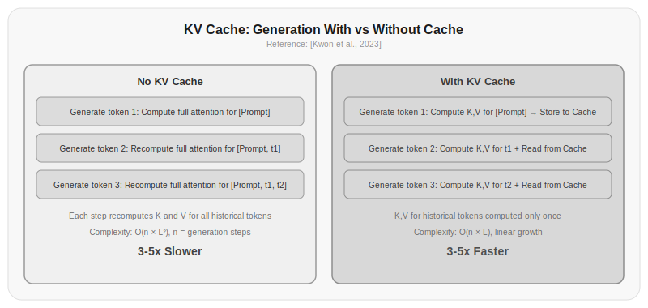
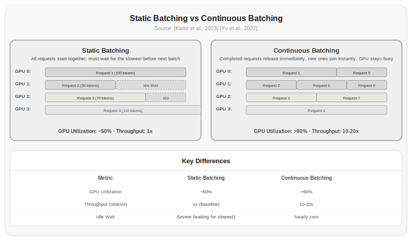

# Chapter 8: KV Cache

Chapter 7 covered multi-head attention and causal masking. You saw how attention matrices are computed and how different attention variants affect the number of KV heads. But those were all about "how the model computes," not "how the model runs fast."

This chapter is about inference speed. LLM inference is different from training—training processes an entire text at once, while inference generates tokens one at a time. Does the model have to recompute all previous tokens' Keys and Values for every new token? Of course not. KV Cache is the key optimization that avoids this redundant computation.

## 8.1 The Computational Disaster of Autoregressive Generation

LLMs generate text autoregressively—predicting the next token based on all previous tokens. When you input "周末去杭州玩两天，第一天" and ask the model to continue, the process goes like this:

**Step 1**: Input 6 prompt tokens, predict the 1st output token
**Step 2**: Input 7 tokens (prompt + 1st output token), predict the 2nd output token
**Step 3**: Input 8 tokens, predict the 3rd output token
...
**Step m**: Input n+m-1 tokens, generate the m-th output token

The problem: at every step, the model must compute QKV for all existing tokens and then compute attention. But from Step 2 onward, the K and V for the first n tokens are identical to Step 1—because these tokens haven't changed, the model parameters haven't changed, and the linear transformation results are necessarily the same.

Without KV Cache, Step t requires recomputing attention for all existing tokens. It's like re-reading the entire article from the beginning every time you read a new paragraph—you've already understood the earlier paragraphs, but you don't trust your memory and insist on starting over. A huge amount of computation is purely redundant.

$$\sum_{t=1}^{m} (n+t)^2 \times d = O(m \times n^2 \times d + m^2 \times n \times d)$$

Most of this is redundant computation. It's like moving all your furniture all over again every time you move houses—Step 1 you moved everything, Step 2 you move everything again, Step 100 you're still moving everything.

## 8.2 The Core Insight Behind KV Cache

Let's look carefully at the self-attention computation. For the token at position $t$, its attention output is:

$$\text{output}_t = \sum_{j=1}^{t} \alpha_{t,j} \cdot V_j$$

where $\alpha_{t,j}$ is the attention weight and $V_j$ is the Value vector at position $j$.

To compute $\alpha_{t,j}$, we need:

$$\alpha_{t,j} = \text{softmax}\left(\frac{Q_t \cdot K_j}{\sqrt{d_k}}\right)_j$$

See? The current token only needs its own Query ($Q_t$) and all historical positions' Keys and Values.

What about previous positions' Queries? They're not needed. $Q_1$ is only used in Step 1; from Step 2 onward, it's never used again. But $K_1$ and $V_1$ are different—they're needed in Step 2, Step 3, and Step 100.

So the solution is natural: **cache the already-computed Keys and Values, and at each subsequent step, only compute the new token's QKV, then compute attention using the cache plus the new K and V**.

This is KV Cache—only cache Key and Value, not Query.

To use an analogy: Query is like the question you're looking for at the library—you ask it and it's done, no need to keep a record. Key is like the label on each book on the shelf—you refer to it repeatedly, so you must keep it. Value is like the book's content—you might cite it every time, so you must keep it too.

## 8.3 Prefill and Decode: Two Fundamentally Different Phases

With KV Cache, LLM inference clearly separates into two phases:

**Prefill phase**: Process the user's input prompt. This step is parallel—all prompt tokens pass through the model simultaneously, computing and caching all tokens' KV. The computation is $O(n^2 \times d)$, where n is the prompt length.

**Decode phase**: Generate output tokens one at a time. At each step, only compute Q, K, V for the new token, append the new K and V to the cache, and then compute attention using the new Q with all cached K and V. The computation per step is $O((n+t) \times d)$—linear in current sequence length, no longer quadratic.

```python title="8.01_generate_with_kv_cache" linenums="1"
def generate_with_kv_cache(model, prompt_ids, max_new_tokens=100):
    # Prefill: process all prompt tokens at once
    kv_cache = None
    logits, kv_cache = model(prompt_ids, kv_cache=kv_cache, use_cache=True)
    next_token = sample(logits[:, -1, :])
    generated = [next_token]
    
    # Decode: generate tokens one at a time
    for _ in range(max_new_tokens - 1):
        logits, kv_cache = model(
            next_token.unsqueeze(0),  # Only 1 new token
            kv_cache=kv_cache,
            use_cache=True
        )
        next_token = sample(logits[:, -1, :])
        generated.append(next_token)
        
        if next_token == eos_token_id:
            break
    
    return generated
```

> This code is pseudocode illustrating the logical structure of the Prefill and Decode phases. Actual execution requires a complete model, sampler, and tokenizer.

The two phases have completely different performance characteristics:

| Property | Prefill | Decode |
|----------|---------|--------|
| Computation | $O(n^2)$ | $O(n)$ |
| Compute type | Compute-intensive | Memory-bandwidth-intensive |
| Parallelism | High (all tokens processed simultaneously) | Low (only 1 token at a time) |
| Bottleneck | Compute capacity | Memory bandwidth |
| Time share | 10-20% | 80-90% |

The Prefill phase is short but compute-heavy (because it processes all input at once), while each Decode token is lightweight but there are many steps. In practice, 80-90% of inference time is spent in the Decode phase [Kwon et al., 2023].



*Figure 8.1: Comparison of generation with and without KV Cache. Without caching, historical tokens' K and V are recomputed at every step, with computation scaling quadratically with sequence length; with caching, historical tokens' K and V are computed only once and cached, and each step only computes the new token's K and V, with computation scaling linearly.*

The reason the Decode phase is slow is not because of high computation—each token only requires $O(n)$ computation, not $O(n^2)$. It's slow because every step requires reading the entire KV Cache from GPU memory to the compute unit. The larger the KV Cache, the longer the read time. This is a memory bandwidth bottleneck, not a compute bottleneck.

> Data source: [Kwon et al., 2023] analyzed the time distribution across inference phases in the vLLM paper, finding that the Decode phase accounts for 80-90% of total time and is primarily limited by memory bandwidth rather than compute capacity.

## 8.4 How Large Is the KV Cache

KV Cache size depends on several parameters:

$$\text{KV Cache Size} = 2 \times n_\text{layers} \times n_\text{kv\_heads} \times d_\text{head} \times L \times \text{bytes\_per\_element}$$

Where:
- 2: One copy each for Key and Value
- $n_\text{layers}$: Number of Transformer layers
- $n_\text{kv\_heads}$: Number of KV heads (may be fewer than Query heads in GQA)
- $d_\text{head}$: Dimension per head
- $L$: Sequence length (including input and output)
- $\text{bytes\_per\_element}$: Bytes per parameter (2 for FP16, 4 for FP32)

Take LLaMA 3 8B as an example:

| Parameter | Value |
|-----------|-------|
| Layers | 32 |
| KV heads | 8 (GQA-8) |
| Head dimension | 128 |
| FP16 bytes | 2 |

KV Cache size at sequence length 4096:

$$2 \times 32 \times 8 \times 128 \times 4096 \times 2 = 536,870,912 \text{ bytes} \approx 512\text{MB}$$

At sequence length 128000 (LLaMA 3's maximum context):

$$2 \times 32 \times 8 \times 128 \times 128000 \times 2 \approx 16\text{GB}$$

16GB, just for KV Cache. An A100 only has 80GB of memory. If 4 users simultaneously request 128K context responses, KV Cache alone requires 64GB, plus model parameters at 8GB (FP16), totaling 72GB—already approaching the 80GB limit.

This means KV Cache size directly determines concurrency and maximum context length.

```python title="8.02_calculate_kv_cache_size" linenums="1"
def calculate_kv_cache_size(num_layers, num_kv_heads, head_dim, seq_length, 
                             batch_size=1, fp16=True):
    """Calculate KV Cache memory usage"""
    bytes_per_element = 2 if fp16 else 4
    size = 2 * num_layers * num_kv_heads * head_dim * seq_length * bytes_per_element * batch_size
    return size

# KV Cache size comparison across models
models = {
    "LLaMA 3 8B": {"layers": 32, "kv_heads": 8, "head_dim": 128},
    "LLaMA 2 70B": {"layers": 80, "kv_heads": 8, "head_dim": 128},
    "GPT-3 175B": {"layers": 96, "kv_heads": 96, "head_dim": 128},
}

for name, config in models.items():
    for seq_len in [2048, 4096, 8192, 32768]:
        size = calculate_kv_cache_size(
            config["layers"], config["kv_heads"], config["head_dim"], seq_len
        )
        print(f"{name} @ {seq_len}K: {size / 1e9:.2f} GB")
```

Actual running result:

```
LLaMA 3 8B @ 2048K: 0.27 GB
LLaMA 3 8B @ 4096K: 0.54 GB
LLaMA 3 8B @ 8192K: 1.07 GB
LLaMA 3 8B @ 32768K: 4.29 GB
LLaMA 2 70B @ 2048K: 0.67 GB
LLaMA 2 70B @ 4096K: 1.34 GB
LLaMA 2 70B @ 8192K: 2.68 GB
LLaMA 2 70B @ 32768K: 10.74 GB
GPT-3 175B @ 2048K: 9.66 GB
GPT-3 175B @ 4096K: 19.33 GB
GPT-3 175B @ 8192K: 38.65 GB
GPT-3 175B @ 32768K: 154.62 GB
```

## 8.5 Why Not QKV Cache

A natural question: why not cache Query as well?

The answer was already given in Section 8.2: Query is only used at the current step, and once used, it's done. Each new token has its own Query, and it needs to match against all historical tokens' Keys—so Keys need to be kept. Values are the same—the new token needs to take weighted values from all historical tokens' Values.

But no future token will ever "look at" a token's Query. In causal attention, position i's Query $Q_i$ is only used to compute attention weights at position i. When the model moves to position i+1, $Q_i$'s job is already done.

From another angle: even if you cached Query, you couldn't use it, because in autoregressive generation, only the new token's Query is meaningful at each step—you use this new Query to match against all historical Keys, rather than using cached old Queries.

Storing Query wastes memory without providing any computational savings. So we cache only K and V, not Q.

## 8.6 GQA's Impact on KV Cache

Chapter 7 covered GQA. Now you can see that GQA affects not just model quality, but also KV Cache size directly.

GQA reduces KV head count from $H$ to $G$ ($G < H$), and KV Cache shrinks proportionally:

$$\text{KV Cache (MHA)} = 2 \times L \times n_\text{layers} \times H \times d_\text{head} \times \text{bytes}$$
$$\text{KV Cache (GQA)} = 2 \times L \times n_\text{layers} \times G \times d_\text{head} \times \text{bytes}$$

The ratio is $G/H$. LLaMA 3 8B has 32 Query heads but only 8 KV heads, so its KV Cache is only 25% of what MHA would require.

The impact on inference speed is enormous. During the Decode phase, every step reads the entire KV Cache from GPU memory—shrinking the KV Cache by 4x means 4x less memory read, directly boosting inference throughput.

This is why GQA has become standard in current mainstream LLMs—not because it makes models "smarter," but because it makes models "faster."

## 8.7 PagedAttention: Managing KV Cache Like an OS Manages Memory

Traditional KV Cache implementations have a problem: memory fragmentation.

When multiple requests are processed simultaneously, each request has a different sequence length, and it keeps growing at each step. If you pre-allocate maximum-length cache for each request, a lot of cache is wasted. If you allocate dynamically, fragmentation occurs.

[Kwon et al., 2023] proposed PagedAttention, borrowing the idea of operating system virtual memory.

An operating system's virtual memory divides physical memory into fixed-size pages, and each process maps virtual addresses to physical addresses through a page table. Processes don't need contiguous physical memory—physical pages can be scattered anywhere in memory.

PagedAttention does exactly the same thing:

1. Divide KV Cache into fixed-size blocks, where each block stores KV for a fixed number of tokens
2. Maintain a block pool managing all physical blocks
3. Each request maintains a block table that records the mapping from logical blocks to physical blocks
4. When a new token arrives, write it to the current block if there's space; if the block is full, allocate a new one

```
Traditional mode (pre-allocated):
Request 1: [████████████████████░░░░░░░░░░] 62% wasted
Request 2: [██████████░░░░░░░░░░░░░░░░░░░░] 75% wasted
Request 3: [████████████░░░░░░░░░░░░░░░░░░] 69% wasted

PagedAttention:
Block pool: [B0][B1][B2][B3][B4][B5][B6][B7][B8][Free][Free][Free]
Block table:
Request 1: logical blocks [0,1,2,3] → physical blocks [B3,B7,B1,B5]
Request 2: logical blocks [0,1]     → physical blocks [B0,B6]
Request 3: logical blocks [0,1,2]   → physical blocks [B2,B8,B4]

Memory utilization: >90%
```

PagedAttention also has a clever feature: block sharing. If multiple requests share the same prompt (e.g., the same system prompt), they can share the same KV Cache block without duplicating it.

> Data source: [Kwon et al., 2023] published vLLM at SOSP 2023, improving GPU memory utilization from about 50% to over 90% through PagedAttention, and improving inference throughput by 2-4x.

## 8.8 Continuous Batching

Traditional static batching works like this: collect a batch of requests, wait for all requests to finish, then process the next batch. Short requests wait for long requests, and the GPU is idle during the wait.

Continuous batching changes this: scheduling is at the request level, not the batch level. When one request finishes, it leaves immediately and a new request joins. The GPU is always processing valid requests.



*Figure 8.2: Comparison of static batching and continuous batching. In static batching, the GPU must wait for the slowest request to finish, with utilization around 50%; in continuous batching, finished requests release resources immediately and new requests join, achieving GPU utilization over 90% and throughput improvements of 10-20x.*

PagedAttention + continuous batching = the core of vLLM, the most widely used LLM inference framework today.

| Method | GPU Utilization | Throughput (Relative) |
|--------|----------------|----------------------|
| No optimization | <30% | 1x |
| KV Cache | ~50% | 3-5x |
| + PagedAttention | >80% | 5-10x |
| + Continuous batching | >90% | 10-20x |

> Data source: [Kwon et al., 2023] and [Yu et al., 2022]'s Orca paper jointly established the theoretical foundation for continuous batching.

## 8.9 KV Cache Optimizations in Practice

Beyond PagedAttention and continuous batching, there are several practical KV Cache optimization techniques:

**KV Cache quantization**—Store K and V in 8-bit or even 4-bit instead of 16-bit. KV Cache is reduced by 2x or 4x directly. Although precision is lost, experiments show 8-bit quantization has almost no impact on model quality. The latest TurboQuant method [Zandieh et al., 2025] goes further: it uses random rotations to concentrate coordinate distributions, then applies an optimal scalar quantizer independently per coordinate, and finally performs 1-bit QJL correction on residuals to eliminate inner product bias. In KV Cache quantization, TurboQuant achieves 3.5-bit/channel absolute quality neutrality (zero perceptible difference from FP16), and 2.5-bit/channel with only marginal quality degradation. Compared to traditional Product Quantization, TurboQuant achieves higher recall in nearest neighbor search with near-zero indexing time—because it operates online without requiring a pre-built index.

**Sliding window**—Only keep the most recent W tokens in the KV Cache, discarding earlier ones. This fixes KV Cache size at $O(W)$ instead of $O(L)$. [Mistral, 2023]'s Mistral-7B uses sliding window attention with a window size of 8K tokens.

**KV Cache eviction**—Rather than simply discarding the oldest KV, intelligently evict the least important KV based on attention weights. H2O (Heavy-Hitter Oracle) retains the K and V that are attended to by the most tokens [Zhang et al., 2023].

**Prefix caching**—If multiple requests share the same system prompt, the system prompt's KV Cache can be precomputed and shared. This is especially useful in multi-turn conversations and tool-calling scenarios.

```python title="8.03_estimate_serving_capacity" linenums="1"
def estimate_serving_capacity(gpu_memory_gb, model_params_b, 
                               seq_length, num_kv_heads, head_dim, 
                               num_layers, fp16=True):
    """Estimate how many concurrent requests a GPU can serve"""
    model_memory = model_params_b * (2 if fp16 else 4)  # Memory for parameters
    
    kv_per_request = (2 * num_layers * num_kv_heads * head_dim * 
                       seq_length * (2 if fp16 else 4))
    kv_per_request_gb = kv_per_request / 1e9
    
    available = gpu_memory_gb - model_memory
    if available <= 0:
        return 0
    
    max_requests = int(available / kv_per_request_gb)
    return max_requests

# LLaMA 3 8B on A100 80GB
requests = estimate_serving_capacity(80, 8, 4096, 8, 128, 32)
print(f"Maximum concurrent requests: {requests}")  # About 120 concurrent (80GB A100, 4096 context)
```

Actual running result:

```
Maximum concurrent requests: 119
```

## Exercises

1. Manually simulate the KV Cache working process: assume the prompt has 3 tokens and generate 2 new tokens. Draw the KV Cache size change at each step and calculate the difference in total computation with and without KV Cache.

2. Implement a simplified KV Cache class that supports two operations: `update(layer_idx, new_k, new_v)` and `get(layer_idx)`. Use it to drive a simple Transformer to generate 5 tokens, comparing generation speed with and without caching.

3. Calculate KV Cache sizes for the following configurations:
   - LLaMA 3 8B: 32 layers, 8 KV heads, head dimension 128, FP16, sequence length 8192
   - GPT-3 175B: 96 layers, 96 KV heads, head dimension 128, FP16, sequence length 2048
   - If GPT-3 used GQA-8 instead of MHA, how much would the KV Cache be reduced?

4. Implement a simplified PagedAttention simulator: manage a fixed-size block pool, supporting allocation and release of blocks for multiple requests. Test memory utilization under different block sizes (16, 32, 64 tokens).

5. Write an inference speed calculator: given model configuration, GPU specifications, and request configuration, estimate Prefill time and Decode time. Consider the KV Cache memory bandwidth bottleneck.

## References

1. Kwon, W., et al. (2023). Efficient Memory Management for Large Language Model Serving with PagedAttention. *arXiv:2309.06180*. https://arxiv.org/abs/2309.06180

2. Shazeer, N. (2019). Fast Transformer Decoding: One Write-Head is All You Need. *arXiv:1911.02150*. https://arxiv.org/abs/1911.02150

3. Ainslie, J., et al. (2023). GQA: Training Generalized Multi-Query Transformer Models from Multi-Head Checkpoints. *arXiv:2305.13245*. https://arxiv.org/abs/2305.13245

4. Yu, G., et al. (2022). Orca: A Distributed Serving System for Transformer-Based Generative Models. *USENIX OSDI 2022*. https://www.usenix.org/conference/osdi22

5. Zhang, Z., et al. (2023). H2O: Heavy-Hitter Oracle for Efficient Generative Language Model Inference. *arXiv:2306.14098*. https://arxiv.org/abs/2306.14098

6. Mistral AI. (2023). Mistral 7B. *Technical Report*. https://mistral.ai/news/announcing-mistral-7b/

7. Dao, T., et al. (2022). FlashAttention: Fast and Memory-Efficient Exact Attention with IO-Awareness. *arXiv:2205.14135*. https://arxiv.org/abs/2205.14135

8. Pope, R., et al. (2023). Efficiently Scaling Transformer Inference. *arXiv:2211.05102*. https://arxiv.org/abs/2211.05102