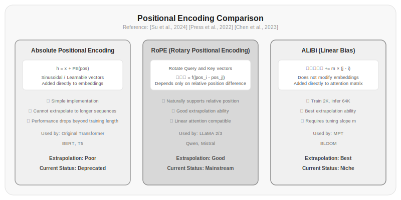

# Chapter 9: Positional Encoding

Chapters 5 through 8 covered how the Transformer computes attention internally, how it caches, and how it optimizes. But there's a problem that's been skipped all along: self-attention itself is completely agnostic to order.

This sounds wrong—language has order, and "收入增长" (revenue growth) and "增长收入" (grow revenue) mean entirely different things. But in self-attention's computation, no step uses token position information. Swap the order of two input tokens, and the attention matrix just swaps rows and columns—the values stay the same. This means the model cannot distinguish "收入增长" from "增长收入."

Positional encoding solves this problem—it tells the model where each token sits in the sequence.

## 9.1 Why Position Information Is Needed

The equivariance of self-attention is a mathematical property: applying a permutation to the input produces the same permutation of the output. This means attention weights depend only on token content, not token position.

```
Input: "收入 增长"
Attention weights:
    收入→收入: 0.5, 收入→增长: 0.3,
    增长→收入: 0.3, 增长→增长: 0.5

Input: "增长 收入"  (same words, different order)
Attention weights:
    增长→增长: 0.5, 增长→收入: 0.3,
    收入→增长: 0.3, 收入→收入: 0.5
```

The weight values are identical—only the ordering changes. If the model has self-attention but no position information, it can never distinguish "收入增长" from "增长收入"—because from its perspective, the internal relationships in these two sequences are completely symmetric.

This clearly won't work. In language, order is part of meaning. The role of positional encoding is to inject order information into the model so that the same word at different positions produces different representations.

There are three approaches to injecting position information:

**Additive injection**—Add a position vector to the embedding vector. This is the approach used in the original Transformer paper and most subsequent work.

**Multiplicative injection**—Modify the attention computation formula so that position information affects attention weights. RoPE does this.

**Attention bias**—Add a position-dependent bias term to the attention scores. ALiBi does this.

## 9.2 Sinusoidal Positional Encoding: The Original Transformer's Approach

The original Transformer [Vaswani et al., 2017] used sinusoidal positional encoding:

$$PE_{(pos, 2i)} = \sin\left(\frac{pos}{10000^{2i/d}}\right)$$
$$PE_{(pos, 2i+1)} = \cos\left(\frac{pos}{10000^{2i/d}}\right)$$

Where $pos$ is the position index, $i$ is the dimension index, and $d$ is the embedding dimension.

The intuition behind this formula: low dimensions use high-frequency sine waves (changing quickly, distinguishing adjacent positions), and high dimensions use low-frequency sine waves (changing slowly, distinguishing distant positions). Different dimensions' sine waves superimpose to give each position a unique "fingerprint."

```python title="9.01_sinusoidal_position_encoding" linenums="1"
def sinusoidal_position_encoding(max_len, d_model):
    pe = torch.zeros(max_len, d_model)
    position = torch.arange(0, max_len).unsqueeze(1)
    div_term = torch.exp(
        torch.arange(0, d_model, 2) * -(math.log(10000.0) / d_model)
    )
    pe[:, 0::2] = torch.sin(position * div_term)
    pe[:, 1::2] = torch.cos(position * div_term)
    return pe
```

Actual running result:

```
>>> pe = sinusoidal_position_encoding(8, 4)
>>> pe.shape
torch.Size([8, 4])
>>> pe
tensor([[ 0.0000,  1.0000,  0.0000,  1.0000],
        [ 0.8415,  0.5403,  0.0100,  0.9999],
        [ 0.9093, -0.4161,  0.0200,  0.9998],
        [ 0.1411, -0.9900,  0.0300,  0.9996],
        [-0.7568, -0.6536,  0.0400,  0.9992],
        [-0.9589,  0.2837,  0.0500,  0.9988],
        [-0.2794,  0.9602,  0.0600,  0.9982],
        [ 0.6570,  0.7539,  0.0699,  0.9976]])
```

Sinusoidal encoding has an elegant mathematical property: for any fixed offset $k$, the encoding at position $pos+k$ can be obtained from the encoding at position $pos$ through a linear transformation. This means the model can infer relative positions through learned linear transformations, without needing to explicitly learn a representation for each absolute position.

But sinusoidal encoding has drawbacks:

**Fixed encoding**—The frequencies of the sine waves are predetermined, not learned. This means the model must adapt to this encoding scheme, rather than the encoding adapting to the model.

**Limited extrapolation**—The maximum position seen during training is $L_{train}$, but during inference, sequences longer than $L_{test} > L_{train}$ may be encountered. Sinusoidal encoding can still be computed for these positions, but the model's performance on them is unpredictable—it has never trained on those positions.

**Absolute position rather than relative position**—Sinusoidal encoding gives each position an absolute encoding, but what matters more in language is relative position. The relationship between "定价" (pricing) and "策略" (strategy) depends more on how many words apart they are, not whether "定价" is at position 3 or position 30.

## 9.3 Learned Positional Encoding: Letting the Model Learn Itself

GPT-2 adopted a simpler approach: instead of presetting sine waves, learn a vector for each position.

```python title="9.02_learned_position_embedding" linenums="1"
class LearnedPositionEmbedding(nn.Module):
    def __init__(self, max_len, d_model):
        super().__init__()
        self.embedding = nn.Embedding(max_len, d_model)
    
    def forward(self, x):
        seq_len = x.shape[1]
        positions = torch.arange(seq_len, device=x.device)
        return x + self.embedding(positions)
```

Actual running result:

```
>>> model = LearnedPositionEmbedding(max_len=8, d_model=4)
>>> x = torch.randn(2, 5, 4)
>>> output = model(x)
>>> output.shape
torch.Size([2, 5, 4])
>>> model.embedding.weight[:5]
tensor([[ 0.3630, -0.1455, -1.8669,  2.0868],
        [-0.1186, -0.1289, -1.5298, -1.1209],
        [-0.0085, -0.1137,  1.0977,  1.6141],
        [-1.0705,  0.4745, -0.7935, -0.0832],
        [-0.9164,  0.7546, -0.1804,  0.4228]],
       grad_fn=<SliceBackward0>)
```

The advantage of learned positional encoding is that the model can learn the position representations that best fit the training data, without manually setting frequencies. GPT-2 and GPT-3 both use this approach.

But learned positional encoding has more obvious problems:

**Hard cap on context length**—The model can only learn encodings for positions seen during training. If the maximum sequence length during training is 1024, the position embedding matrix has size `(1024, d_model)`, and position 1025 can't be encoded at inference time. Supporting longer sequences requires retraining.

**No extrapolation ability**—The relationship between position 1024's encoding and positions 0–1023 is learned by the model, not guaranteed by mathematical properties. The model can't infer what position 2048's encoding should look like.

**Wastes parameters**—For a model with a maximum length of 128K, the position embedding matrix has 128K rows. If $d_{model}=4096$, that's 500 million parameters—as large as the entire embedding matrix.

Because of these limitations, learned positional encoding has been eliminated in long-context models. It has been replaced by a better approach—rotary positional encoding.



*Figure 9.1: Comparison of three positional encoding schemes. Absolute positional encoding cannot extrapolate to longer sequences; RoPE implements relative positional encoding through rotational transformations and is the current mainstream approach; ALiBi directly adds linear biases to attention scores, with the strongest extrapolation ability but less adoption.*

## 9.4 RoPE: Rotary Position Embedding

Rotary Position Embedding (RoPE) proposed by [Su et al., 2024] is the current mainstream positional encoding scheme for LLMs—LLaMA, Qwen, and Mistral all use RoPE.

The core idea of RoPE is not to add a position bias to the embedding vector, but to apply a rotational transformation to the Query and Key vectors based on position.

Rotation in 2D space is intuitive: rotating the vector $(x_1, x_2)$ by angle $\theta$ gives $(x_1\cos\theta - x_2\sin\theta, x_1\sin\theta + x_2\cos\theta)$.

RoPE generalizes this idea to high-dimensional space: treat every two dimensions of the embedding vector as a 2D subspace, and rotate each subspace with a different frequency. Position $m$'s rotation angle is $m \cdot \theta_i$, where $\theta_i$ is the base frequency for subspace $i$.

The mathematical formula:

$$\text{RoPE}(x, m) = \begin{pmatrix} x_1\cos(m\theta_1) - x_2\sin(m\theta_1) \\ x_1\sin(m\theta_1) + x_2\cos(m\theta_1) \\ x_3\cos(m\theta_2) - x_4\sin(m\theta_2) \\ x_3\sin(m\theta_2) + x_4\cos(m\theta_2) \\ \vdots \end{pmatrix}$$

Where $\theta_i = 10000^{-2i/d}$ (consistent with the sinusoidal encoding frequency formula).

RoPE is applied only to Query and Key, not to Value. This is because RoPE's goal is to influence attention weight computation—automatically reducing attention weights between distant tokens.

RoPE has two key mathematical properties:

**Inner product depends only on relative position**—When taking the inner product of Query and Key at positions $m$ and $n$, the result depends only on their relative position $m - n$, not on absolute positions $m$ and $n$. This is exactly what we want—the semantic relationship between "增长" (growth) and "收入" (revenue) depends on how many positions apart they are, not on the absolute position of "增长."

**Long-range decay**—RoPE automatically decreases attention weights between distant tokens. This is guaranteed by the mathematical properties of rotation frequencies—high-frequency rotations make inner products large for nearby positions and small for distant positions.

```python title="9.03_rope_implementation" linenums="1"
def apply_rotary_pos_emb(q, k, cos, sin):
    """Apply RoPE to Q and K"""
    def rotate_half(x):
        x1 = x[..., :x.shape[-1] // 2]
        x2 = x[..., x.shape[-1] // 2:]
        return torch.cat((-x2, x1), dim=-1)
    
    q_embed = (q * cos) + (rotate_half(q) * sin)
    k_embed = (k * cos) + (rotate_half(k) * sin)
    return q_embed, k_embed

def precompute_freqs_cis(dim, max_len, theta=10000.0):
    """Precompute RoPE's cos and sin values"""
    freqs = 1.0 / (theta ** (torch.arange(0, dim, 2).float() / dim))
    t = torch.arange(max_len).float()
    freqs = torch.outer(t, freqs)
    cos = torch.cos(freqs)
    sin = torch.sin(freqs)
    return cos, sin
```

Actual running result:

```
>>> cos, sin = precompute_freqs_cis(dim=8, max_len=16)
>>> cos.shape, sin.shape
(torch.Size([16, 4]), torch.Size([16, 4]))
>>> cos[0]  # Cosine values at position 0
tensor([1.0000, 1.0000, 1.0000, 1.0000])
>>> sin[0]  # Sine values at position 0
tensor([0., 0., 0., 0.])

# Verify RoPE's key property: inner product depends only on relative position
# Use a mathematically equivalent pairwise rotation implementation to verify
>>> def rope_pairs(x, cos_val, sin_val):
...     xp = x.float().reshape(*x.shape[:-1], -1, 2)
...     x1, x2 = xp[..., 0], xp[..., 1]
...     o1 = x1 * cos_val - x2 * sin_val
...     o2 = x1 * sin_val + x2 * cos_val
...     return torch.stack([o1, o2], dim=-1).flatten(-2)
>>> q, k = torch.randn(1,1,1,8), torch.randn(1,1,1,8)
>>> d0 = (rope_pairs(q,cos[0],sin[0]) * rope_pairs(k,cos[2],sin[2])).sum()
>>> d1 = (rope_pairs(q,cos[2],sin[2]) * rope_pairs(k,cos[4],sin[4])).sum()
>>> d2 = (rope_pairs(q,cos[3],sin[3]) * rope_pairs(k,cos[5],sin[5])).sum()
>>> d0.item(), d1.item(), d2.item()
(-5.964396, -5.964396, -5.964396)  # Relative distance is 2 for all, inner products are identical ✓
```

Note that RoPE is a multiplicative operation, not additive—it embeds position information into the direction of Q and K through rotation, rather than simply adding a position bias to the embedding vector. This multiplicative operation causes relative position information to naturally manifest in the attention scores.

## 9.5 Why RoPE Is Better Than Absolute Positional Encoding

RoPE's advantages in three areas:

**Relative position awareness**—RoPE encodes relative position rather than absolute position. Language inherently cares about the relative distance between words, not absolute positions. "Three words ahead" is more meaningful than "at position 17."

**Directly embedded in attention computation**—Absolute positional encoding adds position information to the input embeddings and lets the model learn to "use position information" on its own. RoPE directly encodes relative position in the Q·K inner product, requiring no additional learning by the model. This makes it easier for the model to learn position-dependent patterns.

**Better extrapolation**—This is the most important reason RoPE has become mainstream.

GPT-2's learned positional encoding has a hard cap: trained on 1024 positions, it can process at most 1024 tokens at inference. How to support longer sequences? Retrain, or use various hacks (like position interpolation).

RoPE has no such hard cap. $\theta_i = 10000^{-2i/d}$ is a formula, not a lookup table. You can compute rotation angles at any position, unconstrained by training length. Although the model hasn't trained on position 2048, the rotation angle $\theta_i \cdot 2048$ is still computable, and the model can leverage learned patterns to generalize.

Of course, RoPE's extrapolation isn't perfect. A model trained on length 2048 will perform worse at length 4096—it hasn't seen such distant relative positions. But the degradation is gradual, not catastrophic.

> Data source: [Su et al., 2024]'s RoPE paper experimentally demonstrated that RoPE significantly outperforms sinusoidal and learned encodings on long sequence extrapolation. [Chen et al., 2023] further analyzed RoPE's extrapolation behavior.

## 9.6 Context Length Extension

Although RoPE extrapolates better than absolute positional encoding, a model trained on length 2048 will still show degraded performance when directly handling sequences of 32K. Several common context length extension methods:

**Position Interpolation**—Proposed by [Chen et al., 2023]. Core idea: "compress" the positions of a long sequence into the range the model saw during training. If the model was trained up to 2048 and now needs to handle a sequence of 4096, map position indices from [0, 4095] linearly to [0, 2047], then apply RoPE normally.

```python title="9.04_position_interpolation" linenums="1"
def position_interpolation(pos_ids, max_train_len, max_new_len):
    """Position interpolation: map new sequence length to training length range"""
    scale = max_train_len / max_new_len
    return pos_ids * scale  # Compress position indices
```

Actual running result:

```
>>> pos_ids = torch.arange(0, 16)
>>> scaled = position_interpolation(pos_ids, max_train_len=2048, max_new_len=4096)
>>> scaled
tensor([ 0.0000,  0.5000,  1.0000,  1.5000,  2.0000,  2.5000,
         3.0000,  3.5000,  4.0000,  4.5000,  5.0000,  5.5000,
         6.0000,  6.5000,  7.0000,  7.5000])
# Scale factor = 2048 / 4096 = 0.5, positions compressed to within training range
```

Position interpolation is simple and effective, but compressing position indices means the model loses precision in distinguishing adjacent positions.

**NTK-Aware Scaling**—An improvement proposed by [Reddit community technical discussion, 2023]. Instead of compressing position indices, it adjusts the base $\theta$ in RoPE. Changing 10000 to a larger value makes low-frequency rotations slower, maintaining distinguishability over a longer range.

```python title="9.05_ntk_aware_scaling" linenums="1"
def ntk_aware_scaling(dim, max_train_len, max_new_len, base=10000.0):
    """NTK-Aware Scaling: adjust the base rather than compress positions"""
    scale = max_new_len / max_train_len
    new_base = base * (scale ** (dim / (dim - 2)))
    freqs = 1.0 / (new_base ** (torch.arange(0, dim, 2).float() / dim))
    return freqs
```

Actual running result:

```
>>> dim = 64
>>> original_freqs = 1.0 / (10000.0 ** (torch.arange(0, dim, 2).float() / dim))
>>> ntk_freqs = ntk_aware_scaling(dim, 2048, 8192)
>>> original_freqs[:5]
tensor([1.0000, 0.7499, 0.5623, 0.4217, 0.3162])
>>> ntk_freqs[:5]
tensor([1.0000, 0.7171, 0.5142, 0.3688, 0.2644])
# New base ≈ 41829 (originally 10000), frequencies overall lower, low-frequency dimensions changed more
```

**YaRN**—[Peng et al., 2023] combines position interpolation and NTK scaling, using different scaling strategies for different dimension subspaces. Low-frequency dimensions (capturing long-range relationships) use interpolation, while high-frequency dimensions (capturing short-range relationships) use NTK scaling.

The current mainstream approach is to directly fine-tune the model on longer sequences (continued pretraining), letting RoPE learn correct rotation patterns at longer distances. LLaMA 3's official model was expanded from 8K to 128K through continued training.

| Method | Approach | Supported Length | Needs Fine-tuning |
|--------|----------|-----------------|-------------------|
| Direct extrapolation | No modification | Slightly longer than training length | No |
| Position interpolation | Compress position indices | 2-4x training length | Recommended |
| NTK-Aware | Adjust base | 4-8x training length | Recommended |
| YaRN | Per-dimension mixed scaling | 8-16x training length | Recommended |
| Continued pretraining | Continue training on longer sequences | Any length (compute-limited) | Yes |

> Data sources: [Chen et al., 2023] proposed position interpolation. [Peng et al., 2023] proposed YaRN. [Dubey et al., 2024] described LLaMA 3's context extension training pipeline.

## 9.7 ALiBi: A Different Approach

[Press et al., 2022] proposed ALiBi (Attention with Linear Biases), a method that doesn't rely on positional embeddings at all.

ALiBi doesn't add position information to the input or rotate Q and K; instead, it directly adds a distance-dependent bias to the attention scores:

$$\text{score}_{i,j} = \frac{q_i \cdot k_j}{\sqrt{d_k}} + m \cdot (-|i - j|)$$

Where $m$ is a non-learnable hyperparameter that differs for each attention head. The farther apart the tokens, the more negative the bias and the lower the attention weight.

```python title="9.06_alibi_bias" linenums="1"
def alibi_bias(num_heads, seq_len, device):
    """Compute ALiBi's positional bias"""
    # Each head has a different slope
    slopes = torch.tensor(
        [2 ** (-8 * i / num_heads) for i in range(num_heads)],
        device=device
    )
    
    # Position distance matrix
    positions = torch.arange(seq_len, device=device)
    distance = positions.unsqueeze(0) - positions.unsqueeze(1)  # (seq_len, seq_len)
    distance = distance.abs().unsqueeze(0)  # (1, seq_len, seq_len)
    
    # Bias = slope × distance × (-1)
    alibi = slopes.unsqueeze(1).unsqueeze(1) * distance * (-1)
    return alibi  # (num_heads, seq_len, seq_len)
```

Actual running result:

```
>>> bias = alibi_bias(num_heads=8, seq_len=6, device='cpu')
>>> bias.shape
torch.Size([8, 6, 6])
# Head 0 has the steepest slope (1.0), sharpest nearby decay
>>> bias[0]
tensor([[-0., -1., -2., -3., -4., -5.],
        [-1., -0., -1., -2., -3., -4.],
        [-2., -1., -0., -1., -2., -3.],
        [-3., -2., -1., -0., -1., -2.],
        [-4., -3., -2., -1., -0., -1.],
        [-5., -4., -3., -2., -1., -0.]])
# Head 7 has the shallowest slope (0.0078), gentlest decay
>>> bias[7]
tensor([[-0.0000, -0.0078, -0.0156, -0.0234, -0.0312, -0.0391],
        [-0.0078, -0.0000, -0.0078, -0.0156, -0.0234, -0.0312],
        [-0.0156, -0.0078, -0.0000, -0.0078, -0.0156, -0.0234],
        [-0.0234, -0.0156, -0.0078, -0.0000, -0.0078, -0.0156],
        [-0.0312, -0.0234, -0.0156, -0.0078, -0.0000, -0.0078],
        [-0.0391, -0.0312, -0.0234, -0.0156, -0.0078, -0.0000]])
```

ALiBi has several notable characteristics:

**No parameters**—No position vectors need to be learned; everything is determined by the formula.

**Forced long-range decay**—The farther the distance, the more negative the bias and the lower the attention weight. This ensures the model doesn't assign too much attention to distant tokens.

**Natural extrapolation**—ALiBi's distance bias is a linear function of relative distance that doesn't depend on the training-time maximum position. A model trained on length 1024 can directly handle length 8192 at inference without any adjustment.

BLOOM [Scao et al., 2023] and the MPT series of models use ALiBi.

ALiBi's drawback is limited expressiveness—it only encodes the single prior that "nearby is important, distant is less important," without RoPE's rich frequency variation. On tasks requiring fine-grained positional awareness, ALiBi underperforms compared to RoPE.

> Data source: [Press et al., 2022]'s ALiBi paper showed that a model trained on length 1024 can directly extrapolate to length 8192, with perplexity increasing by less than 1 point.

## 9.8 Comparison of Three Positional Encoding Schemes

| Dimension | Sinusoidal | Learned | RoPE | ALiBi |
|-----------|-----------|---------|------|-------|
| Position type | Absolute | Absolute | Relative | Relative |
| Parameters | 0 | $L_{max} \times d$ | 0 | 0 |
| Extrapolation | Poor | None | Good | Good |
| Encoding method | Additive | Additive | Multiplicative (rotation) | Additive (bias) |
| Applied to | Input embeddings | Input embeddings | Q and K | Attention scores |
| Long-range decay | Yes (implicit) | Unknown | Yes (mathematically guaranteed) | Yes (forced) |
| Current usage | Rare | Rare | Mainstream | Rare |

RoPE has become mainstream because it is optimal or near-optimal across multiple dimensions:

- Relative positional encoding better matches the nature of language than absolute positional encoding
- Zero parameters, no increase in model size
- Good extrapolation, supporting context length extension
- Multiplicative encoding makes position information utilization more direct than additive encoding
- Mathematical properties guarantee long-range decay

## Exercises

1. Implement sinusoidal positional encoding and learned positional encoding. Train a small model with each encoding separately, and compare performance differences on short sequences (within training length) and long sequences (beyond training length).

2. Implement RoPE's `apply_rotary_pos_emb` function. Take the inner product of vectors at two different positions and verify that the inner product depends only on relative position—i.e., RoPE(q_m, k_n) = f(m-n), not f(m, n).

3. Implement ALiBi's positional bias computation. Visualize the bias matrices for different heads, and observe how the slope parameter $m$ affects attention distribution—steeper slopes concentrate attention more on nearby positions.

4. Calculate the frequency distributions of RoPE under different context length extension methods. Use matplotlib to plot frequency curves under different scaling factors, and explain why NTK-Aware scaling is better than simple position interpolation.

5. Design an experiment to test the extrapolation ability of different positional encodings: train three models (sinusoidal, RoPE, ALiBi) at length 512, then measure perplexity on sequences of length 256, 512, 1024, 2048, and 4096. Plot length vs. perplexity curves.

## References

1. Vaswani, A., et al. (2017). Attention Is All You Need. *arXiv:1706.03762*. https://arxiv.org/abs/1706.03762

2. Su, J., et al. (2024). RoFormer: Enhanced Transformer with Rotary Position Embedding. *arXiv:2104.09864*. https://arxiv.org/abs/2104.09864

3. Press, O., et al. (2022). Train Short, Test Long: Attention with Linear Biases Enables Input Length Extrapolation. *arXiv:2108.12409*. https://arxiv.org/abs/2108.12409

4. Chen, S., et al. (2023). Extending Context Window of Large Language Models via Position Interpolation. *arXiv:2306.15595*. https://arxiv.org/abs/2306.15595

5. Peng, B., et al. (2023). YaRN: Efficient Context Window Extension of Large Language Models. *arXiv:2309.00071*. https://arxiv.org/abs/2309.00071

6. Scao, T., et al. (2023). BLOOM: A 176B-Parameter Open-Access Multilingual Language Model. *arXiv:2211.05100*. https://arxiv.org/abs/2211.05100

7. Dubey, A., et al. (2024). The LLaMA 3 Herd of Models. *arXiv:2407.21783*. https://arxiv.org/abs/2407.21783