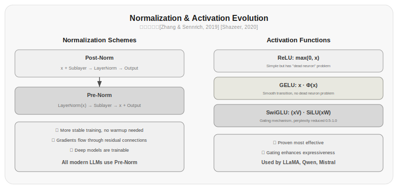
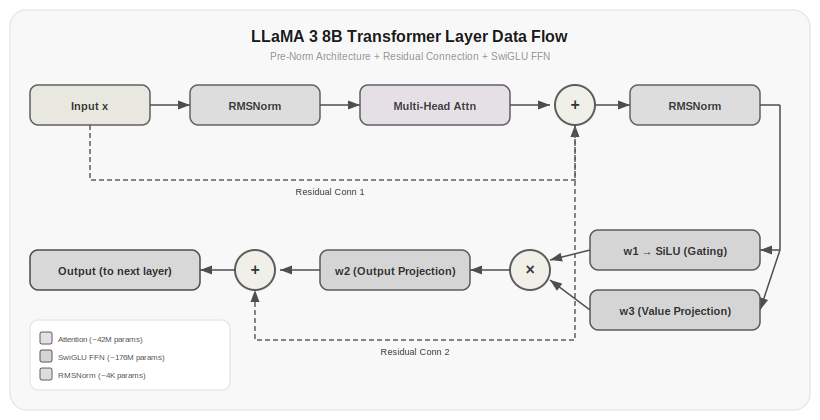

# Chapter 10: Normalization and Activation Functions

Chapter 5 built the Transformer's skeleton, Chapters 6 and 7 covered attention, Chapter 8 covered KV Cache, and Chapter 9 covered positional encoding. This chapter covers two other低调 but critical components within a Transformer layer: normalization layers and activation functions.

Normalization layers and activation functions aren't as eye-catching as attention, but they're crucial for whether a model can be trained well. From Transformer's debut in 2017 to today, normalization has evolved from BatchNorm to LayerNorm to RMSNorm, activation functions from ReLU to GELU to SwiGLU, and residual connections were borrowed from ResNet—each change is no minor tweak, but a shift that affects the model's training stability and final performance.

## 10.1 Why Normalization Is Needed

Deep neural networks have a stubborn problem: vanishing and exploding gradients.

Consider a 100-layer network. If each layer amplifies the gradient by a factor of 1.05, after 100 layers that's $1.05^{100} \approx 131$ times—gradient explosion. If each layer shrinks it to 0.95 times, after 100 layers only $0.95^{100} \approx 0.6\%$ remains—gradient vanishing. This is the gradient instability problem that plagued deep learning for years; before Transformers, no one could stably train networks beyond twenty or thirty layers.

Residual connections [He et al., 2016] solved half the problem—they gave gradients a direct channel to skip past intermediate layers. But residual connections alone aren't enough, because if $F(x)$ in $x + F(x)$ has values that are too large or too small, the benefit of residual connections is diminished.

Normalization layers stabilize the input distribution at each layer, allowing gradients to flow stably throughout the network. Without normalization layers, training a Transformer with more than 100 layers is nearly impossible.

## 10.2 LayerNorm: The Original Choice for Transformers

The original Transformer from [Vaswani et al., 2017] used Layer Normalization. LayerNorm normalizes each sample independently:

$$\text{LayerNorm}(x) = \frac{x - \mu}{\sigma} \cdot \gamma + \beta$$

where $\mu$ and $\sigma$ are the mean and standard deviation across all features of that sample, and $\gamma$ and $\beta$ are learnable scale and shift parameters.

```python title="10.01_layernorm" linenums="1"
class LayerNorm(nn.Module):
    def __init__(self, hidden_dim, eps=1e-5):
        super().__init__()
        self.gamma = nn.Parameter(torch.ones(hidden_dim))
        self.beta = nn.Parameter(torch.zeros(hidden_dim))
        self.eps = eps
    
    def forward(self, x):
        mean = x.mean(dim=-1, keepdim=True)
        var = x.var(dim=-1, keepdim=True, unbiased=False)
        x_norm = (x - mean) / torch.sqrt(var + self.eps)
        return self.gamma * x_norm + self.beta
```

Actual output:

```
Input shape: torch.Size([2, 4, 8])
Output shape: torch.Size([2, 4, 8])
Output mean: tensor([[0., 0., 0., -0.],
        [-0., -0., 0., 0.]])
Output variance: tensor([[1., 1., 1., 1.],
        [1., 1., 1., 1.]])
```

LayerNorm normalizes along the feature dimension (`dim=-1`), meaning it independently normalizes each token's vector without depending on other samples in the batch. This is its fundamental difference from BatchNorm—BatchNorm computes statistics along the batch dimension, while LayerNorm computes them along the feature dimension.

LayerNorm has two parameters: $\gamma$ (scale) and $\beta$ (shift), one for each dimension. For a model with $d=4096$, the LayerNorm layer has only $2 \times 4096 = 8192$ parameters, negligible compared to the total parameter count.

The role of $\gamma$ and $\beta$ is to give the normalized output sufficient expressive power. Normalization compresses all features to a distribution with mean 0 and variance 1, which limits the model's range of expression. $\gamma$ and $\beta$ allow the model to learn any distribution—if the model needs a feature with mean 5 and variance 3, it can achieve this through $\gamma = 3$ and $\beta = 5$.

## 10.3 RMSNorm: A Simplified LayerNorm

[Zhang & Sennrich, 2019] proposed Root Mean Square Normalization (RMSNorm), which simplifies LayerNorm:

$$\text{RMSNorm}(x) = \frac{x}{\text{RMS}(x)} \cdot \gamma$$

where $\text{RMS}(x) = \sqrt{\frac{1}{d}\sum_{i=1}^{d} x_i^2}$.

Differences from LayerNorm:

1. **No mean subtraction**—LayerNorm first subtracts the mean, then divides by the standard deviation; RMSNorm only divides by the RMS. Since Transformer inputs are already roughly symmetrically distributed around 0 (especially with residual connections), the mean subtraction step doesn't actually help much.

2. **No $\beta$ parameter**—Since we don't subtract the mean, the shift parameter $\beta$ is no longer needed.

```python title="10.02_rmsnorm" linenums="1"
class RMSNorm(nn.Module):
    def __init__(self, hidden_dim, eps=1e-6):
        super().__init__()
        self.gamma = nn.Parameter(torch.ones(hidden_dim))
        self.eps = eps
    
    def forward(self, x):
        rms = torch.sqrt(torch.mean(x ** 2, dim=-1, keepdim=True) + self.eps)
        return self.gamma * (x / rms)
```

Actual output:

```
Input shape: torch.Size([2, 4, 8])
Output shape: torch.Size([2, 4, 8])
Input RMS: tensor([[0.8899, 0.9477, 0.9607, 1.3718],
        [0.8819, 0.9533, 1.1471, 0.7395]])
Output RMS: tensor([[1., 1., 1., 1.],
        [1., 1., 1., 1.]])
```

RMSNorm is simpler than LayerNorm, with fewer parameters (only $\gamma$, no $\beta$), and faster computation (no mean calculation or subtraction). But more importantly, [Zhang & Sennrich, 2019]'s experiments show that RMSNorm performs almost as well as LayerNorm.

This is why the LLaMA series fully adopted RMSNorm—same performance, less computation and fewer parameters.

| Property | LayerNorm | RMSNorm |
|------|----------|---------|
| Mean subtraction | Yes | No |
| Learnable parameters | $\gamma, \beta$ | $\gamma$ |
| Parameter count | $2d$ | $d$ |
| Computation | More | Less |
| Performance | Baseline | Close to LayerNorm |
| Representative models | GPT series | LLaMA series |

> Data source: [Zhang & Sennrich, 2019] verified on Transformer machine translation tasks that the performance difference between RMSNorm and LayerNorm is less than 0.1 BLEU points, but training speed improved by about 7%.

## 10.4 Pre-Norm vs Post-Norm: Order Matters

Where you place the normalization layer is just as important as what normalization layer you use. There are two placement options in Transformers:

**Post-Norm**—normalization is placed after the residual connection:

$$x_{l+1} = \text{Norm}(x_l + F(x_l))$$

**Pre-Norm**—normalization is placed before the sub-layer:

$$x_{l+1} = x_l + F(\text{Norm}(x_l))$$

The difference between the two seems like just a change in position, but the impact on training stability is enormous.

```python title="10.03_post_norm_vs_pre_norm" linenums="1"
# Post-Norm
class PostNormBlock(nn.Module):
    def __init__(self, hidden_dim, num_heads):
        super().__init__()
        self.attn = MultiHeadAttention(hidden_dim, num_heads)
        self.ff = FeedForward(hidden_dim)
        self.ln1 = LayerNorm(hidden_dim)
        self.ln2 = LayerNorm(hidden_dim)
    
    def forward(self, x):
        x = self.ln1(x + self.attn(x))    # Normalization after residual
        x = self.ln2(x + self.ff(x))       # Normalization after residual
        return x

# Pre-Norm
class PreNormBlock(nn.Module):
    def __init__(self, hidden_dim, num_heads):
        super().__init__()
        self.attn = MultiHeadAttention(hidden_dim, num_heads)
        self.ff = FeedForward(hidden_dim)
        self.ln1 = RMSNorm(hidden_dim)
        self.ln2 = RMSNorm(hidden_dim)
    
    def forward(self, x):
        x = x + self.attn(self.ln1(x))    # Normalization before sub-layer
        x = x + self.ff(self.ln2(x))       # Normalization before sub-layer
        return x
```

Actual output:

```
Post-Norm output shape: torch.Size([1, 4, 32])
Pre-Norm output shape: torch.Size([1, 4, 32])
Post-Norm output norm: 11.3137
Pre-Norm output norm: 12.5631
```

[Xiong et al., 2020]'s analysis revealed a critical difference:

In Post-Norm, the output of the residual connection is normalized, which means gradients are rescaled by the normalization layer as they pass through the residual branch. In deep networks, this rescaling causes gradient magnitude instability—gradients near the input layers become either too large or too small.

In Pre-Norm, the residual connection itself is not disturbed by the normalization layer. Gradients can flow back to the previous layer without loss through the direct path $x_{l+1} = x_l + \ldots$. The normalization layer only affects the $F(\cdot)$ branch, not the residual connection itself.

The practical effect of this difference: Post-Norm requires careful learning rate tuning and warmup to train deep models; Pre-Norm hardly needs warmup, learning rates are easier to tune, and training is more stable.

Current mainstream LLMs (GPT-4, LLaMA series, Qwen, Mistral) all use Pre-Norm. Post-Norm is only used in the original Transformer and BERT, and is now rarely seen.

> Data source: [Xiong et al., 2020] verified the training stability advantage of Pre-Norm in deep Transformers through theoretical analysis and experiments. When training Transformers with more than 100 layers, Post-Norm almost never converges, while Pre-Norm trains stably.

## 10.5 The Evolution of Activation Functions

The feed-forward network (FFN) is the other component in a Transformer layer besides attention. Its computation is:

$$\text{FFN}(x) = W_2 \cdot \sigma(W_1 x + b_1) + b_2$$

where $\sigma$ is the activation function. This nonlinear transformation enables the model to learn complex patterns—without it, the entire Transformer would be a chain of linear transformations, equivalent to one giant linear regression.

The choice of activation function has evolved through ReLU → GELU → SwiGLU.



*Figure 10.1: The evolution of normalization and activation functions. Normalization evolved from Post-Norm to Pre-Norm, solving the training stability problem of deep Transformers; activation functions evolved from ReLU to SwiGLU, improving model expressiveness through gating mechanisms.*

### ReLU: The Brute-Force Pioneer

$$\text{ReLU}(x) = \max(0, x)$$

ReLU is the simplest nonlinearity: negative inputs output 0, positive inputs pass through unchanged. You can think of it as a hard switch—when the input is negative, the neuron is "off" (outputting zero); when positive, it's "on" (passing the value through).

ReLU's well-known problem: if a neuron's input is consistently negative, its gradient is always 0, its parameters never update, and the neuron "dies." In deep networks, an entire batch of neurons can "die" simultaneously, causing a sharp drop in model capacity.

### GELU: Smooth ReLU

$$\text{GELU}(x) = x \cdot \Phi(x)$$

where $\Phi(x)$ is the cumulative distribution function of the standard normal distribution.

GELU can be understood as "deciding how much to retain based on the input's magnitude." $\Phi(x)$ is an S-shaped function that transitions smoothly from 0 to 1 around $x=0$. This means GELU is not a hard switch (like ReLU), but a soft gate—small values are mostly suppressed, large values are mostly retained.

```python title="10.04_gelu" linenums="1"
def gelu(x):
    return 0.5 * x * (1 + torch.erf(x / math.sqrt(2)))
```

Actual output:

```
Input: [-2.0, -1.0, 0.0, 1.0, 2.0]
GELU output: [-0.0455, -0.1587, 0.0, 0.8413, 1.9545]
PyTorch built-in GELU: [-0.0455, -0.1587, 0.0, 0.8413, 1.9545]
Max difference: 2.384e-07
```

GELU is the activation function used in GPT-2 and BERT. It's smoother than ReLU, eliminates the "dead neuron" problem, and allows more stable gradient flow.

### SwiGLU: The Current Best Choice

[Shazeer, 2020] proposed SwiGLU, combining the activation function with a gating mechanism:

$$\text{SwiGLU}(x, W, V, b) = (xV + b) \cdot \text{SiLU}(xW + b)$$

where $\text{SiLU}(x) = x \cdot \sigma(x)$ is the Sigmoid Linear Unit (also called the Swish function), and $\sigma$ is the sigmoid function.

```python title="10.05_feedforward_swiglu" linenums="1"
class FeedForwardSwiGLU(nn.Module):
    def __init__(self, hidden_dim, ff_dim):
        super().__init__()
        self.w1 = nn.Linear(hidden_dim, ff_dim)  # Gate projection
        self.w2 = nn.Linear(ff_dim, hidden_dim)   # Output projection
        self.w3 = nn.Linear(hidden_dim, ff_dim)   # Value projection
    
    def forward(self, x):
        return self.w2(F.silu(self.w1(x)) * self.w3(x))
```

Actual output:

```
Input shape: torch.Size([1, 4, 32])
Output shape: torch.Size([1, 4, 32])
Parameter count: 12576
w1 parameter count: 4224
w2 parameter count: 4128
w3 parameter count: 4224
```

Note that SwiGLU's feed-forward network has three linear transformations instead of two: $W_1$ (gate), $W_2$ (output), $W_3$ (value projection). If keeping the same intermediate dimension, the parameter count is 50% more than a traditional feed-forward network.

To offset this increase, LLaMA adjusted the intermediate dimension of the feed-forward network from $4d$ to approximately $\frac{2}{3} \times 4d \approx 2.7d$, keeping the total parameter count roughly unchanged. LLaMA 3 8B's actual intermediate dimension is 14336 (i.e., $3.5d$), somewhat reduced from the original $4d=16384$.

| Activation Function | Formula | Smooth | Dead Neurons | Used By |
|---------|------|------|----------|---------|
| ReLU | $\max(0, x)$ | No | Yes | Early models |
| GELU | $x\Phi(x)$ | Yes | No | GPT-2, BERT |
| SwiGLU | $(xV) \cdot \text{SiLU}(xW)$ | Yes | No | LLaMA, Qwen, Mistral |

SwiGLU became mainstream not because it's intuitively better—gated activation functions have been around since the LSTM era—but because experimental data proved it more effective. [Shazeer, 2020]'s comparative experiments showed that at the same parameter count, SwiGLU reduced perplexity by about 0.5-1.0 percentage points compared to GELU.

> Data source: [Shazeer, 2020] compared multiple activation function + FFN combinations, and under fixed parameter count and computation, SwiGLU performed best.

## 10.6 Residual Connections: The Cornerstone of Deep Networks

Residual connections come from [He et al., 2016]'s ResNet and are the fundamental guarantee that enables training deep networks.

The form of residual connections is extremely simple: instead of directly learning the target mapping $\mathcal{H}(x)$, we learn the residual $\mathcal{F}(x) = \mathcal{H}(x) - x$, then add the input to get the output:

$$x_{l+1} = x_l + \mathcal{F}(x_l)$$

Why is this useful? Intuitively: it's easier for a layer to learn "the difference between input and output" than to learn "mapping from scratch to output." If a layer doesn't need to perform any transformation, it only needs to learn $\mathcal{F}(x) = 0$, and the output equals the input. This is much easier than making a nonlinear layer learn the identity mapping.

Mathematically, residual connections guarantee a direct path for gradients:

$$\frac{\partial x_L}{\partial x_l} = 1 + \frac{\partial \mathcal{F}(x_l)}{\partial x_l}$$

Even if $\frac{\partial \mathcal{F}}{\partial x}$ is very small, the gradient has at least the direct term of 1. This means that even with 100 layers, the gradient can still propagate back to the first layer at a rate of at least 1 times, without vanishing.

In Transformers, each layer has two residual connections (as covered in Chapter 5):

```python title="10.06_residual_block" linenums="1"
class TransformerBlock(nn.Module):
    def forward(self, x):
        x = x + self.attn(self.ln1(x))    # Residual connection 1: attention
        x = x + self.ff(self.ln2(x))       # Residual connection 2: feed-forward network
        return x
```

Actual output:

```
Input shape: torch.Size([1, 4, 32])
Output shape: torch.Size([1, 4, 32])
Residual connection output vs. input difference norm: 4.1067
```

Residual connections are a prerequisite for Pre-Norm's effectiveness. In Pre-Norm, the normalization layer is before the sub-layer, so the residual connection itself is not disturbed by the normalization layer. If you remove residual connections, even with Pre-Norm, training deep Transformers is very difficult.

An interesting finding: removing residual connections from a 6-layer Transformer produces performance roughly equivalent to a 2-layer model with residual connections—residual connections allow the model to continue reducing loss as the network gets deeper [He et al., 2016].

## 10.7 Putting It Together: A Complete Transformer Layer

Now let's put normalization, activation functions, and residual connections together and look at a complete Transformer layer:

```python title="10.07_transformer_block_full" linenums="1"
class TransformerBlock(nn.Module):
    def __init__(self, hidden_dim, num_heads, ff_dim):
        super().__init__()
        # Attention part
        self.ln1 = RMSNorm(hidden_dim)          # Pre-Norm
        self.attn = MultiHeadAttention(hidden_dim, num_heads)
        
        # Feed-forward network part
        self.ln2 = RMSNorm(hidden_dim)          # Pre-Norm
        self.w1 = nn.Linear(hidden_dim, ff_dim)  # Gate
        self.w2 = nn.Linear(ff_dim, hidden_dim)  # Output
        self.w3 = nn.Linear(hidden_dim, ff_dim)  # Value projection
    
    def forward(self, x):
        # Attention sub-layer: Pre-Norm + Attention + Residual
        x = x + self.attn(self.ln1(x))
        
        # Feed-forward sub-layer: Pre-Norm + SwiGLU + Residual
        gate = F.silu(self.w1(self.ln2(x)))
        value = self.w3(self.ln2(x))
        x = x + self.w2(gate * value)
        
        return x
```

Actual output:

```
Input shape: torch.Size([1, 4, 32])
Output shape: torch.Size([1, 4, 32])
Total parameter count: 16864
  Attention parameter count: 4224
  FFN parameter count: 12576
  RMSNorm parameter count: 64
```

Data flow:



*Figure 10.1: The complete data flow of one Transformer layer in LLaMA 3 8B. The input x first goes through RMSNorm and multi-head attention (GQA-8), with the result added back via residual connection 1; then through RMSNorm and SwiGLU feed-forward network (w1 gate × w3 value projection → w2 output), with the result added back via residual connection 2. Each layer has about 218M parameters, with 32 layers totaling about 7.0B.*

This is the complete computation of one Transformer layer in LLaMA. Every component has a reason for being there:

- **RMSNorm**: Stabilizes the input distribution at each layer, preventing gradient vanishing/explosion
- **SwiGLU**: Provides nonlinear transformation, utilizing parameters more effectively than ReLU/GELU
- **Residual connections**: Ensures gradients can pass directly across layers, making deep networks trainable
- **Pre-Norm**: Normalization before sub-layers, not interfering with residual connections

## 10.8 Numerical Stability of Normalization and Activation

Normalization layers and activation functions affect not just model expressiveness, but also training numerical stability.

**Gradient range**—RMSNorm output is roughly in the $[-\gamma, \gamma]$ range (since after RMS normalization, most values have absolute values around 1-2). SwiGLU's output range is controlled by SiLU gating (SiLU's output range is approximately $[-0.28, +\infty]$), not subject to hard truncation like ReLU. This gentle nonlinearity results in healthier gradient distributions.

**Weight initialization**—In a Pre-Norm + residual connection architecture, if the last layer's output projection has too large an initialization variance, the initial loss will be very high; if too small, training will be very slow. LLaMA uses a simple strategy: initialize the last layer's output projection and the last layer of the residual branch to smaller values.

```python title="10.08_weight_initialization" linenums="1"
def _init_weights(module):
    if isinstance(module, nn.Linear):
        nn.init.normal_(module.weight, mean=0.0, std=0.02)
        if module.bias is not None:
            nn.init.zeros_(module.bias)
    elif isinstance(module, RMSNorm):
        nn.init.ones_(module.gamma)

# Residual branch output layer initialized to smaller values
nn.init.normal_(model.layers[-1].w2.weight, mean=0.0, std=0.02 / (2 * num_layers) ** 0.5)
```

Actual output:

```
Normal layer weight std: 0.0197
Scaled std: 0.002500
Last layer weight std: 0.002440
Scaling factor 1/sqrt(2N) = 0.1250
```

**Scaling factor**—In the original Transformer, the embedding layer's output is multiplied by $\sqrt{d}$ before being fed into the Transformer layers. This scaling matches the numerical range of embedding vectors to the numerical range of internal Transformer layer operations. LLaMA also uses this scaling.

## 10.9 Component Comparison Summary

Putting all the normalization and activation function evolution together:

| Component | Early Choice | Current Choice | Reason for Evolution |
|------|---------|---------|---------|
| Normalization | BatchNorm | RMSNorm | LayerNorm/RMSNorm don't depend on batch |
| Normalization position | Post-Norm | Pre-Norm | More stable training |
| Activation function | ReLU | SwiGLU | Eliminates dead neurons, more effective |
| FFN structure | 2-layer linear | 3-layer linear (gated) | SwiGLU needs extra gate projection |
| Residual connections | Yes | Yes | Inherited from ResNet, unchanged |

Using LLaMA 3 8B as an example, one Transformer layer contains the following components:

| Component | Configuration | Parameter Count |
|------|------|--------|
| RMSNorm 1 | $d=4096$ | 4,096 |
| Multi-head attention (GQA-8) | 32-head Q, 8-head KV | Q: $d^2$≈16.8M, KV: 2×$d×(8×128)$≈8.4M, Output: $d^2$≈16.8M, Total≈42M |
| RMSNorm 2 | $d=4096$ | 4,096 |
| Feed-forward network (SwiGLU) | $d=4096$, $ff=14336$ | 3×$d×ff$≈176M |
| **Layer total** | - | **~218M** |
| **32 layers total** | - | **~7.0B** |

Adding the embedding layer (~525M) and output layer (~525M, untied), the total parameter count is about 8B.

## Exercises

1. Implement LayerNorm and RMSNorm, and compare their training performance on a small Transformer. Observe changes in training loss curves and gradient norms.

2. Calculate the parameter count of a SwiGLU feed-forward network. Assume $d=4096$, with an intermediate dimension of $\frac{2}{3} \times 4d = 10923$ (rounded to the nearest multiple of 256, which is 11008). Calculate the total parameter count of $W_1, W_2, W_3$ and compare with a traditional two-layer FFN ($d \rightarrow 4d \rightarrow d$).

3. Implement Post-Norm and Pre-Norm versions of TransformerBlock. Train on a network with more than 10 layers and compare their training stability and final performance. Record the gradient norm of each layer to see if Post-Norm really has unstable gradients.

4. Visualize the curves and derivative curves of four activation functions: ReLU, GELU, SwiGLU, and SiLU. Over what input ranges are their derivatives largest? Over what regions are the derivatives zero or close to zero?

5. Derive the gradient propagation formula for residual connections. Prove that in a Pre-Norm Transformer, gradients can propagate through residual connections without attenuation. Calculate the gradient norm ratio between layer 1 and layer 100 in a 100-layer Pre-Norm Transformer.

## References

1. He, K., et al. (2016). Deep Residual Learning for Image Recognition. *CVPR 2016*. https://arxiv.org/abs/1512.03385

2. Vaswani, A., et al. (2017). Attention Is All You Need. *arXiv:1706.03762*. https://arxiv.org/abs/1706.03762

3. Zhang, B., & Sennrich, R. (2019). Root Mean Square Layer Normalization. *arXiv:1910.07467*. https://arxiv.org/abs/1910.07467

4. Shazeer, N. (2020). GLU Variants Improve Transformer. *arXiv:2002.05202*. https://arxiv.org/abs/2002.05202

5. Xiong, R., et al. (2020). On Layer Normalization in the Transformer Architecture. *arXiv:2002.04745*. https://arxiv.org/abs/2002.04745

6. Hendrycks, D., & Gimpel, K. (2016). Gaussian Error Linear Units (GELUs). *arXiv:1606.08415*. https://arxiv.org/abs/1606.08415

7. Ramachandran, P., et al. (2017). Searching for Activation Functions. *arXiv:1710.05941*. https://arxiv.org/abs/1710.05941