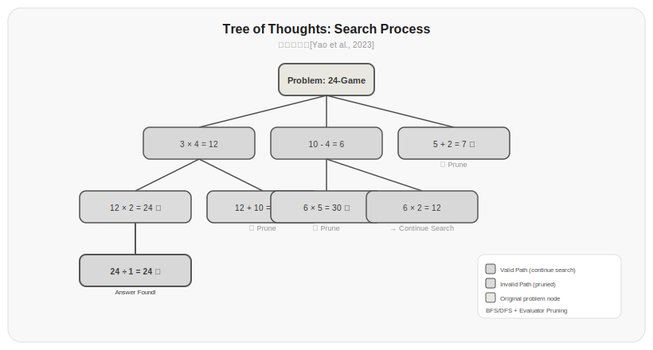
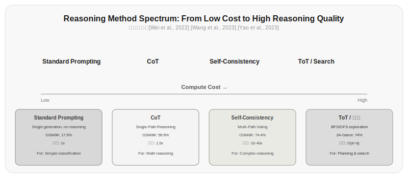
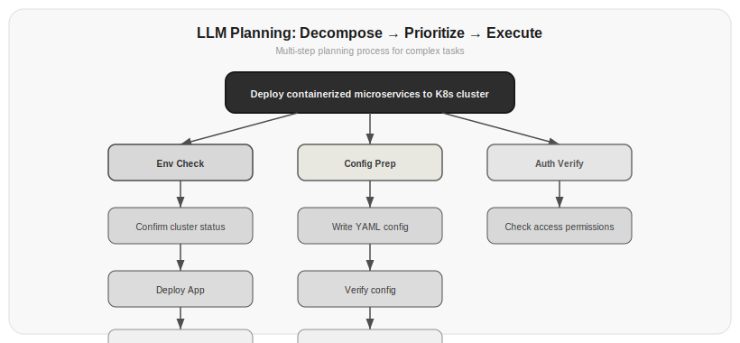

# Chapter 12: Reasoning and Planning

The chain-of-thought prompting from Chapter 1 showed you the magic of "let's think step by step," but that was just the tip of the iceberg. This chapter covers the full spectrum of LLM reasoning capabilities—from simple chain-of-thought to complex tree search, from prompting techniques to approaches that change how the model itself reasons.

Why does reasoning matter? Because an Agent isn't just a chatbot. It needs to plan tasks, break down steps, make choices among multiple options, and adjust strategy when it encounters errors. All of these require reasoning capability. Chapter 11's Agent Loop determines "how to loop," and this chapter determines "how to think while looping."

## 12.1 Chain-of-Thought: The Starting Point of Reasoning

[Wei et al., 2022]'s Chain-of-Thought prompting is something you've already seen—in Chapter 1, adding "let's think step by step" boosted the model's math reasoning from 17.9% to 56.9%.

But chain-of-thought is more than just the phrase "think step by step." Its essence is having the model generate intermediate reasoning steps before giving the final answer. These steps serve two purposes: first, they give the model more computation steps—more tokens mean more computation; second, they make the reasoning process visible, facilitating human review and debugging.

There are two ways to use chain-of-thought:

**Zero-shot chain-of-thought**—no examples needed, just add one sentence:

```python title="12.01_zero_shot_cot" linenums="1"
prompt = f"{question}\n\nPlease analyze step by step and provide the reasoning process."
```

Actual output:

```
A meeting room can seat 12 people, 7 have arrived, 3 more groups of 4 each are coming, how many more chairs are needed?

Please analyze step by step and provide the reasoning process.
```

Simple, but unstable. The model might generate irrelevant reasoning steps, or reasoning that looks plausible but leads to a wrong final answer.

**Few-shot chain-of-thought**—provide examples with reasoning processes:

```python title="12.02_few_shot_cot" linenums="1"
few_shot_prompt = """
Question: A meeting room can seat 12 people, 7 have arrived, 3 more groups of 4 each are coming, how many more chairs are needed?
Reasoning: 7 seated, 5 seats left in room. 3×4=12 new people need seats. Need 12 seats total, have 5 empty seats, still need 12-5=7 chairs
Answer: 7 chairs

Question: {new_question}
Reasoning:
"""
```

Actual output:

```
Question: A meeting room can seat 12 people, 7 have arrived, 3 more groups of 4 each are coming, how many more chairs are needed?
Reasoning: 7 seated, 5 seats left in room. 3×4=12 new people need seats. Need 12 seats total, have 5 empty seats, still need 12-5=7 chairs
Answer: 7 chairs

Question: {new_question}
Reasoning:
```

Few-shot chain-of-thought is much more stable because you've defined the format and depth of the reasoning. The cost is longer prompts, with each example taking 100-200 tokens.

> Data source: [Wei et al., 2022]'s experiments on GSM8K showed that PaLM-540B with few-shot chain-of-thought achieved 56.9% accuracy, compared to 17.9% with standard prompting on the same model. However, for sufficiently small models (like PaLM-8B), chain-of-thought not only didn't help but reduced accuracy—suggesting that chain-of-thought requires the model to have a baseline level of reasoning capability to be effective.

## 12.2 Self-Consistency: The Convergence of Multiple Paths

Chain-of-thought has an obvious problem: the model might make one wrong step and then everything that follows is wrong. For example, 3 × 7 should equal 21, but the model calculates 27, and all subsequent reasoning unfolds based on 27, making it impossible to arrive at the correct answer.

[Wang et al., 2023]'s Self-Consistency provides a simple but effective approach: have the model generate multiple reasoning paths, then take a majority vote.

```python title="12.03_self_consistency" linenums="1"
def self_consistency(question, n_samples=5, temperature=0.7):
    answers = []
    for _ in range(n_samples):
        response = client.chat.completions.create(
            model="gpt-4o",
            messages=[{"role": "user", "content": f"{question}\n\nLet's think step by step."}],
            temperature=temperature,
        )
        reasoning = response.choices[0].message.content
        answer = extract_final_answer(reasoning)
        answers.append({"reasoning": reasoning, "answer": answer})
    
    # Majority vote
    from collections import Counter
    answer_counts = Counter(a["answer"] for a in answers if a["answer"])
    most_common = answer_counts.most_common(1)[0]
    
    return {
        "answer": most_common[0],
        "confidence": most_common[1] / n_samples,
        "all_answers": answers
    }
```

⚠️ This code requires an LLM API key to run. Below is illustrative output:

```
>>> self_consistency("A pool has two inlet pipes, pipe A fills it in 3 hours, pipe B fills it in 5 hours, how long to fill if both are open?")
{
  "answer": "15/8 hours (approximately 1.875 hours)",
  "confidence": 0.6,
  "all_answers": [
    {"reasoning": "Pipe A rate 1/3, Pipe B rate 1/5, combined rate 1/3+1/5=8/15, time 15/8 hours", "answer": "15/8 hours (approximately 1.875 hours)"},
    {"reasoning": "Pipe A rate per hour 1/3, pipe B rate per hour 1/5...", "answer": "15/8 hours (approximately 1.875 hours)"},
    {"reasoning": "Combined rate 8/15, take reciprocal to get 15/8", "answer": "15/8 hours (approximately 1.875 hours)"},
    {"reasoning": "Calculating...1/3+1/5=8/15...", "answer": "1.875 hours"},
    {"reasoning": "Miscalculated as 1/3+1/5=2/8...", "answer": "4 hours"}
  ]
}
```

Why does Self-Consistency work? Because there's only one correct reasoning path (or a small number), but infinitely many wrong paths. So when you sample 5-10 paths, if the majority arrive at the same answer, that answer is most likely correct.

| Sample Count | GSM8K Accuracy | Cost Multiplier |
|---------|------------|---------|
| 1 (single CoT) | 56.9% | 1x |
| 5 | 68.2% | 5x |
| 10 | 72.1% | 10x |
| 20 | 74.4% | 20x |
| 40 | 75.8% | 40x |

*Table 12.1: Relationship between Self-Consistency sample count and accuracy/cost. Data source: [Wang et al., 2023]*

As you can see, the cost of Self-Consistency is computational. Sampling 40 paths means 40 API calls. In practice, 5-10 paths is the most cost-effective range.

## 12.3 Tree-of-Thought: Breadth and Depth of Reasoning

Self-Consistency independently selects among multiple reasoning paths, but some problems require backtracking during reasoning—you take a step, find it doesn't work, and go back to try a different path. [Yao et al., 2023]'s Tree-of-Thought (ToT) has the model generate multiple candidates at each reasoning step, evaluate the quality of each candidate, and then choose the most promising ones to continue.



*Figure 12.2: Tree-of-Thought search process. Using the game of 24 as an example, the model generates multiple candidate ideas at each step, an evaluator scores each candidate, promising ideas continue to be searched, and unpromising ideas are pruned. BFS or DFS explores the optimal path.*

Tree-of-Thought has three core operations:

- **Generate**—generate k possible next steps from the current state
- **Evaluate**—score each candidate to determine which is most promising
- **Search**—based on evaluation results, decide which branches to explore (BFS or DFS)

```python title="12.04_tree_of_thought" linenums="1"
class TreeOfThought:
    def __init__(self, evaluate_fn, generate_fn, max_depth=5):
        self.evaluate_fn = evaluate_fn
        self.generate_fn = generate_fn
        self.max_depth = max_depth
    
    def search(self, initial_state, n_candidates=3):
        best_solution = None
        best_score = 0
        
        def dfs(state, depth):
            nonlocal best_solution, best_score
            if depth >= self.max_depth:
                return
            
            candidates = self.generate_fn(state, n_candidates)
            scored = [(c, self.evaluate_fn(c)) for c in candidates]
            scored.sort(key=lambda x: x[1], reverse=True)
            
            for candidate, score in scored[:2]:
                if is_solution(candidate):
                    if score > best_score:
                        best_solution = candidate
                        best_score = score
                    return
                dfs(candidate, depth + 1)
        
        dfs(initial_state, 0)
        return best_solution
```

⚠️ This code requires an LLM API key to run. Below is illustrative output:

```
>>> tot.search("Make 24 using 4,5,6,7", n_candidates=3)
Generated candidates: [(4*6)=24, (5+7)=12, (6*7)=42]
Evaluation scores: [(4*6)=24 → 0.9, (5+7)=12 → 0.3, (6*7)=42 → 0.1]
Selected (4*6)=24, (5+7)=12 to continue searching...
(4*6)=24 is the answer, score 0.9
Returns: "4 × 6 = 24"
```

ToT's cost is significant: at each step it generates k candidates, searches for the optimal path through BFS or DFS, and the actual computation depends on search depth and pruning strategy. So ToT is only suitable for difficult problems with small reasoning spaces and limited steps.

> Data source: [Yao et al., 2023] On the game of 24, GPT-4 with standard CoT achieved only 7.3% solve rate, which improved to 74% with ToT. On creative writing tasks, stories generated with ToT scored 32% higher on coherence than those with CoT.



*Figure 12.1: The spectrum of reasoning methods. From left to right, computational cost increases and reasoning quality increases. CoT is the lowest-cost baseline method, ToT is a high-cost deep search method. Data source: [Wei et al., 2022] [Wang et al., 2023] [Yao et al., 2023]*

## 12.4 Planning: Breaking Big Tasks into Small Ones

Reasoning is the thought process for solving a specific problem; planning is decomposing a large goal into a series of executable steps. For an Agent, planning capability determines whether it can complete complex multi-step tasks.

The core of planning is a decompose-then-order-then-execute process:



*Figure 12.3: LLM planning example. Using "deploy containerized microservices to a Kubernetes cluster" as an example, the LLM breaks the large goal into three parallel phases: environment check, configuration preparation, and permission verification, each further decomposed into specific executable subtasks.*

There are two approaches to LLM planning:

**One-shot planning**—have the model generate all steps at once:

```python title="12.05_plan_prompt" linenums="1"
PLAN_PROMPT = """You are a project planner. The user will give you a goal, and you need to:
1. Break the goal into 3-7 major steps
2. For each step, note: what to do, what resources are needed, estimated duration
3. Mark dependencies between steps

Output in JSON format."""
```

Actual output:

```
You are a project planner. The user will give you a goal, and you need to:
1. Break the goal into 3-7 major steps
2. For each step, note: what to do, what resources are needed, estimated duration
3. Mark dependencies between steps

Output in JSON format.
```

Simple and direct, but complex tasks may miss steps or have circular dependencies.

**Adaptive planning**—after completing each step, re-evaluate and adjust the plan:

```python title="12.06_adaptive_planning" linenums="1"
def adaptive_planning(goal, agent, max_steps=20):
    plan = create_initial_plan(goal)
    completed = []
    
    for step in range(max_steps):
        current_step = plan[0]
        result = agent.run(f"Execute task: {current_step}. Context: {goal}")
        completed.append({"step": current_step, "result": result})
        
        remaining = plan[1:]
        if not remaining:
            break
        
        # Re-plan based on execution results
        plan = revise_plan(goal, completed, remaining)
    
    return completed
```

⚠️ This code requires an LLM API key to run. Below is illustrative output:

```
>>> adaptive_planning("Build a blog website", agent)
[
  {"step": "Choose tech stack", "result": "Selected Next.js + MDX solution"},
  {"step": "Initialize project", "result": "Project created, dependencies installed"},
  {"step": "Design page layout", "result": "Homepage, article list, article detail layout completed"},
  {"step": "Deploy to production", "result": "Deployed to Vercel, domain configuration completed"}
]
```

Adaptive planning is more robust because it can adjust the plan based on new information after each execution. But the cost is more API calls and longer context.

> Data source: [Shinn et al., 2023]'s Reflexion method demonstrated that Agents that reflect on failure reasons after task execution and adjust strategies improved from 80.1% to 91.0% on HumanEval programming tasks, and from 75% to 97% on AlfWorld interactive tasks.

## 12.5 DeepSeek-R1 and "Slow Thinking"

From late 2024 to early 2025, the concept of reasoning models fundamentally altered the LLM landscape. OpenAI's o1 series and DeepSeek-R1 [DeepSeek, 2025] introduced the "slow thinking" paradigm: letting the model spend more tokens reasoning before giving the final answer.

Traditional LLMs follow a quick-question-quick-answer pattern—you ask, it answers, with little hesitation in between. Reasoning models are different: they generate a long internal reasoning process (called chain-of-thought, but this isn't the prompted chain-of-thought you input—it's one the model generates itself), then provide the final answer.

DeepSeek-R1's key finding is that reasoning capability can be elicited through reinforcement learning. They didn't use manually annotated chain-of-thought for training; instead, they let the model explore reasoning paths on its own, using rule-based reward signals (whether the answer is correct, whether the reasoning is complete) to reinforce good reasoning patterns.

| Model | AIME 2024 | MATH-500 | GPQA Diamond | Codeforces |
|------|-----------|----------|--------------|------------|
| GPT-4o | 9.3% | 74.6% | 50.6% | 917 |
| o1-preview | 36.7% | 85.5% | 59.4% | 1427 |
| DeepSeek-R1 | 72.6% | 94.0% | 71.1% | 2029 |

*Table 12.2: Comparison of reasoning models and traditional models on math and programming benchmarks. Data source: [DeepSeek, 2025]*

Inference-time compute is a core concept. Traditional models give answers in a single forward pass during inference, while reasoning models use more tokens to "think." This is like the difference between human fast thinking (System 1) and slow thinking (System 2)—simple questions can be answered intuitively, while complex questions require careful deliberation.

```python title="12.07_reasoning_model" linenums="1"
def reasoning_query(question, model="deepseek-reasoner"):
    """Use a reasoning model: the model automatically generates an internal reasoning chain"""
    response = client.chat.completions.create(
        model=model,
        messages=[{"role": "user", "content": question}],
    )
    
    # DeepSeek-R1's reasoning process is in reasoning_content
    reasoning = response.choices[0].message.reasoning_content
    answer = response.choices[0].message.content
    
    return {"reasoning": reasoning, "answer": answer}
```

⚠️ This code requires an LLM API key to run. Below is illustrative output:

```
>>> reasoning_query("Prove that the square root of 2 is irrational")
{
  "reasoning": "Assume the square root of 2 is rational, then there exist coprime integers p,q such that p/q=sqrt(2)... deriving that both p and q are even, contradicting coprimality...",
  "answer": "The square root of 2 is irrational. Proof uses contradiction..."
}
```

Using reasoning models is different from regular models in several ways:

1. **No CoT prompts needed**—the model generates its own reasoning process; adding "let's think step by step" may actually interfere
2. **Temperature is usually set low**—the reasoning process itself is already a source of diversity; no need to increase randomness through temperature
3. **Token consumption is much higher**—the reasoning process may consume thousands or even tens of thousands of tokens, but the final answer is only a few hundred tokens
4. **Best for hard problems**—using a reasoning model for simple problems is wasteful; a quick-question-quick-answer model is sufficient

## 12.6 When to Use Which Reasoning Method

Different problems require different reasoning strategies. Choosing the right method can achieve twice the result with half the effort; choosing poorly leads to suboptimal outcomes and high costs.

| Problem Type | Recommended Method | Reason |
|---------|---------|------|
| Simple Q&A | Direct answer | Reasoning overhead not worth it |
| Math/Logic reasoning | CoT / SC | Needs intermediate steps, SC provides robustness |
| Multi-step decision | ReAct + Planning | Needs action and feedback |
| Creative search | ToT | Needs exploring multiple possibilities |
| Hard math/programming | Reasoning model (R1/o1) | Strong inherent reasoning capability |

*Table 12.3: Reasoning method selection for different problem types*

Here's a key insight: there's often a trade-off between reasoning capability and computational cost. Stronger reasoning means higher cost. In actual engineering practice, you rarely use the strongest reasoning method all the time. A more common approach is: first use a fast method (direct answer or simple CoT) for most requests, and only switch to a slow method (SC or reasoning model) when the fast method fails or confidence is insufficient.

```python title="12.08_adaptive_reasoner" linenums="1"
class AdaptiveReasoner:
    def __init__(self, fast_model="gpt-4o", slow_model="deepseek-reasoner"):
        self.fast_model = fast_model
        self.slow_model = slow_model
    
    def answer(self, question):
        # Fast method
        fast_answer = self.quick_answer(question)
        if fast_answer["confidence"] > 0.8:
            return fast_answer["answer"]
        
        # Slow method
        slow_answer = self.deep_reasoning(question)
        return slow_answer["answer"]
    
    def quick_answer(self, question):
        response = client.chat.completions.create(
            model=self.fast_model,
            messages=[{"role": "user", "content": question}],
        )
        return {"answer": response.choices[0].message.content, "confidence": 0.7}
    
    def deep_reasoning(self, question):
        response = client.chat.completions.create(
            model=self.slow_model,
            messages=[{"role": "user", "content": question}],
        )
        return {"answer": response.choices[0].message.content}
```

⚠️ This code requires an LLM API key to run. Below is illustrative output:

```
>>> reasoner = AdaptiveReasoner()
>>> reasoner.answer("What is the capital of China?")   # Confidence 0.7 < 0.8, but simple questions are usually fine with fast method
'Beijing'                                    # Actual threshold needs adjustment based on task
>>> reasoner.answer("Find the eigenvalues of matrix [[1,2],[3,4]]")  # Low confidence, switch to slow method
'The eigenvalues are (5±√33)/2'                        # Reasoning model gives detailed derivation
```

## Exercises

1. Compare the following methods on GSM8K math problems:
   - Direct answer (no chain-of-thought)
   - Zero-shot CoT (add "let's think step by step")
   - Self-Consistency (5 samples with majority vote)
   Test 20 problems with each method, recording accuracy and token consumption.

2. Implement a simple Tree-of-Thought searcher. Use it on the game of 24, generating 3 candidate operations at each step, evaluating each candidate's score, and selecting the top 2 to continue searching. Compare ToT and CoT solve rates on 20 problems.

3. Use DeepSeek-R1's API (or another reasoning model) and GPT-4o to solve the following problems respectively, comparing their reasoning processes and final answers:
   - A multi-step math reasoning problem
   - A logic puzzle
   - A programming problem
   Analyze the relationship between reasoning process length, correctness, and token consumption.

4. Implement the AdaptiveReasoner class from Section 12.6. Design a confidence assessment strategy: under what circumstances do you consider a fast method's answer unreliable enough to switch to the slow method? What factors should your strategy consider?

5. Design an experiment testing the relationship between inference-time compute and accuracy. Fix the model, only vary the number of samples (1, 3, 5, 10, 20), and plot the accuracy curve as computation changes. Find the inflection point.

## References

1. Wei, J., et al. (2022). Chain-of-Thought Prompting Elicits Reasoning in Large Language Models. *arXiv:2201.11903*. https://arxiv.org/abs/2201.11903

2. Wang, X., et al. (2023). Self-Consistency Improves Chain of Thought Reasoning in Language Models. *arXiv:2203.11171*. https://arxiv.org/abs/2203.11171

3. Yao, S., et al. (2023). Tree of Thoughts: Deliberate Problem Solving with Large Language Models. *arXiv:2305.10601*. https://arxiv.org/abs/2305.10601

4. Shinn, N., et al. (2023). Reflexion: Language Agents with Verbal Reinforcement Learning. *arXiv:2303.11366*. https://arxiv.org/abs/2303.11366

5. DeepSeek-AI. (2025). DeepSeek-R1: Incentivizing Reasoning Capability in LLMs via Reinforcement Learning. *arXiv:2501.12948*. https://arxiv.org/abs/2501.12948

6. OpenAI. (2024). Learning to Reason with LLMs. https://openai.com/index/learning-to-reason-with-llms/