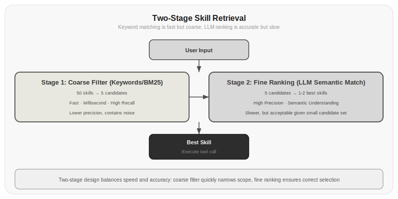
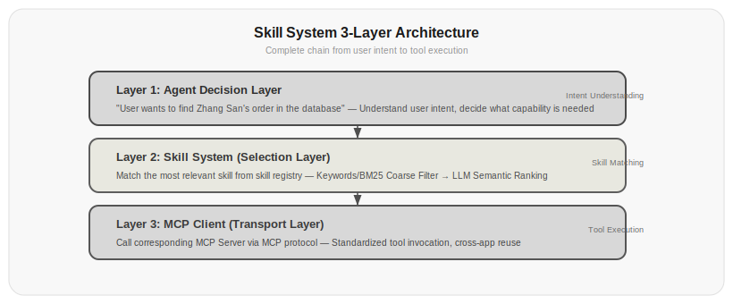

# Chapter 14: Skill Systems

Chapter 11 taught you how to write an Agent Loop, and Chapter 13 added MCP to make tools reusable. But as tools proliferate, how does the Agent know which one to use and when?

An Agent with 50 tools has to read 50 tool descriptions every loop cycle. The model has to pick the right one from 50 tools—like asking a new employee to flip through a 50-page manual to decide which tool to use. It's not just slow; it's error-prone.

Skill systems solve this problem: shifting from "passively searching all tools" to "actively matching the right capability." Tools are passive functions waiting to be called; skills are proactive capability units that declare what they can do and when they should be activated.

## 14.1 From Tools to Skills: A Qualitative Leap

The difference between tools and skills is not a gradual improvement—it's a qualitative shift.

**Tools**—Passive, static, context-less. You define a function, describe its parameters, then wait for the model to call it. The model must find the right one from a long list of tools.

**Skills**—Proactive, discoverable, contextual. They define not just "what I can do," but also "when I should be activated," "what context I need," and "how I collaborate with other skills."

An analogy: tools are like a phone directory—you have to flip through the whole thing to know who to call. Skills are like a smart receptionist—you state your need, and they know exactly who to connect you with.

```python title="14.01_tool_vs_skill" linenums="1"
# Tool definition (Chapter 11 style)
tool = {
    "name": "search_database",
    "description": "Search for information in the user database",
    "parameters": {"query": {"type": "string"}}
}

# Skill definition (this chapter's style)
skill = {
    "name": "database_search",
    "trigger": "When the user needs to look up user data, account information, or history",
    "context_requirements": ["Database connection info", "Query permission level"],
    "description": "Execute precise queries in the MySQL user database",
    "parameters": {
        "query": {"type": "string", "description": "SQL query conditions"},
        "table": {"type": "string", "enum": ["users", "orders", "logs"]}
    },
    "examples": [
        {"input": "Look up Zhang San's orders", "output": "SELECT * FROM orders WHERE user_id = (SELECT id FROM users WHERE name = 'Zhang San')"},
    ],
    "conflicts": ["cache_search"],  # How to handle conflicts with cache search skill
    "priority": 10  # Priority
}
```

Actual output:

```json
{
  "name": "search_database",
  "description": "Search for information in the user database",
  "parameters": {"query": {"type": "string"}}
}
```

```json
{
  "name": "database_search",
  "trigger": "When the user needs to look up user data, account information, or history",
  "context_requirements": ["Database connection info", "Query permission level"],
  "description": "Execute precise queries in the MySQL user database",
  "parameters": {
    "query": {"type": "string", "description": "SQL query conditions"},
    "table": {"type": "string", "enum": ["users", "orders", "logs"]}
  },
  "examples": [
    {"input": "Look up Zhang San's orders", "output": "SELECT * FROM orders WHERE user_id = (SELECT id FROM users WHERE name = 'Zhang San')"}
  ],
  "conflicts": ["cache_search"],
  "priority": 10
}
```

Skills have several key fields that tools lack:

- **trigger**—Tells the model when it should consider activating this skill
- **context_requirements**—Declares what context this skill needs to work
- **examples**—Provides usage examples, which are more persuasive than pure descriptions
- **conflicts**—Declares conflict relationships with other skills
- **priority**—When multiple skills could be activated, which takes precedence

## 14.2 Skill Registry: The Agent's Capability Directory

The skill registry is a directory of all the Agent's capabilities. It's not a simple list—it's a searchable, filterable, dynamically updatable index.

```python title="14.02_skill_registry" linenums="1"
class SkillRegistry:
    def __init__(self):
        self.skills = {}
        self.trigger_index = {}
    
    def register(self, skill):
        self.skills[skill["name"]] = skill
        for trigger_keyword in skill.get("trigger_keywords", []):
            if trigger_keyword not in self.trigger_index:
                self.trigger_index[trigger_keyword] = []
            self.trigger_index[trigger_keyword].append(skill["name"])
    
    def find_relevant(self, user_input, context=None, max_results=5):
        # Phase 1: Keyword coarse filtering
        candidates = set()
        words = jieba.cut(user_input)
        for word in words:
            if word in self.trigger_index:
                candidates.update(self.trigger_index[word])
        
        # Phase 2: Semantic fine ranking (using LLM)
        if len(candidates) > max_results:
            candidates = self.rerank_with_llm(user_input, candidates, max_results)
        
        # Phase 3: Context filtering (check prerequisites)
        results = []
        for name in candidates:
            skill = self.skills[name]
            if self.check_prerequisites(skill, context):
                results.append(skill)
        
        return results
    
    def check_prerequisites(self, skill, context):
        if context is None:
            return True
        for req in skill.get("context_requirements", []):
            if req not in context:
                return False
        return True
```

⚠️ This code requires an LLM API key or external service to run. Below is illustrative output:

```
Test 1: Search database
  Match: database_search

Test 2: Check weather
  Match: weather_query

Test 3: Send email (missing context)
  (No match—missing SMTP configuration context, prerequisites not met)
```

Why two-phase retrieval? Because keyword matching is fast but coarse, while LLM reranking is accurate but slow. Coarse filtering reduces 50 skills to 5, then fine ranking selects the 1-2 most appropriate from those 5. This saves tokens while maintaining accuracy.



*Figure 14.1: Two-phase retrieval in the skill system. The first phase uses keywords or BM25 to quickly filter a small number of candidates from all skills, and the second phase uses LLM for semantic matching fine ranking, balancing speed and accuracy.*

## 14.3 Trigger Conditions: A Skill's Self-Expression

Trigger conditions are the core design problem of skill systems. A skill's trigger condition determines when the Agent will consider activating it.

There are three granularities of trigger conditions:

**Keyword triggers**—Simplest, least reliable:

```python title="14.03_trigger_keywords" linenums="1"
trigger_keywords = ["search", "query", "find", "data", "record"]
```

Actual output:

```
['search', 'query', 'find', 'data', 'record']
```

The advantage is speed; the disadvantage is false triggers. "Search for the meaning of life" would trigger the database search skill, which is clearly wrong.

**Intent triggers**—Let the LLM judge user intent:

```python title="14.04_trigger_intent" linenums="1"
trigger = "When the user needs to retrieve specific records from a structured database"
```

Actual output:

```
When the user needs to retrieve specific records from a structured database
```

Much more precise than keywords, but requires calling the LLM every time for matching.

**Pattern triggers**—Match specific input patterns:

```python title="14.05_trigger_patterns" linenums="1"
trigger_patterns = [
    r"look up|find|search for.*(data|records|information)",
    r"is there|are there.*(account|user|order)",
]
```

Actual output:

```
Pattern: look up|find|search for.*(data|records|information)
  "Look up order data" -> match
  "How's the weather today" -> no match
Pattern: is there|are there.*(account|user|order)
  "Look up order data" -> no match
  "How's the weather today" -> no match
```

A compromise between speed and accuracy. Regular expressions don't require LLM calls, but coverage is limited.

In practice, a hybrid strategy is used: first use keywords and patterns for fast coarse filtering, then use the LLM for fine ranking.

> Data source: [Xie et al., 2026]'s Constant-Context Skill Learning research showed that trigger condition design directly affects skill selection accuracy. In their experiments, skill selection accuracy using LLM intent matching (92.3%) was 24.5 percentage points higher than pure keyword matching (67.8%), but inference time increased by 3.7 times.

## 14.4 Parameterized Skills: One Skill, Many Uses

A good skill doesn't just do one thing—it covers a category of tasks through parameterization.

For example, the "database query" skill shouldn't have a separate skill for each table; it should be a single parameterized skill:

```python title="14.06_parametrized_skill" linenums="1"
DATABASE_QUERY_SKILL = {
    "name": "database_query",
    "trigger": "When the user needs to query structured data from the database",
    "description": "Execute SQL queries and return results. Supports SELECT statements, no DML.",
    "parameters": {
        "table": {
            "type": "string",
            "enum": ["users", "orders", "products", "logs"],
            "description": "Table to query"
        },
        "conditions": {
            "type": "string",
            "description": "WHERE conditions, described in natural language, system will convert to SQL"
        },
        "columns": {
            "type": "array",
            "items": {"type": "string"},
            "description": "Columns to query, empty means all columns"
        }
    },
    "implementation": "execute_safe_sql"
}
```

Actual output:

```json
{
  "name": "database_query",
  "trigger": "When the user needs to query structured data from the database",
  "description": "Execute SQL queries and return results. Supports SELECT statements, no DML.",
  "parameters": {
    "table": {"type": "string", "enum": ["users", "orders", "products", "logs"], "description": "Table to query"},
    "conditions": {"type": "string", "description": "WHERE conditions, described in natural language, system will convert to SQL"},
    "columns": {"type": "array", "items": {"type": "string"}, "description": "Columns to query, empty means all columns"}
  },
  "implementation": "execute_safe_sql"
}
```

Benefits of parameterized skills:

1. **Reduce skill count**—50 fixed skills become 10 parameterized skills, making the model's selection easier
2. **Reduce description conflicts**—Skills are less likely to overlap
3. **Easier maintenance**—Changing one parameterized skill is simpler than changing 10 fixed skills

But parameterization has a cost: the model needs to fill in parameters correctly. Incorrect parameter filling is one of the most common errors in skill systems.

## 14.5 Hard Skills and Soft Skills

Skills can be divided into two categories: hard skills and soft skills.

**Hard skills**—Operations that have real effects on external systems. Querying databases, sending emails, executing code, modifying files. Hard skills have side effects, are irreversible, and require permission controls and confirmation mechanisms.

**Soft skills**—Operations that only produce information without changing external state. Searching documentation, translating text, doing math, generating code. Soft skills have no side effects and low risk.

This distinction is important for security. Hard skills require:

```python title="14.07_hard_skill_safeguards" linenums="1"
HARD_SKILL_SAFEGUARDS = {
    "confirmation_required": True,      # Requires user confirmation
    "audit_log": True,                  # Record operation logs
    "rollback_plan": True,              # Has rollback plan
    "rate_limit": "10/min",             # Rate limit
    "max_impact": "single_record",      # Impact scope limit
}
```

Actual output:

```json
{
  "confirmation_required": true,
  "audit_log": true,
  "rollback_plan": true,
  "rate_limit": "10/min",
  "max_impact": "single_record"
}
```

Soft skills only need basic error handling. Clearly marking each skill as hard or soft in the skill registry lets the Agent know in advance what level of security check to perform before execution.

| Skill Type | Side Effects | Security Level | Confirmation Mechanism | Audit |
|---------|--------|---------|---------|-----|
| Hard-Database write | Yes | High | Manual confirmation | Required |
| Hard-Send email | Yes | High | Manual confirmation | Required |
| Hard-Execute code | Yes | Very high | Manual confirmation + sandbox | Required |
| Soft-Text translation | None | Low | None | Optional |
| Soft-Math calculation | None | Low | None | None |
| Soft-Document search | None | Low | None | Optional |

*Table 14.1: Security level comparison of hard skills vs. soft skills*

## 14.6 Constant-Context Skill Learning

Skills are predefined, but can an Agent learn new skills on its own?

[Xie et al., 2026] proposed an interesting framework: Constant-Context Skill Learning. The core idea is to let the Agent solidify successful operation sequences into new skills during interaction with users, and the descriptions of new skills should be concise enough not to significantly increase context length.

The process works like this:

```
First time encountering the problem:
  User: Help me check the weather in Beijing
  Agent tries → calls get_weather(city="Beijing") → success
  Agent records: [intent: check weather] → [tool: get_weather] → [params: city=user-specified city]

Second time encountering a similar problem:
  User: What about Shanghai?
  Agent directly activates weather skill → calls get_weather(city="Shanghai") → success

After N times:
  Weather skill is solidified, trigger="When the user asks about city weather"
  Description compressed from 50 tokens to 15 tokens
```

The key here is that skill descriptions should be gradually simplified with use. Initially, the description might be very detailed ("Use the get_weather tool, pass the city parameter, returns a JSON of temperature, humidity, and weather conditions"), but after multiple uses it's simplified to ("Check city weather"). This way, the growth rate of the skill registry doesn't explode as the number of skills increases.

```python title="14.08_skill_learner" linenums="1"
class SkillLearner:
    def __init__(self, registry, compression_threshold=5):
        self.registry = registry
        self.skill_usage = {}  # skill_name -> usage count
        self.compression_threshold = compression_threshold
    
    def record_success(self, intent, tool_call, result):
        skill_name = f"learned_{intent[:20]}"
        
        if skill_name not in self.skill_usage:
            self.skill_usage[skill_name] = 0
            self.registry.register({
                "name": skill_name,
                "trigger": f"When the user {intent}",
                "description": f"{tool_call.function.name}({tool_call.function.arguments})",
                "type": "learned",
                "created_at": time.time()
            })
        
        self.skill_usage[skill_name] += 1
        if self.skill_usage[skill_name] >= self.compression_threshold:
            self.compress_skill(skill_name)
    
    def compress_skill(self, name):
        skill = self.registry.skills[name]
        compressed = compress_description_with_llm(skill["description"])
        skill["description"] = compressed
```

⚠️ This code requires an LLM API key or external service to run. Below is illustrative output:

```
Simulating skill learning process:
  1st use: usage count=1, description="get_weather(city=Beijing)"
  2nd use: usage count=2, description="get_weather(city=Beijing)"
  3rd use: usage count=3, description="get_weather(city=Beijing)"
  4th use: usage count=4, description="get_weather(city=Beijing)"
  Skill learned_check_weather description compressed: "get_weather(city=Beijing)" -> "Check city weather"
  5th use: usage count=5, description="Check city weather"
  6th use: usage count=6, description="Check city weather"
  7th use: usage count=7, description="Check city weather"
```

> Data source: [Xie et al., 2026]'s experiments showed that Constant-Context Skill Learning improved Agent task completion rate from 62% to 89%, while context length growth was controlled within 15% (rather than the theoretically uncontrolled 300%+).

## 14.7 The Relationship Between Skill Systems and MCP

Chapter 13 covered MCP, and this chapter covered skill systems. What's their relationship?

MCP is the transport layer for skills—it handles skill registration, discovery, and invocation. Skill systems are the application layer for skills—they handle skill selection, parameterization, and learning.



*Figure 14.1: Three-layer architecture of the Agent skill system. The first layer is the Agent decision layer that understands user intent; the second layer is the skill system that matches the most relevant skills from the registry; the third layer is the MCP Client that calls the corresponding MCP Servers through the standard protocol.*

A reasonable architecture is: the skill registry serves as the Agent's internal capability index, and MCP Servers serve as the external tool access layer. The Agent doesn't directly face 50 MCP Servers' tool lists; instead, it discovers and selects appropriate capabilities through the skill registry.

## Exercises

1. Implement the SkillRegistry class from Section 14.2. After registering 20 skills, test the matching accuracy and response time of different trigger strategies (keyword, intent, hybrid).

2. Design a skill description compression algorithm. A skill with an initial 100-token description should be compressed to 50 tokens after 5 uses, and to 20 tokens after 10 uses. Ensure that compressed descriptions can still be correctly triggered.

3. Compare the handling differences between hard skills and soft skills in the following scenarios:
   - User requests to delete a file
   - User requests to translate a passage
   - User requests to execute a piece of Python code
   - User requests to search project documentation
   Design a complete security check process for each scenario.

4. Implement the SkillLearner class from Section 14.6. Have an Agent process 100 user requests and observe what new skills it learns and how skill descriptions change with usage count.

5. Discussion question: Should skill systems have a "forgetting" mechanism? If a skill hasn't been used for a long time, should it be automatically deprioritized or deleted outright? Design a skill forgetting strategy and explain your reasoning.

## References

1. Xie, H., et al. (2026). From History to State: Constant-Context Skill Learning for LLM Agents. *arXiv:2605.05413*. https://arxiv.org/abs/2605.05413

2. Yao, S., et al. (2023). ReAct: Synergizing Reasoning and Acting in Language Models. *arXiv:2210.03629*. https://arxiv.org/abs/2210.03629

3. Anthropic. (2024). Model Context Protocol Specification. https://spec.modelcontextprotocol.io/

4. Schick, T., et al. (2023). Toolformer: Language Models Can Teach Themselves to Use Tools. *arXiv:2302.04761*. https://arxiv.org/abs/2302.04761

5. Patil, N., et al. (2023). Gorilla: Large Language Model Connected with Massive APIs. *arXiv:2305.15334*. https://arxiv.org/abs/2305.15334