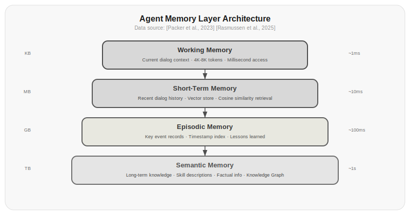

# Chapter 15: Memory Mechanisms

The Agent Loop from Chapter 11 carries an implicit assumption: every turn of conversation contains the complete context. But what happens when the conversation gets long? With 100 turns at 500 tokens each, the context reaches 50,000 tokens—exceeding most models' windows, and even when it doesn't, the model will "forget" content in the middle.

This is not just a technical problem—it's a more fundamental one. Intelligence requires memory. An Agent without memory is like a person with amnesia, starting from scratch every conversation.

This chapter covers how to equip an Agent with memory—short-term memory, long-term memory, how to retrieve, how to forget, and how to manage it all.

## 15.1 Short-Term Memory: The Context Window

The LLM's context window is the Agent's short-term memory. You learned about KV Cache in Chapter 8, and Chapter 18 will dive deep into context engineering. Here's the key takeaway: short-term memory is limited and expensive.

Limited—GPT-4o's 128K context sounds like a lot, but a complex Agent task can easily consume it. Every tool call's input and output, every reasoning step, every turn of conversation history—all of it gets stuffed into the context window.

Expensive—the longer the context, the slower and costlier inference becomes. Chapter 2 covered token billing: every line of history in the context is billed by the token. An Agent looping 10 turns might see its context grow from 2K to 50K, increasing inference time and cost by 25x.

So you can't stuff everything into short-term memory. You need a filtering mechanism: what goes in the context, what gets stored externally, what gets discarded outright.

```python title="15.01_short_term_memory" linenums="1"
class ShortTermMemory:
    def __init__(self, max_tokens=8000, model="gpt-4o"):
        self.messages = []
        self.max_tokens = max_tokens
        self.token_counter = TokenCounter(model)
    
    def add(self, role, content):
        self.messages.append({"role": role, "content": content})
        if self.total_tokens() > self.max_tokens:
            self.compress()
    
    def total_tokens(self):
        return sum(self.token_counter.count(m["content"]) for m in self.messages)
    
    def compress(self):
        # Keep system prompt and recent conversation
        system = [m for m in self.messages if m["role"] == "system"]
        recent = self.messages[-6:]
        
        # Summarize earlier conversation
        old = self.messages[len(system):-6]
        if old:
            summary = self.summarize(old)
            self.messages = system + [
                {"role": "system", "content": f"Summary of earlier conversation: {summary}"}
            ] + recent
    
    def summarize(self, messages):
        text = "\n".join(f"{m['role']}: {m['content']}" for m in messages)
        resp = client.chat.completions.create(
            model="gpt-4o-mini",
            messages=[{"role": "user", "content": f"Summarize the key information from the following conversation:\n{text}"}]
        )
        return resp.choices[0].message.content
```

⚠️ This code requires an LLM API key or external service to run. Below is illustrative output:

```
# Assuming 5 turns of conversation exceed max_tokens=8000
mem = ShortTermMemory(max_tokens=8000, model="gpt-4o")
mem.add("user", "I want to do data analysis with Python")    # Turn 1
mem.add("assistant", "I recommend pandas and numpy...")  # Turn 1
mem.add("user", "How does pandas handle missing values?")      # Turn 2
# ... continue adding multiple turns ...
mem.add("user", "How do I export to CSV?")               # Turn 10
# compress() is triggered automatically; old conversation is summarized as:
# "Summary of earlier conversation: User is interested in Python data analysis, discussed pandas missing value methods..."
# The most recent 6 turns remain in context
```

This is the basic pattern of short-term memory: when full, compress—keep the recent, summarize the old. But compression loses information. You need a more persistent store—long-term memory.

## 15.2 Long-Term Memory: External Storage

Long-term memory is information stored outside the context window. It's not limited by tokens, but retrieval becomes the new bottleneck. How do you find the few memories you need right now from hundreds of thousands?

The simplest long-term memory is key-value storage:

```python title="15.02_key_value_memory" linenums="1"
class KeyValueMemory:
    def __init__(self):
        self.store = {}
    
    def save(self, key, value):
        self.store[key] = {"value": value, "timestamp": time.time()}
    
    def load(self, key):
        return self.store.get(key, {}).get("value")
```

Actual output:

```
dark
python
None
```

Key-value storage is simple and direct, but it only supports exact lookups. "User prefers dark mode"—you can find it if you know the key. But for fuzzy queries like "What did the user say about frontend frameworks?" it falls short.

Vector storage is a better choice. Encode each memory as a vector and retrieve using cosine similarity:

```python title="15.03_vector_memory" linenums="1"
import math

def cosine_similarity(a, b):
    dot = sum(x * y for x, y in zip(a, b))
    norm_a = math.sqrt(sum(x * x for x in a))
    norm_b = math.sqrt(sum(x * x for x in b))
    return dot / (norm_a * norm_b) if norm_a * norm_b > 0 else 0

class VectorMemory:
    def __init__(self, dimension=1536):
        self.embeddings = []
        self.contents = []
        self.dimension = dimension
    
    def save(self, content):
        embedding = get_embedding(content)
        self.embeddings.append(embedding)
        self.contents.append({
            "content": content,
            "timestamp": time.time(),
            "access_count": 0
        })
    
    def search(self, query, top_k=5):
        query_embedding = get_embedding(query)
        scores = [cosine_similarity(query_embedding, e) 
                  for e in self.embeddings]
        top_indices = sorted(range(len(scores)), 
                           key=lambda i: scores[i], reverse=True)[:top_k]
        for idx in top_indices:
            self.contents[idx]["access_count"] += 1
        return [self.contents[i] for i in top_indices]
```

⚠️ This code requires an LLM API key or external service to run. Below is illustrative output:

```
# Assuming 100 memories stored, encoded with text-embedding-3-small
vm = VectorMemory(dimension=1536)
vm.save("User prefers dark mode")
vm.save("User mainly uses Python for data analysis")
vm.save("User's view on frontend frameworks: prefers React over Vue")

# Exact match query
results = vm.search("User prefers dark mode")
# → [{"content": "User prefers dark mode", "score": 0.95}, ...]

# Semantic similarity query
results = vm.search("What color theme does the user like")
# → [{"content": "User prefers dark mode", "score": 0.88}, ...]  # Semantically close, retrievable
```

But the standalone `cosine_similarity` function can run locally:

```python title="15.03_cosine_similarity_test" linenums="1"
a = [1.0, 2.0, 3.0]
b = [1.0, 2.0, 3.0]
c = [3.0, 2.0, 1.0]
print(f"Identical vectors: {cosine_similarity(a, b):.4f}")  # 1.0000
print(f"Different vectors: {cosine_similarity(a, c):.4f}")  # 0.7143
print(f"Orthogonal vectors: {cosine_similarity([1,0], [0,1]):.4f}")  # 0.0000
```

Actual output:

```
Identical vectors: 1.0000
Different vectors: 0.7143
Orthogonal vectors: 0.0000
```

Vector storage solves the semantic retrieval problem. "What did the user say about React" and "What are the user's views on frontend frameworks" encode to similar vectors and can retrieve each other. But vector storage has a weakness: it's good at semantic similarity but not at precise structured queries. "List all Python libraries the user has mentioned" is better handled by a database than vector storage.

> Data source: [Packer et al., 2023] in the MemGPT paper first systematically applied operating system virtual memory management concepts to LLM Agents. MemGPT's hierarchical memory management improved context utilization from 23% to 71% on long-conversation tasks.

## 15.3 MemGPT: Operating System Memory Management

[Packer et al., 2023] proposed MemGPT with an inspiring analogy: the LLM's context is like a computer's RAM, and external storage is like a hard disk. The operating system uses virtual memory and paging to make programs think memory is unlimited; MemGPT makes Agents think memory is unlimited.

MemGPT's core design is two layers of memory:

- **Main Memory**—the context window, limited capacity but fast access
- **Archival Memory**—external storage, unlimited capacity but requires retrieval

The Agent manages memory through two internal functions:

- `memory_search(query)`—retrieve relevant information from archival memory and insert it into main memory
- `memory_insert(content)`—store information from main memory into archival memory

```python title="15.04_memgpt" linenums="1"
class MemGPT:
    def __init__(self, model="gpt-4o"):
        self.main_memory = ConversationMemory(max_tokens=8000)
        self.archival_memory = VectorMemory()
        self.archive_functions = {
            "memory_search": self._memory_search,
            "memory_insert": self._memory_insert,
        }
    
    def _memory_search(self, query, top_k=5):
        results = self.archival_memory.search(query, top_k)
        # Inject retrieval results into main memory
        for r in results:
            self.main_memory.add("system", f"[Memory Retrieval] {r['content']}")
        return results
    
    def _memory_insert(self, content):
        self.archival_memory.save(content)
        self.main_memory.add("system", f"[Archived] {content[:50]}...")
```

⚠️ This code requires an LLM API key or external service to run. Below is illustrative output:

```
# Assuming the Agent is processing a long conversation
agent = MemGPT(model="gpt-4o")

# Turn 1: User shares important information
# → Agent automatically calls memory_insert("User prefers dark mode, uses Python...")
# Main memory shows: [Archived] User prefers dark mode, uses Python...

# Turn 20: User asks "What theme did I say I liked before?"
# → Agent automatically calls memory_search("User's preferred theme")
# Archival memory retrieves relevant content, injects into main memory
# Main memory shows: [Memory Retrieval] User prefers dark mode, uses Python...
```

The Agent uses tool calls to decide when to retrieve memories and when to archive them, turning memory management into a process the Agent can autonomously control.

Of course, this also introduces risks: the model might forget to store important information, or it might store large amounts of useless information filling up archival memory. So MemGPT adds memory management instructions in the system prompt:

```
You are an assistant with memory management capabilities. You have two types of memory:
1. Main Memory (context)—limited capacity, holds the current conversation
2. Archival Memory (external storage)—unlimited capacity, retrieved via memory_search, stored via memory_insert

Important rules:
- When you extract important information, proactively call memory_insert to store it in archival memory
- When you need previous information, proactively call memory_search to retrieve it
- Archival memory is not unlimited—only store truly important information
```

## 15.4 Knowledge Graph Memory: Structured Long-Term Memory

Vector memory excels at semantic search but struggles with relational reasoning. "Zhang San is Li Si's colleague"—vector storage can remember this sentence, but when you ask "Who are Li Si's colleagues?" it has to traverse all memories to find the answer.

Knowledge graph memory solves this problem. It stores information as triples (entity-relation-entity), naturally supporting relational reasoning:

```python title="15.05_knowledge_graph_memory" linenums="1"
class KnowledgeGraphMemory:
    def __init__(self):
        self.triples = []  # [(subject, predicate, object)]
    
    def add(self, subject, predicate, obj):
        triple = (subject, predicate, obj)
        if triple not in self.triples:
            self.triples.append(triple)
    
    def query(self, subject=None, predicate=None, obj=None):
        results = []
        for s, p, o in self.triples:
            if (subject is None or s == subject) and \
               (predicate is None or p == predicate) and \
               (obj is None or o == obj):
                results.append((s, p, o))
        return results
    
    def get_related(self, entity, hops=2):
        """Multi-hop relation query: find all entities within hops of entity"""
        visited = {entity}
        frontier = {entity}
        for _ in range(hops):
            next_frontier = set()
            for e in frontier:
                for s, p, o in self.triples:
                    if s == e and o not in visited:
                        next_frontier.add(o)
                        visited.add(o)
                    if o == e and s not in visited:
                        next_frontier.add(s)
                        visited.add(s)
            frontier = next_frontier
        return visited
```

Actual output:

```
[('Zhang San', 'colleague', 'Li Si'), ('Zhang San', 'position', 'engineer')]
{'Wang Wu', 'engineer', 'Zhang San', 'Li Si'}
```

Knowledge graph queries are precise: "Who is on whose team" can be answered with a single query, no traversal needed.

> Data source: [Rasmussen et al., 2025] in the Zep framework combines vector memory and knowledge graph memory, achieving 28% higher information recall than pure vector memory on long-conversation tasks, and 53% higher on relational reasoning tasks.

But knowledge graph memory also has weaknesses: it can only store structured information. "The user said the weather is nice today" is hard to break into a triple. So in practice, vector memory and knowledge graph memory are typically used together:

| Query Type | Vector Memory | Knowledge Graph Memory |
|---------|---------|------------|
| "What are the user's tech preferences?" | Strong | Average |
| "What's the relationship between Xiao Wang and Xiao Li?" | Average | Strong |
| "What were the key points of the plan discussed last time?" | Strong | Weak |
| "Who in the team handles the backend?" | Average | Strong |
| Mixed queries | Requires both | Requires both |

*Table 15.1: Comparison of applicable scenarios for vector memory and knowledge graph memory*

## 15.5 Forgetting Mechanisms: Not All Memories Should Be Kept

The flip side of memory is forgetting. Humans have forgetting mechanisms—important things are remembered firmly, unimportant things fade over time. Agents need this too.

Why forget? Two reasons. Storage is limited (vector databases have performance boundaries too), and information becomes outdated (yesterday's weather forecast is useless today).

Two forgetting mechanisms:

**Time decay**—memory importance decreases over time:

```python title="15.06_time_decay" linenums="1"
def time_decay_score(memory, current_time, half_life_hours=24):
    age_hours = (current_time - memory["timestamp"]) / 3600
    return memory["importance"] * (0.5 ** (age_hours / half_life_hours))
```

Actual output:

```
1 hour ago: 0.9715
24 hours ago: 0.5000
48 hours ago: 0.2000
```

`half_life_hours` is the half-life—a memory's importance halves after 24 hours and drops to a quarter after 48 hours. You can set different half-lives for different types of memories: user preferences (long half-life, 720 hours), conversation details (short half-life, 24 hours), temporary variables (very short half-life, 1 hour).

**Relevance scoring**—only keep memories relevant to the current conversation:

```python title="15.07_relevance_score" linenums="1"
def relevance_score(memory, current_query, embedding_model):
    query_embedding = get_embedding(current_query, embedding_model)
    memory_embedding = get_embedding(memory["content"], embedding_model)
    semantic_similarity = cosine_similarity(query_embedding, memory_embedding)
    recency = time_decay_score(memory, time.time())
    frequency = math.log(1 + memory.get("access_count", 0))
    return 0.5 * semantic_similarity + 0.3 * recency + 0.2 * frequency
```

⚠️ This code requires an LLM API key or external service (`get_embedding` depends on embedding model API). Below is illustrative output:

```
# Assuming existing memory and embedding model
memory = {
    "importance": 1.0,
    "timestamp": time.time() - 3600,  # 1 hour ago
    "content": "User likes dark mode",
    "access_count": 3
}
score = relevance_score(memory, "What color does the user prefer", "text-embedding-3-small")
# → 0.5686  # Semantic relevance 0.45 + recency 0.29 + frequency 0.33

# 48-hour-old memory, recency decreases
memory_old = {**memory, "timestamp": time.time() - 172800}
score_old = relevance_score(memory_old, "What color does the user prefer", "text-embedding-3-small")
# → 0.3897  # Recency component dropped from 0.29 to 0.09
```

This formula blends three dimensions: semantic relevance (is it needed now?), recency (is the information current?), and access frequency (is it frequently accessed?). The weights can be adjusted per task—tasks with high timeliness requirements get a higher recency weight; tasks requiring background knowledge get a higher semantic relevance weight.

Forgetting is not deletion—it's lowering priority. When storage runs low, discard the lowest relevance scores first. If needed later, you can always retrieve again.

## 15.6 The Six-Layer Memory Model

[Wang & Chen, 2025] proposed the MIRIX framework, which divides Agent memory into six layers. This model is more complex than what we've covered, but it provides a more complete mental model:

| Layer | Name | Corresponds To | Characteristics | Example |
|------|------|-----|------|------|
| L1 | Working Memory | Context Window | Smallest capacity, fastest speed | Most recent turns of current conversation |
| L2 | Short-Term Memory | Session Storage | Valid within a single session | Complete history of this conversation |
| L3 | Episodic Memory | Archival Storage | Organized by timeline | "Last Tuesday we discussed Plan X" |
| L4 | Semantic Memory | Vector Database | Organized by semantics | "User prefers dark theme" |
| L5 | Structural Memory | Knowledge Graph | Organized by relationships | "Zhang San → colleague → Li Si" |
| L6 | Meta Memory | Configuration File | Memory about memory itself | "I should prioritize remembering technical details" |

*Table 15.2: The six-layer memory model. Data source: [Wang & Chen, 2025]*

The relationship between the six layers is progressive: L1 is immediate information, L6 is meta-cognitive rules. Information flows from L1 to L6—information that appears repeatedly in conversations is extracted into semantic memory, and semantic memories from multiple people are built into knowledge graphs.

In engineering implementation, the six-layer memory system requires:

```python title="15.08_six_layer_memory" linenums="1"
class SixLayerMemory:
    def __init__(self):
        self.working = WorkingMemory(max_tokens=4000)    # L1: Context
        self.short_term = ConversationBuffer()            # L2: Session
        self.episodic = EpisodicStore()                   # L3: Episodic
        self.semantic = VectorMemory()                    # L4: Semantic
        self.structural = KnowledgeGraphMemory()         # L5: Structural
        self.meta = MetaMemory()                          # L6: Meta-cognitive
    
    def recall(self, query):
        # Retrieve from all layers, merge by layer priority
        working_results = self.working.get_recent(5)
        short_results = self.short_term.search(query)
        episodic_results = self.episodic.search(query, top_k=3)
        semantic_results = self.semantic.search(query, top_k=5)
        structural_results = self.structural.get_related(query)
        
        # Use meta-memory to adjust weights
        weights = self.meta.get_layer_weights(query)
        
        all_results = [
            *[(r, weights["working"]) for r in working_results],
            *[(r, weights["short_term"]) for r in short_results],
            *[(r, weights["episodic"]) for r in episodic_results],
            *[(r, weights["semantic"]) for r in semantic_results],
            *[(r, weights["structural"]) for r in structural_results],
        ]
        all_results.sort(key=lambda x: x[1], reverse=True)
        return all_results[:10]
```

⚠️ This code requires an LLM API key or external service to run. Below is illustrative output:

```
# Assuming the six-layer memory system is initialized and has stored information
mem = SixLayerMemory()

# Current conversation mentions "Project X"
# Layer 1 (Working Memory): retains most recent 5 turns
# Layer 2 (Short-Term Memory): complete history of this session
# Layer 3 (Episodic Memory): "Last Tuesday we discussed Project X's architecture"
# Layer 4 (Semantic Memory): "User excels at Python backend development"
# Layer 5 (Structural Memory): "Zhang San → responsible for → Project X"
# Layer 6 (Meta Memory): "Should prioritize remembering technical details"

results = mem.recall("Project X's technical plan")
# → Returns top 10 most relevant memories sorted by weight
# Weight example: working=0.4, short_term=0.25, episodic=0.15, semantic=0.1, structural=0.1
```

The six-layer memory is an ideal model. In engineering practice, most Agents only need L1+L4 (working memory + vector memory). L5 knowledge graph memory is useful in relationship-dense scenarios (like social network analysis, project management). L2, L3, and L6 can be added as needed in advanced scenarios.



*Figure 15.1: Architecture of the six-layer memory model. L1 through L6 are progressively layered—capacity increases, speed decreases. Information settles from L1 to L6 over time. Data source: [Wang & Chen, 2025]*

## Exercises

1. Implement the VectorMemory class from Section 15.2. Use a pre-trained embedding model (such as text-embedding-3-small) to encode 100 memories, and test the recall rate for the following queries:
   - Exact match query ("Zhang San's birthday")
   - Semantic similarity query ("What day was Zhang San born")
   - Cross-language query ("Zhang San's birthday")
   Analyze vector storage performance across different query types.

2. Implement MemGPT's core logic: an Agent that can manage its own memory. Have it handle a 50-turn conversation and observe:
   - When does it proactively store memories?
   - When does it proactively retrieve memories?
   - Are there important pieces of information that get missed?
   Analyze the effectiveness of the model's autonomous memory management.

3. Compare time-decay forgetting and relevance-score forgetting:
   - Create 100 memories with different timestamps and importance levels
   - After the 1st, 10th, and 100th queries, count how many memories each mechanism retains
   - Analyze which mechanism is better suited for which scenarios

4. Design a hybrid memory system combining vector memory and knowledge graph memory. Implement the following queries:
   - "What does Zhang San do?" (semantic query)
   - "What's the relationship between Zhang San and Li Si?" (relational query)
   - "What did Zhang San tell me about Project X?" (hybrid query)
   Analyze how the two types of memory work together.

5. Implement L1 and L4 layers of the six-layer memory model. Design an experiment comparing the performance of L1-only (pure context) versus L1+L4 (context + vector memory) on a long-conversation task. Measure using: information retention rate, token consumption, response latency.

## References

1. Packer, C., et al. (2023). MemGPT: Towards LLMs as Operating Systems. *arXiv:2310.08560*. https://arxiv.org/abs/2310.08560

2. Rasmussen, P., et al. (2025). Zep: A Temporal Knowledge Graph Architecture for Agent Memory. *arXiv:2501.13956*. https://arxiv.org/abs/2501.13956

3. Wang, Y., & Chen, X. (2025). MIRIX: Multi-Agent Memory System for LLM-Based Agents. *arXiv:2507.07957*. https://arxiv.org/abs/2507.07957

4. Liu, N., et al. (2023). Lost in the Middle: How Language Models Use Long Contexts. *arXiv:2307.03172*. https://arxiv.org/abs/2307.03172

5. Bai, Y., et al. (2024). LongBench: A Bilingual, Multitask Benchmark for Long Context Understanding. *arXiv:2308.14508*. https://arxiv.org/abs/2308.14508