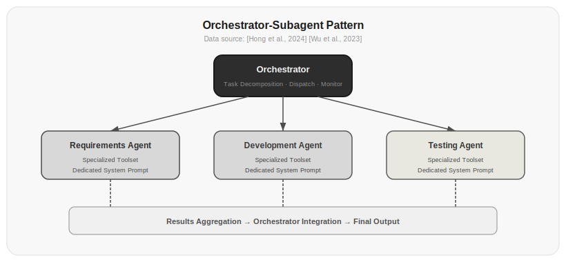

# Chapter 16: Subagents

From Chapter 11 through Chapter 15, the Agents you've built have all been driven by a single LLM. One LLM does the reasoning, picks the tools, manages memory—everything by itself.

That's sufficient for simple tasks. But what about complex ones? Having one Agent write an entire software project—analyze requirements, design architecture, write frontend code, write backend code, write tests, write documentation—can you really expect one LLM to do all of that well?

The reality is, a single LLM has limited context, limited specialization, and limited attention. When a task exceeds its capacity, you need to break the big task into smaller ones and have different Agents handle different subtasks. That's the idea behind Subagents.

## 16.1 From Single Agent to Orchestrator-Subagent Pattern

The simplest multi-Agent pattern is the Orchestrator-Subagent pattern:



*Figure 16.1: The orchestrator-subagent pattern. The orchestrator handles task decomposition, distribution, and monitoring. Each subagent has a specialized toolset and dedicated system prompt, independently completing its assigned subtask before returning results to the orchestrator for integration.*

The orchestrator Agent doesn't do the work directly. It does three things:

1. **Understand the task**—break the user's complex requirement into subtasks
2. **Distribute subtasks**—assign each subtask to the Agent specialized for that type
3. **Integrate results**—synthesize the subagents' results into a final answer

```python title="16.01_orchestrator" linenums="1"
class Orchestrator:
    def __init__(self, subagents):
        self.subagents = {sa["name"]: sa for sa in subagents}
        self.system_prompt = """You are a task orchestrator. Your responsibilities are:
1. Analyze user requirements and break them into subtasks
2. Assign each subtask to the appropriate subagent
3. Integrate all subagent results into a final answer

Available subagents:
{subagent_descriptions}

Please output in the following format:
Subtask list:
- [Subtask 1] → [subagent name]
- [Subtask 2] → [subagent name]
..."""
    
    def run(self, user_query):
        # Step 1: Decompose the task
        plan = self.plan(user_query)
        
        # Step 2: Distribute subtasks
        results = {}
        for task in plan:
            agent = self.subagents[task["agent"]]
            results[task["id"]] = agent.run(task["description"])
        
        # Step 3: Integrate results
        final = self.synthesize(user_query, results)
        return final
    
    def plan(self, query):
        response = client.chat.completions.create(
            model="gpt-4o",
            messages=[
                {"role": "system", "content": self.system_prompt},
                {"role": "user", "content": query}
            ]
        )
        return parse_plan(response.choices[0].message.content)
    
    def synthesize(self, query, results):
        prompt = f"Original requirement: {query}\n\nSubagent results:\n"
        for task_id, result in results.items():
            prompt += f"\n[{task_id}]: {result}\n"
        prompt += "\nPlease integrate the above results and provide a complete answer."
        
        response = client.chat.completions.create(
            model="gpt-4o",
            messages=[{"role": "user", "content": prompt}]
        )
        return response.choices[0].message.content
```

⚠️ This code requires an LLM API key or external service to run. Below is illustrative output:

```
Subtask list:
- [Analyze sorting algorithm requirements] → searcher
- [Write Python sorting implementation] → developer
- [Review code quality] → tester
Final integrated answer: An insertion sort algorithm has been implemented for you, code review confirms quality is satisfactory...
```

The benefit of this pattern is that each subagent has a specialized system prompt and toolset—it only cares about its own subtask, without needing to understand the global picture. The orchestrator only cares about the global picture, without needing to dive into details.

## 16.2 Subagent Specialization

The value of subagents lies in specialization. A general-purpose Agent can do everything but excels at nothing. A specialized Agent's system prompt, toolset, and memory can all be optimized for a specific task.

```python title="16.02_specialized_agents" linenums="1"
# Search Agent: specializes in information retrieval
search_agent = {
    "name": "searcher",
    "system_prompt": """You are an information retrieval expert. Your tasks are:
- Find the most relevant information for the question
- Organize information and cite sources
- Distinguish facts from opinions
- If information is insufficient, state it clearly""",
    "tools": [web_search, wiki_search, news_search],
    "memory": VectorMemory(),
}

# Development Agent: specializes in writing code
dev_agent = {
    "name": "developer",
    "system_prompt": """You are a full-stack development expert. Your tasks are:
- Write clear, testable code
- Follow project coding conventions
- Write unit tests
- Handle edge cases and error handling""",
    "tools": [python_repl, file_write, test_runner],
    "memory": CodebaseMemory(),
}

# Testing Agent: specializes in quality assurance
qa_agent = {
    "name": "tester",
    "system_prompt": """You are a quality assurance expert. Your tasks are:
- Design test cases covering normal flows and edge cases
- Run automated tests and analyze results
- Check security, performance, and maintainability
- Give a 1-10 score and specific improvement suggestions""",
    "tools": [static_analyzer, security_scanner, test_runner],
    "memory": TestResultMemory(),
}
```

⚠️ This code requires an LLM API key or external service to run. Below is illustrative output:

```
search_agent: {name: "searcher", tools: [web_search, wiki_search, news_search], ...}
dev_agent: {name: "developer", tools: [python_repl, file_write, test_runner], ...}
qa_agent: {name: "tester", tools: [static_analyzer, security_scanner, test_runner], ...}
Three specialized subagents defined, each with focused system prompts and streamlined toolsets.
```

The impact of specialization is significant. A dedicated coding Agent outperforms a general Agent on code generation tasks—not because it's smarter, but because:

1. **Focused system prompt**—no need to handle generic "you are an all-purpose assistant" instructions, just focus on programming
2. **Streamlined toolset**—only 3 coding-related tools, no need to choose from 50
3. **Targeted examples**—the system prompt's examples are all coding examples, making pattern matching easier
4. **Smaller hallucination space**—the narrower the task, the less room the model has to fabricate information

> Data source: [Hong et al., 2024] in the MetaGPT experiments showed that specialized subagents achieved 18-25% higher pass rates on code generation tasks than general-purpose Agents. The key factor was not model capability differences, but system prompt focus and toolset streamlining.

## 16.3 Task Decomposition: The Orchestrator's Hardest Job

The bottleneck in the orchestrator-subagent pattern isn't the subagents—it's the orchestrator. The orchestrator's core capability is task decomposition: breaking a large task into multiple independent or partially dependent subtasks.

Task decomposition follows several principles.

**MECE principle**—subtasks should be Mutually Exclusive and Collectively Exhaustive. No overlaps, no gaps.

**Minimal dependency principle**—minimize dependencies between subtasks so they can be executed in parallel. If subtask B depends on subtask A's result, B must wait for A to finish before starting.

**Appropriate granularity principle**—decomposition that's too coarse is meaningless ("write the project" is still one task), and decomposition that's too fine increases communication overhead ("write line 3 of code" is not a reasonable subtask).

```python title="16.03_decompose_task" linenums="1"
def decompose_task(task):
    """Let the LLM decompose the task"""
    response = client.chat.completions.create(
        model="gpt-4o",
        messages=[{
            "role": "user",
            "content": f"""Please decompose the following task into 3-7 subtasks.
Requirements:
1. Subtasks should be as independent as possible (MECE principle)
2. Each subtask can be completed independently by a specialized agent
3. Mark dependencies between subtasks
4. Specify the required agent type for each subtask

Task: {task}

Output in JSON format:
{{
  "subtasks": [
    {{
      "id": "T1",
      "description": "Subtask description",
      "agent_type": "searcher/coder/reviewer/writer",
      "depends_on": [],
      "estimated_tokens": 500
    }}
  ]
}}"""
        }]
    )
    return json.loads(response.choices[0].message.content)
```

⚠️ This code requires an LLM API key or external service to run. Below is illustrative output:

```json
{
  "subtasks": [
    {"id": "T1", "description": "Search for information about sorting algorithms", "agent_type": "searcher", "depends_on": [], "estimated_tokens": 500},
    {"id": "T2", "description": "Write a Python implementation of a sorting algorithm", "agent_type": "coder", "depends_on": ["T1"], "estimated_tokens": 800},
    {"id": "T3", "description": "Review code quality", "agent_type": "reviewer", "depends_on": ["T2"], "estimated_tokens": 400}
  ]
}
```

A good orchestrator also needs to handle dependencies. If task B depends on task A's result, they can't run in parallel:

```python title="16.04_execute_with_dependencies" linenums="1"
def execute_with_dependencies(plan, subagents):
    completed = {}
    remaining = plan["subtasks"][:]
    
    while remaining:
        # Find all subtasks whose dependencies are satisfied
        ready = [t for t in remaining 
                 if all(d in completed for d in t["depends_on"])]
        
        if not ready:
            raise Exception("Circular dependency detected! Cannot continue execution.")
        
        # Execute all ready subtasks in parallel
        with ThreadPoolExecutor() as executor:
            futures = {}
            for task in ready:
                agent = subagents[task["agent_type"]]
                futures[task["id"]] = executor.submit(
                    agent.run, task["description"]
                )
            
            for task_id, future in futures.items():
                completed[task_id] = future.result()
                remaining.remove(next(t for t in remaining if t["id"] == task_id))
    
    return completed
```

⚠️ This code requires an LLM API key or external service to run. Below is illustrative output:

```
Execution plan: T1(no deps) → parallel T2,T3(depend on T1) → T4(depends on T2,T3)
T1 completed (0.5s)
T2 completed (0.8s), T3 completed (0.7s)  [parallel execution]
T4 completed (0.6s)
Total time: 1.9s (sequential would take 2.6s)
```

## 16.4 Communication Between Subagents

Subagents aren't islands. They need to exchange information—the coding Agent needs the requirements document the search Agent found, the review Agent needs the code the coding Agent wrote.

There are three communication approaches:

**Direct passing**—the orchestrator passes one subagent's output as another subagent's input:

```python title="16.05_direct_passing" linenums="1"
# Search Agent found the requirements document
search_result = search_agent.run("Find the project requirements document")

# Orchestrator passes the requirements document to the coding Agent
code_result = code_agent.run(f"Write code based on the following requirements document:\n{search_result}")
```

⚠️ This code requires an LLM API key or external service to run. Below is illustrative output:

```
search_result: "Project requirements: Implement a CRUD todo API..."
code_result: "Based on the requirements document, the todo API code has been completed..."
```

Simple and direct, but tightly coupled—the coding Agent's input format depends entirely on the search Agent's output format.

**Shared state**—subagents exchange information through a shared state store:

```python title="16.06_shared_state" linenums="1"
shared_state = SharedState()

search_agent.run("Find the project requirements document", state=shared_state)
# Search Agent writes results to shared_state["requirements"]

code_agent.run("Write code based on the shared requirements document", state=shared_state)
# Coding Agent reads from shared_state["requirements"]
```

⚠️ This code requires an LLM API key or external service to run. Below is illustrative output:

```
shared_state contents: {"requirements": "...", "search_results": "..."}
search_agent wrote to shared_state["requirements"] successfully
code_agent read from shared_state["requirements"] successfully
```

This decouples the format dependency but introduces state management complexity—who's responsible for updating state? What happens when there are state conflicts?

**Message passing**—subagents communicate through a message queue:

```python title="16.07_message_bus" linenums="1"
message_bus = MessageBus()

search_agent = Agent("searcher", bus=message_bus)
code_agent = Agent("coder", bus=message_bus)

search_agent.send("coder", "requirements", content=requirements_doc)
code_agent.receive("requirements")
```

⚠️ This code requires an LLM API key or external service to run. Below is illustrative output:

```
message_bus routing: searcher → coder, topic="requirements"
coder received message: requirements (length: 1234 characters)
```

The most flexible, but also the most complex. Message format, routing, and timing all need clear conventions.

In the orchestrator-subagent pattern, direct passing is the most common approach—because the orchestrator controls the subagents' execution order and input/output. Shared state and message passing are better suited for the peer-to-peer multi-agent collaboration patterns covered in Chapter 17.

## 16.5 Single Agent vs. Subagents: When to Use Which

The subagent pattern isn't a silver bullet. Many tasks work just fine with a single Agent—introducing subagents adds complexity.

| Dimension | Single Agent | Subagents |
|------|---------|---------|
| Task complexity | Low-Medium | High |
| Context requirements | Low | High (needs to handle information transfer between subtasks) |
| Latency | Low (single loop) | High (orchestration + distributed execution) |
| Cost | Low-Medium | Medium-High (multiple model calls) |
| Quality | Good for simple tasks | Good for complex tasks |
| Debugging difficulty | Low | High (need to track multiple Agents) |

*Table 16.1: Comparison of applicable scenarios for single Agent vs. Subagents*

A simple rule: if a single task's system prompt fits on one page, needs no more than 5 tools, and doesn't require multiple areas of expertise—use a single Agent. Otherwise, consider subagents.

Another angle: the core value of subagents isn't "multiple models" but "multiple specialized prompts." If you find yourself writing more and more conditional branches in your system prompt ("if the user asks about coding then... if the user asks about searching then..."), that's when you should split into subagents.

```python title="16.08_should_split" linenums="1"
# Signal that you should split: system prompt keeps getting longer
system_prompt = """You are an assistant. If the user asks a coding question, write code.
If the user asks a research question, search for information. If the user asks a design question...
If the user asks..."""
# → This should be split into a coding Agent, a search Agent, a design Agent

# Signal that you shouldn't split: task is simple and clear
system_prompt = """You are a code review assistant. Review the code submitted by the user."""
# → This doesn't need splitting; a single Agent is sufficient
```

Actual output:

```
system_prompt (should split): 'You are an assistant. If the user asks a coding question, write code.\nIf the user asks a research question, search for information. If the user asks a design question...\nIf the user asks...'
system_prompt (shouldn't split): 'You are a code review assistant. Review the code submitted by the user.'
```

## 16.6 Subagent Failure Modes

The subagent pattern has several common pitfalls:

**Orchestration hallucination**—the orchestrator overestimates a subagent's capabilities and assigns tasks beyond what it can handle. For example, asking a Python-only coding Agent to write Rust code.

**Cascading failure**—subagent A fails, subagent B which depends on A's result also fails, and C which depends on B fails too. A local error becomes a global failure.

**Information bottleneck**—subagent A produces a large amount of output, but only a summary can be passed to subagent B, and important information is lost in the summary.

**Infinite loop**—the orchestrator finds a subagent's result incorrect, feeds it back to the same subagent, the subagent gets it wrong again, the orchestrator feeds it back again—infinite loop.

Defending against these failure modes:

```python title="16.09_safe_orchestrator" linenums="1"
class SafeOrchestrator:
    def __init__(self, subagents, max_retries=2, max_total_steps=15):
        self.subagents = subagents
        self.max_retries = max_retries
        self.max_total_steps = max_total_steps
    
    def run(self, user_query, max_retries=2):
        plan = self.plan(user_query)
        results = {}
        total_steps = 0
        
        for task in plan:
            if total_steps >= self.max_total_steps:
                return "Maximum total steps reached. Task incomplete."
            
            agent = self.subagents[task["agent_type"]]
            retries = 0
            
            while retries <= self.max_retries:
                total_steps += 1
                context = self.build_context(task, results)
                result = agent.run(context)
                
                if self.validate(result, task):
                    results[task["id"]] = result
                    break
                else:
                    retries += 1
                    if retries > self.max_retries:
                        results[task["id"]] = f"[Failed] {task['id']} failed after {retries} retries"
        
        return self.synthesize(user_query, results)
    
    def validate(self, result, task):
        # Simple result validation: non-empty, not exceeding length limit, contains keywords
        if not result or len(result) < 10:
            return False
        return True
```

⚠️ This code requires an LLM API key or external service to run. Below is illustrative output:

```
Step 1/15: Execute T1 (searcher) → Success
Step 2/15: Execute T2 (coder) → Result empty, retry 1/2
Step 3/15: Retry T2 (coder) → Success
Step 4/15: Execute T3 (reviewer) → Result empty, retry 1/2
Step 5/15: Retry T3 (reviewer) → Result empty, retry 2/2
Step 6/15: Retry T3 (reviewer) → Still failed, recording [Failed] T3 failed after 2 retries
Final synthesis: Some tasks completed, T3 failed.
```


*Figure 16.1: The orchestrator-subagent pattern workflow. The orchestrator decomposes tasks, distributes them to subagents, and integrates results. Note the error handling and retry mechanisms.*

## Exercises

1. Implement the Orchestrator class from Section 16.1 with 3 subagents (search, coding, review). Test it with a complete scenario: have the orchestrator handle "Help me write a Python implementation of a sorting algorithm and review the code quality."

2. Implement the dependency-based task executor from Section 16.3. Construct a task graph with dependencies:
   - T1 (search requirements) → no dependencies
   - T2 (design interface) → depends on T1
   - T3 (write backend code) → depends on T2
   - T4 (write frontend code) → depends on T2
   - T5 (integration testing) → depends on T3 and T4
   Verify that parallel execution of T3 and T4 is indeed faster than sequential execution.

3. Design an experiment comparing single Agent and subagent patterns:
   - Task: research a technical topic and write a 500-word summary
   - Single Agent pattern: one general-purpose Agent completes the entire task
   - Subagent pattern: search Agent finds information + writing Agent writes the summary
   - Comparison dimensions: output quality, total token consumption, total latency

4. Implement the SafeOrchestrator class. Deliberately make a subagent return empty results, and test the retry and failure handling mechanisms. Record: how many retries occurred? How did the orchestrator handle the failure?

5. Discussion question: In what situations might information transfer between subagents cause a "telephone game" problem (information gradually distorting as it's passed along)? What solutions can you think of?

## References

1. Hong, S., et al. (2024). MetaGPT: Meta Programming for A Multi-Agent Collaborative Framework. *ICLR 2024*. https://arxiv.org/abs/2308.00352

2. Park, J., et al. (2023). Generative Agents: Interactive Simulacra of Human Behavior. *UIST 2023*. https://arxiv.org/abs/2304.03442

3. Wu, Q., et al. (2023). AutoGen: Enabling Next-Gen LLM Applications via Multi-Agent Conversation. *arXiv:2308.08155*. https://arxiv.org/abs/2308.08155

4. Significant Gravitas. (2023). AutoGPT: An Autonomous GPT-4 Experiment. https://github.com/Significant-Gravitas/AutoGPT