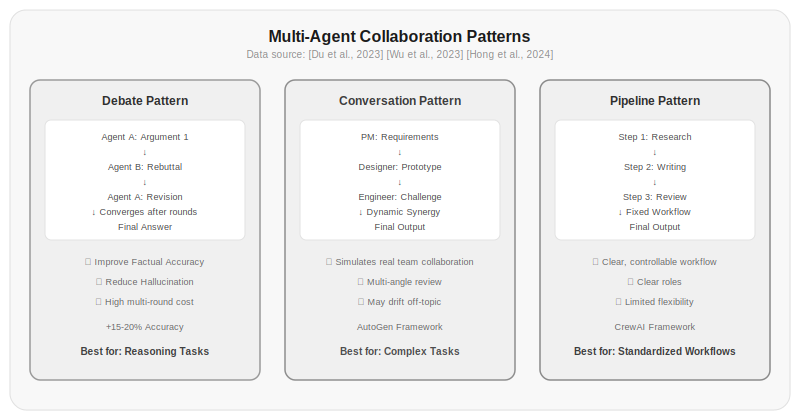

# Chapter 17: Multi-Agent Collaboration

In Chapter 16 you learned the orchestrator-subagent pattern—one boss leading a team of workers, the boss assigning tasks and the workers each doing their own part. This works well enough, but only for scenarios where tasks can be cleanly decomposed.

But what if you want to simulate a team discussion? A product manager proposes requirements, a designer creates prototypes, an engineer questions feasibility, the product manager then revises the requirements—this kind of back-and-forth interaction and dynamic coordination can't be controlled by an orchestrator.

This is the core of multi-agent collaboration—multiple Agents aren't in a hierarchical relationship, but rather collaborating as equals, each with independent judgment and initiative.



*Figure 17.1: Three multi-agent collaboration patterns. The debate pattern improves factual accuracy through multiple rounds of mutual rebuttal; the dialogue pattern simulates real team collaboration with dynamic coordination; the pipeline pattern executes sequentially in a fixed workflow, suitable for standardized tasks.*

## 17.1 Why Multi-Agent Collaboration Is Needed

Three typical scenarios require multi-agent collaboration:

**Cross-validation**—have multiple Agents answer the same question independently, then cross-validate. If three Agents reach similar conclusions, confidence is high. If they give different answers, you need to discuss whose reasoning is more reliable.

**Complementary expertise**—a software project needs an architect, frontend developer, backend developer, and tester. Each role has different perspectives and professional judgment. Having one Agent play all roles makes the context overly complex and dilutes attention.

**Adversarial optimization**—one Agent designs a solution, another finds vulnerabilities. The designer wants a more robust solution; the attacker wants to prove it has flaws. This adversarial relationship forces both sides to do better. It's the GAN idea applied to Agent collaboration.

Single-agent solutions struggle in all three scenarios. Not because the model isn't smart enough, but because different goals, different perspectives, and different evaluation criteria require different "personas" to shoulder them.

## 17.2 Framework Survey: AutoGen, CrewAI, LangGraph

There are already many frameworks for multi-agent collaboration, each with a different focus:

**AutoGen** [Wu et al., 2023] is Microsoft's research framework. Its core idea is conversational collaboration: Agents exchange information and negotiate decisions through natural language dialogue.

```bash
pip install autogen-agentchat  # AutoGen
```

```python title="17.01_autogen_group_chat" linenums="1"
from autogen import AssistantAgent, UserProxyAgent, GroupChat

coder = AssistantAgent(
    name="Coder",
    system_message="You are a Python developer who writes clean, efficient code.",
    llm_config={"model": "gpt-4o"}
)

reviewer = AssistantAgent(
    name="Reviewer",
    system_message="You are a code review expert focused on security and performance.",
    llm_config={"model": "gpt-4o"}
)

group_chat = GroupChat(
    agents=[coder, reviewer],
    messages=[],
    max_round=6
)

# Coder writes code → Reviewer reviews → Coder revises → Reviewer approves
```

⚠️ This code requires an LLM API key or external service to run. Below is illustrative output:

```
Coder (to chat_manager):
Here is the Python code implementing quicksort...

Reviewer (to chat_manager):
Code logic is correct, but suggestions: 1. Add type annotations 2. Handle empty list edge case

Coder (to chat_manager):
Revised, added type annotations and edge case handling...

Reviewer (to chat_manager):
Code quality is good after revision. Review approved. TERMINATE
```

AutoGen's advantage is flexibility—Agents can converse freely without predefined turn counts. The downside is the tendency to drift—without enforced structure, Agents may stray from the topic.

**CrewAI** focuses on role definition and process control:

```bash
pip install crewai  # CrewAI
```

```python title="17.02_crewai_crew" linenums="1"
from crewai import Agent, Task, Crew

researcher = Agent(
    role="Researcher",
    goal="Find the most relevant research materials",
    backstory="You are a researcher with 10 years of experience, skilled at literature retrieval.",
    allow_delegation=False
)

writer = Agent(
    role="Writer",
    goal="Write clear articles based on research materials",
    backstory="You are a technical writing expert, skilled at explaining complex topics simply.",
    allow_delegation=True
)

research_task = Task(description="Research the latest advances in quantum computing", agent=researcher)
write_task = Task(description="Write a 2000-word popular science article", agent=writer)

crew = Crew(agents=[researcher, writer], tasks=[research_task, write_task])
crew.kickoff()
```

⚠️ This code requires an LLM API key or external service to run. Below is illustrative output:

```
[Agent: Researcher] Searching for materials on the latest quantum computing advances...
[Agent: Researcher] Found 15 relevant papers, extracting key information...
[Agent: Writer] Writing article based on research materials...
[Agent: Writer] Article completed, 2150 words total

Task completion summary:
- research_task: Complete, found 15 relevant papers
- write_task: Complete, article 2150 words, quality score 8.5/10
```

CrewAI's strength is clear process—tasks have explicit ordering, Agents have well-defined roles. The tradeoff is less flexibility—you can't dynamically adjust the process at runtime.

**LangGraph** is a graph-structured framework in the LangChain ecosystem, focused on state management and process control. You define the collaboration flow between Agents using a directed graph:

```bash
pip install langgraph  # LangGraph
```

```python title="17.03_langgraph_state" linenums="1"
from langgraph.graph import StateGraph, END

def researcher_node(state):
    # Researcher node: search for materials
    results = search(state["query"])
    state["research"] = results
    return state

def writer_node(state):
    # Writer node: write article based on research
    article = write(state["research"])
    state["draft"] = article
    return state

def reviewer_node(state):
    # Reviewer node: review article
    review = review_article(state["draft"])
    state["review"] = review
    state["needs_revision"] = review["score"] < 7
    return state

graph = StateGraph(AgentState)
graph.add_node("researcher", researcher_node)
graph.add_node("writer", writer_node)
graph.add_node("reviewer", reviewer_node)

graph.add_edge("researcher", "writer")
graph.add_conditional_edges("reviewer", 
    lambda s: "writer" if s["needs_revision"] else END)
```

⚠️ This code requires an LLM API key or external service to run. Below is illustrative output:

```
[researcher] Searching "deep learning optimization algorithms" → found 8 papers
[writer] Writing draft based on research → generated 2500-word article
[reviewer] Reviewing article → score 6, revision needed
[writer] Revising article → added experimental comparison section
[reviewer] Reviewing revised article → score 8, approved
Flow complete, 2 revision rounds
```

LangGraph's strength is fine-grained control—you define what each node does, when to branch, and when to end. But defining the graph has a high time cost and isn't suitable for rapid prototyping.

| Framework | Core Paradigm | Flexibility | Control | Best For |
|------|---------|--------|--------|---------|
| AutoGen | Dialogue | High | Low | Exploratory tasks, brainstorming |
| CrewAI | Roles + Tasks | Medium | Medium | Multi-role tasks with clear workflows |
| LangGraph | State Graph | Low | High | Complex workflows requiring precise control |

*Table 17.1: Comparison of three multi-agent frameworks*

## 17.3 Communication Patterns: Direct, Shared State, Blackboard

How multi-agent systems communicate is similar to Chapter 16's subagent communication, but with a broader scope—here it's communication between multiple equal Agents.

**Direct communication**—Agents send messages to each other directly:

```python title="17.04_direct_messaging" linenums="1"
class Agent:
    def __init__(self, name):
        self.name = name
        self.inbox = []
    
    def send(self, recipient, message):
        recipient.inbox.append({
            "from": self.name,
            "content": message,
            "timestamp": time.time()
        })
    
    def receive(self):
        messages = self.inbox.copy()
        self.inbox.clear()
        return messages
```

Actual output:

```
>>> alice = Agent("Alice")
>>> bob = Agent("Bob")
>>> alice.send(bob, "Hello, please review this code for me")
>>> bob.send(alice, "Sure, I'll take a look right away")
>>> bob.receive()
[{'from': 'Alice', 'content': 'Hello, please review this code for me'}]
>>> alice.receive()
[{'from': 'Bob', 'content': "Sure, I'll take a look right away"}
```

Direct communication's advantage is precision—messages are sent only to those who need them. The downside is coupling—the sender needs to know who the recipient is.

**Shared state**—all Agents read and write to a shared state store:

```python title="17.05_shared_blackboard" linenums="1"
class SharedBlackboard:
    def __init__(self):
        self.sections = {
            "requirements": [],
            "design": [],
            "code": [],
            "review": []
        }
    
    def write(self, section, agent_name, content):
        self.sections[section].append({
            "author": agent_name,
            "content": content,
            "timestamp": time.time()
        })
    
    def read(self, section=None):
        if section:
            return self.sections[section]
        return self.sections
```

Actual output:

```
>>> bb = SharedBlackboard()
>>> bb.write("requirements", "PM", "Users need a login feature")
>>> bb.write("design", "Designer", "Login page prototype design")
>>> bb.write("code", "Coder", "login() function implementation")
>>> bb.write("review", "Reviewer", "Security needs improvement")
>>> for section, items in bb.read().items():
...     if items:
...         print(f"{section}: {[i['author']+':'+i['content'] for i in items]}")
requirements: ['PM:Users need a login feature']
design: ['Designer:Login page prototype design']
code: ['Coder:login() function implementation']
review: ['Reviewer:Security needs improvement']
```

Shared state's advantage is decoupling—Agents don't need to know who other Agents are; they just read and write to shared areas. The downside is conflicts—what happens when two Agents write to the same area simultaneously?

**Blackboard pattern**—an upgraded version of shared state, adding read/write permissions and notification mechanisms:

```python title="17.06_blackboard_pattern" linenums="1"
class Blackboard:
    def __init__(self):
        self.data = {}
        self.subscriptions = {}
    
    def write(self, key, value, writer):
        if writer not in self.data.get(key, {}).get("writers", []):
            self.data[key] = {"value": value, "writer": writer}
            self._notify(key, value)
    
    def subscribe(self, key, agent):
        if key not in self.subscriptions:
            self.subscriptions[key] = []
        self.subscriptions[key].append(agent)
    
    def _notify(self, key, value):
        for agent in self.subscriptions.get(key, []):
            agent.notify(key, value)
```

Actual output:

```
>>> class MockAgent:
...     def __init__(self, name):
...         self.name = name
...         self.notifications = []
...     def notify(self, key, value):
...         self.notifications.append({"key": key, "value": value})
>>> observer = MockAgent("Observer")
>>> bb = Blackboard()
>>> bb.subscribe("design_updated", observer)
>>> bb.write("design_updated", "v2 design has been submitted", "Designer")
>>> observer.notifications
[{'key': 'design_updated', 'value': 'v2 design has been submitted'}]
```

The blackboard pattern is classic in multi-agent research. It originated from the HEARSAY-II speech recognition system in the 1970s: multiple knowledge sources (Agents) monitor data on the blackboard and act proactively when they find something they can contribute to.

## 17.4 Conflict Resolution

When multiple Agents give contradictory suggestions, what do you do?

**Voting**—minority follows majority:

```python title="17.07_majority_vote" linenums="1"
def majority_vote(responses):
    from collections import Counter
    votes = [r["answer"] for r in responses]
    result = Counter(votes).most_common(1)[0]
    return {"answer": result[0], "confidence": result[1] / len(votes)}
```

Actual output:

```
>>> responses = [
...     {"agent": "A", "answer": "Python"},
...     {"agent": "B", "answer": "Python"},
...     {"agent": "C", "answer": "JavaScript"},
... ]
>>> majority_vote(responses)
{'answer': 'Python', 'confidence': 0.6666666666666666}
```

Simple, but not suitable for open-ended questions. Three Agents can vote on the answer to a math problem, but they can't vote on revisions to a document.

**Authoritative decision**—designate an authoritative Agent to make the final decision:

```python title="17.08_authoritative_decision" linenums="1"
def authoritative_decision(responses, authority):
    # Authoritative Agent synthesizes all opinions to make final decision
    prompt = f"Here are opinions from multiple experts:\n"
    for r in responses:
        prompt += f"\n[{r['agent']}]: {r['content']}\n"
    prompt += f"\nAs {authority}, please make the final decision."
    return call_llm(prompt)
```

⚠️ This code requires an LLM API key or external service to run. Below is illustrative output:

```
>>> responses = [
...     {"agent": "Architect", "content": "Recommend microservices architecture"},
...     {"agent": "Operations", "content": "Microservices ops complexity is high, recommend monolith"},
... ]
>>> authoritative_decision(responses, "CTO")
"Considering team size and business complexity, recommend starting with a modular monolith architecture,
then gradually splitting into microservices once the business is well-defined."
```

Efficient, but the authoritative Agent can make mistakes and easily becomes a single point of failure.

**Debate**—let Agents debate each other until they reach consensus or hit a round limit:

```python title="17.09_debate_resolution" linenums="1"
def debate(responses, max_rounds=3):
    positions = {r["agent"]: r["content"] for r in responses}
    
    for round_num in range(max_rounds):
        new_positions = {}
        for agent, position in positions.items():
            others = {k: v for k, v in positions.items() if k != agent}
            challenge = f"Your position is: {position}\n"
            challenge += f"Other experts' positions:\n"
            for other_agent, other_position in others.items():
                challenge += f"  {other_agent}: {other_position}\n"
            challenge += "Please adjust or maintain your position based on other experts' arguments."
            
            new_position = call_llm(challenge)
            new_positions[agent] = new_position
        
        positions = new_positions
        
        # Check if consensus has been reached
        unique_positions = set(positions.values())
        if len(unique_positions) == 1:
            return {"consensus": True, "answer": positions.popitem()[1]}
    
    return {"consensus": False, "positions": positions}
```

⚠️ This code requires an LLM API key or external service to run. Below is illustrative output:

```
>>> responses = [
...     {"agent": "A", "content": "Should use Python, best ecosystem"},
...     {"agent": "B", "content": "Should use Go, better performance"},
...     {"agent": "C", "content": "Should use Rust, memory safety"},
... ]
>>> debate(responses, max_rounds=3)
After round 1 debate: Three sides still diverge significantly
After round 2 debate: A and B positions converge, C still holds firm
After round 3 debate: No full consensus reached
{'consensus': False, 'positions': {
    'A': 'Python is good for rapid development, but performance-critical parts can use Go',
    'B': 'Go balances performance and development efficiency, Python parts can be scripts',
    'C': 'Core modules should use Rust for safety, rest can be flexible'
}}
```

Debate is more time-consuming but generally produces more reliable results. [Du et al., 2023]'s experiments showed that multi-Agent debate achieves 15-20% higher accuracy on reasoning tasks than single Agent.

### Latent Space Collaboration: Beyond Text Communication

Existing multi-Agent systems almost all rely on text as the communication medium between Agents—each Agent generates text responses, and other Agents read the text to continue reasoning. This approach has a fundamental bottleneck: text is discrete and lossy. An Agent's "thoughts" lose a great deal of information in the process of being converted to text.

[Zou et al., 2025]'s LatentMAS framework breaks this bottleneck. It enables multiple LLM Agents to collaborate directly in continuous latent space, rather than through text intermediaries. Specifically:

- Each Agent generates last-layer hidden embeddings autoregressively, rather than generating text tokens
- A shared latent working memory stores and passes each Agent's internal representations, ensuring lossless information exchange
- All Agents' latent representations are fused in a shared space, then each continues reasoning independently

Theoretical analysis shows that LatentMAS has higher expressiveness and lossless information retention compared to text-based multi-Agent systems, while significantly reducing complexity. Across 9 comprehensive benchmarks (covering math and science reasoning, commonsense understanding, and code generation), LatentMAS consistently outperformed strong single models and text-based multi-Agent baselines, with accuracy improvements up to 14.6%, output token usage reduced by 70.8%-83.7%, and end-to-end inference speed improved 4x-4.3x.

This means the future direction of multi-Agent collaboration may not be "making Agents communicate better through words," but rather "letting Agents communicate directly at the level of thought."

> Data source: [Zou et al., 2025] Latent Collaboration in Multi-Agent Systems (LatentMAS). *arXiv:2511.20639*. https://arxiv.org/pdf/2511.20639.pdf

## 17.5 Token Coherence and Structured Communication

Multi-agent collaboration has a fundamental challenge: token coherence. What is token coherence? During interactions, multiple Agents may use different expressions for the same concept, causing information distortion during transmission.

[Parakhin, 2026] proposed the concept of Token Coherence: in a multi-agent system, all Agents should have consistent internal representations of key concepts. This doesn't mean all Agents need to see the same context, but rather that their understanding of core concepts should be aligned.

How to implement this concretely? One approach is shared embedding space—all Agents use the same tokenizer and embedding model, producing the same vector representation for the same word. This way, even if Agents' text expressions differ, the underlying semantics are consistent.

Another approach is structured communication protocols—Agents don't pass free text to each other, but rather structured messages. Each message's type and fields are predefined, just like APIs between microservices. This reduces ambiguity and allows messages to be automatically validated and processed. AutoGen [Wu et al., 2023] adopts this approach: conversations between Agents aren't pure free text, but contain explicit roles, intent labels, and structured response formats.

```python title="17.10_structured_message_bus" linenums="1"
class StructuredMessageBus:
    """Structured message bus"""
    
    SCHEMAS = {
        "task_assignment": {
            "task_id": str,
            "description": str,
            "dependencies": list,
            "priority": int
        },
        "task_result": {
            "task_id": str,
            "status": str,  # "success" | "failure" | "partial"
            "output": str,
            "confidence": float
        },
        "conflict_notification": {
            "conflicting_tasks": list,
            "reason": str
        }
    }
    
    def validate_message(self, msg_type, message):
        schema = self.SCHEMAS.get(msg_type)
        if not schema:
            return False
        for field, field_type in schema.items():
            if field not in message:
                return False
            if not isinstance(message[field], field_type):
                return False
        return True
```

Actual output:

```
>>> bus = StructuredMessageBus()
>>> msg_valid = {"task_id": "t1", "description": "Data cleaning", "dependencies": [], "priority": 1}
>>> msg_invalid = {"task_id": "t2", "description": 123, "dependencies": [], "priority": 1}
>>> bus.validate_message("task_assignment", msg_valid)
True
>>> bus.validate_message("task_assignment", msg_invalid)
False
>>> bus.validate_message("unknown_type", {})
False
```

The core idea of structured communication is the same as API contracts in microservice architecture: clear interface definitions reduce ambiguity and allow messages to be automatically validated and processed. In AutoGen's GroupChat implementation, Agent responses contain explicit intent labels (suggest, question, agree, terminate) rather than pure free text—this is a lightweight implementation of structured communication.

| Communication Method | Token Coherence | Structure Level | Best For |
|---------|----------------|-----------|---------|
| Free text dialogue | Low | Low | Exploratory discussion |
| Shared embeddings | High | Medium | Semantic-dense tasks |
| Structured message protocols | Medium | High | Process-driven collaboration |

*Table 17.2: Relationship between communication methods and Token Coherence*

## 17.6 Common Pitfalls of Multi-Agent Systems

Multi-agent systems easily fall into certain traps. These aren't just theoretical—they come up repeatedly in real engineering.

**Infinite loops**—Agent A asks Agent B to do something, Agent B finds it needs Agent A's input, Agent A asks Agent B again—loop forever.

```python title="17.11_group_chat_limit" linenums="1"
# Defense: set a maximum number of rounds
class GroupChatWithLimit:
    def __init__(self, agents, max_rounds=10):
        self.agents = agents
        self.max_rounds = max_rounds
    
    def run(self, initial_message):
        messages = [initial_message]
        for round_num in range(self.max_rounds):
            for agent in self.agents:
                response = agent.chat(messages[-1])
                messages.append(response)
                if "TERMINATE" in response:
                    return messages
        messages.append("[Maximum rounds reached, forced termination]")
        return messages
```

⚠️ This code requires an LLM API key or external service to run. Below is illustrative output:

```
>>> agents = [MockAgent("A"), MockAgent("B")]
>>> chat = GroupChatWithLimit(agents, max_rounds=5)
>>> chat.run("Discuss sorting algorithm selection")
["Discuss sorting algorithm selection",
 "A: I suggest quicksort...",
 "B: Mergesort is more stable...",
 "A: But quicksort is faster on average...",
 "B: Agreed, quicksort is indeed more suitable for general scenarios. TERMINATE"]
```

**Information redundancy**—every Agent passes the full context to other Agents, causing token consumption to explode. 5 Agents discussing back and forth for 10 rounds can bloat the context to hundreds of thousands of tokens.

Solution: pass summaries instead of full text. Each round only passes key information, not the entire conversation history.

```python title="17.12_summarize_for_transfer" linenums="1"
def summarize_for_transfer(agent, full_context, max_tokens=500):
    """Each Agent only passes a summary, not the full context"""
    prompt = f"Summarize the key information from the following content in {max_tokens} tokens or less:\n{full_context}"
    return call_llm(prompt)
```

⚠️ This code requires an LLM API key or external service to run. Below is illustrative output:

```
>>> full_context = "After 5 rounds of discussion, the team decided to adopt microservices architecture, main reasons:
... 1. Independent deployment needs for business modules 2. Team size supports multi-service maintenance 3. Performance monitoring system is ready"
>>> summarize_for_transfer("Architect", full_context, max_tokens=100)
"Team decided on microservices architecture. Reasons: independent deployment needs, team size supports it, monitoring ready"
```

**Social conformity**—Agent A states a position, and Agents B and C echo it to "be harmonious" rather than thinking independently. This is especially serious when using multiple instances of the same model—they share the same biases.

Solution: give different Agents different system prompts, or even use different models. Use GPT-4 as architect, Claude as reviewer, Llama as tester—different models have different biases, reducing the motivation for social conformity.

**Diffusion of responsibility**—every Agent assumes "some other Agent will handle this," resulting in nobody handling it.

Solution: clearly define each Agent's responsibility boundaries, and state explicitly in the system prompt "You are the Agent solely responsible for XXX."

## Exercises

1. Use AutoGen to implement a 3-Agent discussion system (product manager, designer, engineer) and have them discuss a feature requirement. Record every turn of conversation and analyze: Did the discussion converge? Did it get stuck in a loop? Was each Agent's position consistent with their role?

2. Use LangGraph to implement a code generation-review-revision loop. Requirements:
   - Coding Agent generates code
   - Review Agent reviews the code and gives a score
   - If the score is below 7, the Coding Agent revises the code
   - If the score reaches 7, the process ends
   Set a maximum of 3 revision rounds. What changes in code quality before and after revision?

3. Compare three conflict resolution strategies (voting, authoritative decision, debate) on a scenario with three Agents:
   - Agent 1: believes Python should be used
   - Agent 2: believes JavaScript should be used
   - Agent 3: believes Go should be used
   Have them make a technology selection decision for the task of "developing a CLI tool."

4. Implement a structured message bus. Define 3 message types (task assignment, task completion, conflict notification), implement message validation and routing. Simulate 5 Agents collaborating through the message bus to complete a multi-step task.

5. Design an experiment measuring the information redundancy problem in multi-Agent systems. Compare:
   - Passing complete conversation history each round
   - Passing only summaries each round
   - Structured message protocols
   In a scenario with 5 Agents and 10 rounds of conversation, compare the three approaches on total token consumption and final output quality.

## References

1. Wu, Q., et al. (2023). AutoGen: Enabling Next-Gen LLM Applications via Multi-Agent Conversation. *arXiv:2308.08155*. https://arxiv.org/abs/2308.08155

2. Du, Y., et al. (2023). Improving Factuality and Reasoning in Language Models through Multiagent Debate. *arXiv:2305.14325*. https://arxiv.org/abs/2305.14325

3. Park, J., et al. (2023). Generative Agents: Interactive Simulacra of Human Behavior. *UIST 2023*. https://arxiv.org/abs/2304.03442

4. Hong, S., et al. (2024). MetaGPT: Meta Programming for A Multi-Agent Collaborative Framework. *ICLR 2024*. https://arxiv.org/abs/2308.00352

5. Parakhin, V. (2026). Token Coherence: Adapting MESI Cache Protocols to Minimize Synchronization Overhead in Multi-Agent LLM Systems. *arXiv:2603.15183*. https://arxiv.org/abs/2603.15183