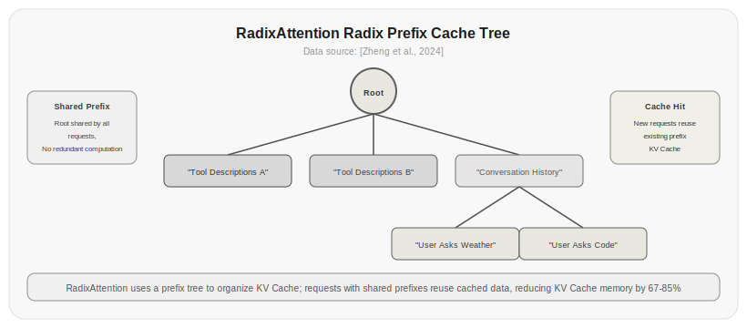
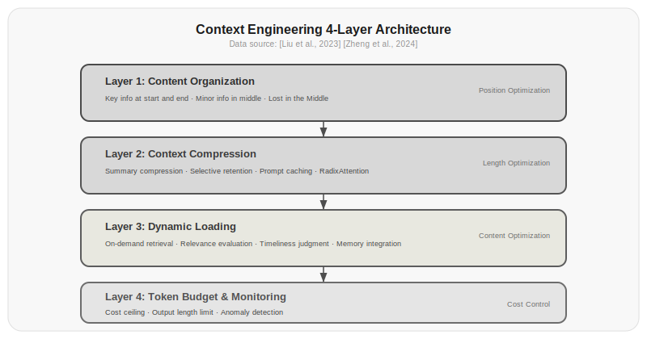

# Chapter 18: Context Engineering

From Chapter 1 through Chapter 17, you've been using a lot of context—system prompts, conversation history, tool descriptions, tool results, reasoning steps, retrieved memories... every turn of the Agent loop stuffs more things into the context window.

But the context window isn't unlimited. Even if a model supports 128K or 1M contexts, you shouldn't mindlessly fill it up. Because the longer the context, the slower inference becomes, the higher the cost, and the weaker the model's attention to information in the middle.

Context engineering is the discipline of managing what goes in, what comes out, what gets compressed, and what gets cached. It's not an upgraded version of prompt engineering—it's a problem in a different dimension altogether.

## 18.1 The Context Window: The Scarcest Resource

The context window is like a CPU's registers—small capacity, but used in every inference step. Every line of content you put in it, the model spends attention to understand. The more you put in, the lower the probability that any given line gets noticed.

[Liu et al., 2023]'s Lost in the Middle research revealed an important finding: LLMs pay more attention to information at the beginning and end of the context, and less to information in the middle. This is called the "U-shaped attention curve."

| Position in Context | Information Extraction Accuracy |
|--------------|-------------|
| Beginning (first 10%) | 76.2% |
| Middle (30%-70%) | 56.8% |
| End (last 10%) | 74.9% |

*Table 18.1: Information extraction accuracy at different positions (based on multi-document QA task). Data source: [Liu et al., 2023]*

What does this mean? If you put important information in the middle of the context, the model may simply ignore it. This isn't an occasional minor issue—it's an inherent property of all Transformer architecture models, where the self-attention mechanism naturally assigns lower weights to middle positions.

This gives context engineering its first principle: **Put important information at the two ends, secondary information in the middle**.

```python title="18.01_build_context" linenums="1"
def build_context(query, tools, memory, history):
    context = []
    
    # Beginning: most important system instructions and current task
    context.append({"role": "system", "content": system_prompt})
    context.append({"role": "user", "content": query})
    
    # Middle: conversation history and retrieved memories
    summarized_history = summarize_if_long(history, max_tokens=1000)
    context.extend(summarized_history)
    
    relevant_memories = memory.search(query, top_k=3)
    for mem in relevant_memories:
        context.append({"role": "system", "content": f"[Memory] {mem}"})
    
    # End: tool descriptions and final instructions
    context.append({"role": "system", "content": format_tools(tools)})
    context.append({"role": "system", "content": "Please answer the user's question based on the above information."})
    
    return context
```

⚠️ This code requires an LLM API key or external service to run. Below is illustrative output:

```
>>> build_context("What is RAG?", ["search", "python"], memory, []) 
[{'role': 'system', 'content': 'You are an intelligent assistant...'},
 {'role': 'user', 'content': 'What is RAG?'},
 {'role': 'system', 'content': '[Memory] RAG stands for Retrieval-Augmented Generation...'},
 {'role': 'system', 'content': 'Tools: search, python'},
 {'role': 'system', 'content': 'Please answer the user\'s question based on the above information.'}]
```

## 18.2 Prompt Caching: Don't Repeat Computation

An Agent in a loop sends a large amount of repeated context every turn—system prompt, tool descriptions, previous conversation history. These get re-encoded and re-computed for attention in every API call, a massive waste.

[Anthropic, 2024]'s Prompt Caching solves this problem: if two consecutive calls share a large common prefix, the model can reuse the previously computed KV Cache and only compute the new portion.

```python
# Without caching: re-encode the entire context every turn
# Turn 1: system(500t) + query1(100t) = 600t all encoded
# Turn 2: system(500t) + query1(100t) + response1(200t) + query2(100t) = 900t all encoded
# Turn 3: system(500t) + ... + query3(100t) = 1200t all encoded

# With caching: only encode the new portion
# Turn 1: system(500t) + query1(100t) = 600t all encoded
# Turn 2: system(500t) cache hit + new(400t) = only encode 400t
# Turn 3: system(500t) + history(300t) cache hit + new(300t) = only encode 300t
```

The effect is significant. In long-context scenarios, prompt caching can reduce encoding computation by 90% and latency by 50-80%.

Using caching is straightforward—just put the unchanging content at the beginning of the context:

```python title="18.02_cache_ordering" linenums="1"
# Correct: unchanging content at the front
messages = [
    {"role": "system", "content": long_system_prompt},     # Cache hit
    {"role": "system", "content": tool_descriptions},      # Cache hit
    *previous_conversation,                                   # Cache hit
    {"role": "user", "content": new_query},                 # New
]

# Wrong: new content inserted in the middle, breaking the cache
messages = [
    {"role": "system", "content": long_system_prompt},
    {"role": "user", "content": new_query},                 # New content in the middle
    *previous_conversation,                                   # Cache invalidated
]
```

⚠️ This code requires an LLM API key or external service to run. Below is illustrative output:

```
# When cache hits: system_prompt + tool_descriptions KV Cache is directly reused
# When cache is invalidated: all content needs to be re-encoded
# Properly ordered caching can achieve 90%+ cache hit rates
```

The prefix-matching property of caching determines: **Put unchanging content at the front, changing content at the back**. This is the second principle of context engineering.

## 18.3 RadixAttention: Prefix Tree Caching

[Zheng et al., 2024]'s RadixAttention takes server-side KV Cache management further. It organizes caches using a prefix tree (trie), enabling different requests with shared prefixes to reuse KV Cache.



*Figure 18.1: RadixAttention prefix cache tree. The root node is shared by all requests, and different requests reuse existing KV Cache along prefix paths. In multi-Agent scenarios, multiple Agents share the same tool descriptions and system prompts, and RadixAttention lets them share the cache for these prefixes, reducing KV Cache memory by 67-85%.*

RadixAttention's benefit is that when different requests have different prefix combinations, it can still find shared intermediate nodes to reuse. This is especially useful in multi-Agent scenarios—multiple Agents share the same tool descriptions and system prompts, but have different conversation histories. RadixAttention lets them share the cache for tool descriptions and system prompts.

> Data source: [Zheng et al., 2024]'s experiments showed that RadixAttention saves 67-85% of KV Cache memory compared to naive prompt caching in multi-conversation scenarios, and reduces first-token latency by 40-60% in concurrent request scenarios.

[Ma et al., 2026]'s Irminsul system further optimizes prefix tree caching strategy. Irminsul's core observation is that in an Agent's loop, the KV Cache across different turns doesn't grow in a simple linear fashion, but has complex sharing patterns. Irminsul adopts MLA-native (Multi-head Latent Attention) position-independent caching strategy, using more efficient tree structures to manage these sharing patterns, achieving higher cache hit rates in long Agent loops.

## 18.4 Compression: Putting the Context on a Diet

Caching solves the "repeated computation" problem but doesn't solve the "too long" problem. When the context exceeds the model's window or budget, you have no choice but to compress it.

There are three main compression strategies.

**Summarization compression**—use an LLM to summarize old content:

```python title="18.03_summarize_compress" linenums="1"
def summarize_compress(messages, max_recent=4):
    """Keep the most recent few turns of conversation, summarize earlier ones"""
    recent = messages[-max_recent:]
    old = messages[:-max_recent]
    
    if not old:
        return messages
    
    old_text = "\n".join(f"{m['role']}: {m['content']}" for m in old)
    summary = call_llm(f"Summarize the key information from the following conversation in 100 words or less:\n{old_text}")
    
    return [
        {"role": "system", "content": f"Summary of earlier conversation: {summary}"},
        *recent
    ]
```

⚠️ This code requires an LLM API key or external service to run. Below is illustrative output:

```
>>> messages = [
...     {"role": "user", "content": "What is Python?"},
...     {"role": "assistant", "content": "Python is a programming language..."},
...     {"role": "user", "content": "What are its advantages?"},
...     {"role": "assistant", "content": "Python's advantages include being concise and easy to learn..."},
...     {"role": "user", "content": "What is it good for?"},
...     {"role": "assistant", "content": "Python is good for web development, data analysis..."},
... ]
>>> summarize_compress(messages, max_recent=4)
[{'role': 'system', 'content': 'Summary of earlier conversation: Discussed Python basics and advantages'},
 {'role': 'user', 'content': 'What are its advantages?'},
 {'role': 'assistant', 'content': "Python's advantages include being concise and easy to learn..."},
 {'role': 'user', 'content': 'What is it good for?'},
 {'role': 'assistant', 'content': 'Python is good for web development, data analysis...'}]
```

Summarization compression preserves semantics but has the downside of consuming tokens and cost for the summarization process itself, and summaries may lose details.

**Selective compression**—keep only important information, discard the rest:

```python title="18.04_selective_compress" linenums="1"
def selective_compress(messages, importance_threshold=0.7):
    """Keep or discard messages based on importance score"""
    compressed = []
    for msg in messages:
        if msg["role"] == "system":
            compressed.append(msg)  # System messages always kept
            continue
        
        importance = score_importance(msg["content"])
        if importance >= importance_threshold:
            compressed.append(msg)
    
    return compressed

def score_importance(text):
    """Evaluate message importance"""
    prompt = f"""Evaluate the importance of the following text on a scale of 0 to 1:
- 1: Contains key decisions or facts
- 0.5: Contains useful but non-critical information
- 0: Chitchat or irrelevant content

Text: {text}"""
    return float(call_llm(prompt))
```

⚠️ This code requires an LLM API key or external service to run. Below is illustrative output:

```
>>> messages = [
...     {"role": "system", "content": "You are an assistant"},
...     {"role": "user", "content": "Nice weather today"},
...     {"role": "assistant", "content": "Yes it is"},
...     {"role": "user", "content": "Please analyze the anomalies in this data report"},
...     {"role": "assistant", "content": "Anomalies appear in column 3..."},
... ]
>>> selective_compress(messages, importance_threshold=0.7)
[{'role': 'system', 'content': 'You are an assistant'},
 {'role': 'user', 'content': 'Please analyze the anomalies in this data report'},
 {'role': 'assistant', 'content': 'Anomalies appear in column 3...'}]
# Chitchat (score 0.2) filtered out, key content (score 0.9) preserved
```

Selective compression preserves original text without introducing summarization error. The downside is that importance scoring itself requires calling an LLM, which is expensive.

**Structured compression**—convert free text into structured formats:

```python title="18.05_structured_compress" linenums="1"
def structured_compress(messages):
    """Compress free text conversations into structured records"""
    records = []
    for msg in messages:
        if msg["role"] == "tool":
            # Tool results compressed to one-line summary
            records.append(f"[Tool {msg['tool_call_id']} result] {msg['content'][:100]}")
        elif msg["role"] == "assistant":
            # Assistant responses compressed to key points
            key_points = extract_key_points(msg["content"])
            records.append(f"[Assistant] {key_points}")
    
    return "\n".join(records)
```

⚠️ This code requires an LLM API key or external service to run (depends on `extract_key_points`). Below is illustrative output:

```
>>> messages = [
...     {"role": "tool", "tool_call_id": "call_1", "content": "Query result: Beijing today's temperature 15-22 degrees, humidity 45%..."},
...     {"role": "assistant", "content": "Based on the query results, Beijing has pleasant temperature today, recommend wearing a light jacket."},
... ]
>>> structured_compress(messages)
"[Tool call_1 result] Query result: Beijing today's temperature 15-22 degrees, humidity 45%...\n[Assistant] Beijing pleasant temperature today, recommend light jacket"
```

Structured compression is the cheapest—it doesn't require extra LLM calls, just simple text processing. But it's only suitable for highly formatted content (tool calls, data records, etc.).

| Compression Method | Compression Ratio | Information Loss | Extra Cost | Best For |
|---------|--------|---------|---------|---------|
| Summarization | 5-10x | Medium | High (LLM call) | Long conversations |
| Selective | 2-3x | Low | Medium (scoring) | Mixed content |
| Structured | 3-5x | Low | Low (heuristic) | Tool calls |

*Table 18.2: Comparison of three compression strategies*

## 18.5 Dynamic Context Loading

Context isn't all loaded at the beginning. A smarter approach: only load the information needed right now, and load more from external storage when needed.

This is the core idea of dynamic context loading: treat the context window like a workbench—only put what you need right now on it, keep what you don't need in drawers (external storage), and pull it out when needed.

```python title="18.06_dynamic_context_manager" linenums="1"
class DynamicContextManager:
    def __init__(self, max_context_tokens=8000):
        self.max_tokens = max_context_tokens
        self.permanent = []    # Always kept: system prompt, core rules
        self.session = []      # Session-kept: current conversation
        self.loaded = []       # Loaded on demand: retrieved memories, tool results
        self.external = VectorMemory()  # External storage
    
    def build_context(self, query):
        context = list(self.permanent)
        token_count = sum(count_tokens(m["content"]) for m in context)
        
        # Add current session
        for msg in self.session[-6:]:
            if token_count + count_tokens(msg["content"]) <= self.max_tokens * 0.7:
                context.append(msg)
                token_count += count_tokens(msg["content"])
        
        # Dynamically load relevant memories
        remaining = self.max_tokens - token_count
        if remaining > 500:
            memories = self.external.search(query, max_tokens=remaining - 200)
            for mem in memories:
                context.append({"role": "system", "content": f"[Memory] {mem}"})
                token_count += count_tokens(mem)
        
        return context
    
    def add_message(self, message):
        self.session.append(message)
        if self.estimate_tokens() > self.max_tokens:
            self.compact()
    
    def compact(self):
        """Compress session history"""
        old = self.session[:-4]
        recent = self.session[-4:]
        summary = summarize(old)
        self.session = [
            {"role": "system", "content": f"Summary of earlier conversation: {summary}"},
            *recent
        ]
```

⚠️ This code requires an LLM API key or external service to run (depends on `VectorMemory`, `count_tokens`, `summarize`). Below is illustrative output:

```
>>> dcm = DynamicContextManager(max_context_tokens=8000)
>>> dcm.permanent = [{"role": "system", "content": "You are a Python programming assistant. Please answer in Chinese."}]
>>> dcm.add_message({"role": "user", "content": "What is context engineering?"})
>>> dcm.add_message({"role": "assistant", "content": "Context engineering is a systematic approach to managing LLM input information flow..."})
>>> dcm.build_context("Python multithreading")
[{'role': 'system', 'content': 'You are a Python programming assistant. Please answer in Chinese.'},
 {'role': 'user', 'content': 'What is context engineering?'},
 {'role': 'assistant', 'content': 'Context engineering is a systematic approach to managing LLM input information flow...'},
 {'role': 'system', 'content': "[Memory] Python's GIL limits multithreading parallelism, recommend multiprocessing..."},
 {'role': 'system', 'content': '[Memory] Context engineering is a systematic approach to managing LLM input information flow...'}]
```

The key decision in dynamic loading is: what information is worth loading? This requires evaluating information relevance, timeliness, and importance. Chapter 15's memory mechanisms provide the framework; here you need to integrate them with context management.

## 18.6 The Four-Layer Model of Context Engineering

Organizing the above, context engineering can be divided into four layers.

| Layer | Name | What Problem It Solves | Core Techniques |
|------|------|------------|---------|
| L1 | Content Selection | What to include, what to exclude | Relevance scoring, Lost in the Middle optimization |
| L2 | Ordering | What goes first, what goes last | Cache optimization, U-shaped attention curve |
| L3 | Compression Management | What to do when it's too long | Summarization, selective deletion, structured compression |
| L4 | Dynamic Loading | How to adjust at runtime | On-demand retrieval, context window management |

*Table 18.3: The four-layer model of context engineering*

**L1 Content Selection**—not all information deserves to go in the context. A tool call's complete output might be a thousand tokens, but the Agent only needs 5 tokens of key information from it. Content selection means asking before putting something in the context: how important is this information? How relevant is it to the current query?

**L2 Ordering**—after deciding what to include, decide where to put it. Important information goes at the beginning and end (U-shaped attention curve), unchanging content goes at the front (cache optimization), tool descriptions go at the end (closest to model output, highest attention).

**L3 Compression Management**—when the context exceeds the budget, compress. Different types of content use different compression strategies: conversation history uses summarization compression, tool results use structured compression, system prompts are never compressed.

**L4 Dynamic Loading**—don't load all information at the beginning, but load dynamically based on need. Memory retrieval, RAG, on-demand tool descriptions—all are manifestations of dynamic loading.

These four layers aren't independent—they influence each other. L1's decisions affect L2's ordering, L2's ordering affects L3's compression effectiveness, and L3's compression determines L4's loading strategy. Good context engineering finds balance across all four layers.

```python title="18.07_context_engineer" linenums="1"
class ContextEngineer:
    def __init__(self, model="gpt-4o"):
        self.model = model
        self.max_tokens = 128000
    
    def build(self, query, tools, memory, history):
        # L1: Content selection
        selected_tools = self.select_tools(query, tools)
        relevant_memories = memory.search(query, top_k=5)
        important_history = self.select_important(history)
        
        # L2: Ordering (important information at the two ends)
        context = []
        context.append(system_prompt)                    # Beginning: system instructions
        context.append(format_tools(selected_tools))      # Beginning: tool descriptions
        context.extend(relevant_memories)                # Middle: retrieved memories
        context.extend(important_history)                 # Middle: conversation history
        context.append({"role": "user", "content": query})  # End: current question
        
        # L3: Compression management
        while self.estimate_tokens(context) > self.max_tokens * 0.8:
            context = self.compress_one_step(context)
        
        # L4: Dynamic loading (mark content that can be dynamically loaded)
        context.append({
            "role": "system", 
            "content": f"There are {memory.size()} more relevant memories available for on-demand loading."
        })
        
        return context
```

⚠️ This code requires an LLM API key or external service to run (depends on `memory.search`, `call_llm`, etc.). Below is illustrative output:

```
>>> ce = ContextEngineer()
>>> ce.build("What is inference-time scaling?", ["search", "calc"], memory, history)
[{'role': 'system', 'content': 'You are an intelligent assistant'},
 {'role': 'system', 'content': 'Tools: search, calc'},
 {'role': 'system', 'content': '[Memory] Inference-time compute is the new scaling direction...'},
 {'role': 'user', 'content': 'What is inference?'},
 {'role': 'assistant', 'content': 'Inference is the process of the model thinking'},
 {'role': 'user', 'content': 'What is inference-time scaling?'},
 {'role': 'system', 'content': 'There are 50 more relevant memories available for on-demand loading.'}]
```



*Figure 18.1: The four-layer model of context engineering. From content selection to dynamic loading, each layer solves the problem of "how to fit the most valuable information into a limited context window."*

## Exercises

1. Verify the Lost in the Middle phenomenon: construct a context containing 20 facts (each fact is one sentence), and have the model answer questions about these facts. Place key facts at the beginning, middle, and end respectively, test each 10 times, and plot an accuracy-vs-position curve.

2. Compare the effects of three compression strategies: using a conversation history with 50 turns, apply summarization compression, selective compression, and structured compression respectively, then have the model answer questions about earlier conversations. Compare the three strategies on:
   - Compression ratio (compressed tokens / original tokens)
   - Information retention rate (proportion of questions answered correctly)
   - Compression cost (tokens consumed by the compression process)

3. Implement dynamic context loading: in an Agent loop, initially only load 5 relevant memories. After each turn of conversation, evaluate whether more memories need to be loaded. Compare dynamic loading vs. one-time full loading on:
   - Average token consumption per turn
   - Final answer quality
   - Total API cost

4. Design a U-shaped attention curve utilization strategy: place system prompts, tool descriptions, and the current question at the two ends of the context, and place conversation history and retrieved memories in the middle. Compare the performance difference between this strategy and random ordering.

5. Implement the ContextEngineer class from Section 18.6. Use it to manage a 20-turn Agent conversation, recording at each turn:
   - Context token count
   - API call latency
   - Model recall accuracy for information at different positions in the context
   Analyze the impact of the four-layer model on Agent performance.

## References

1. Liu, N., et al. (2023). Lost in the Middle: How Language Models Use Long Contexts. *arXiv:2307.03172*. https://arxiv.org/abs/2307.03172

2. Anthropic. (2024). Prompt Caching. https://docs.anthropic.com/en/docs/build-with-claude/prompt-caching

3. Zheng, L., et al. (2024). Efficiently Scaling Transformer Inference with RadixAttention. *arXiv:2312.07140*. https://arxiv.org/abs/2312.07140

4. Ma, B., et al. (2026). Irminsul: MLA-Native Position-Independent Caching for Agentic LLM Serving. *arXiv:2605.05696*. https://arxiv.org/abs/2605.05696

5. Packer, C., et al. (2023). MemGPT: Towards LLMs as Running Systems. *arXiv:2310.08560*. https://arxiv.org/abs/2310.08560

6. Bai, Y., et al. (2024). LongBench: A Bilingual, Multitask Benchmark for Long Context Understanding. *arXiv:2308.14508*. https://arxiv.org/abs/2308.14508