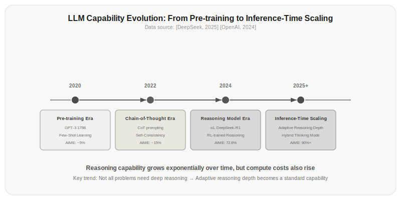

# Chapter 20: Frontiers and Outlook

This is the final chapter. Looking back at the path you've traveled: Chapter 1 wrote prompts, Chapter 2 called APIs, Chapters 3 through 10 dismantled Transformer components one by one, Chapter 11 started building Agents, then came reasoning, MCP, skills, memory, subagents, multi-agent, context engineering, harness engineering—step by step from the most basic prompts to complete LLM systems engineering.

This chapter won't teach you new technical details. The question it answers is: what comes next?

## 20.1 Inference-Time Compute Scaling: A New Paradigm

From late 2024 to early 2025, a fundamental shift occurred in the LLM field: inference-time compute became the new scaling direction.

The traditional paradigm was training-time scaling—bigger models, more data, more training compute. GPT-4, Llama 3, and Gemini were all products of this path. But training-time scaling hit a ceiling: data is running out, training costs keep rising, and marginal returns are diminishing.

Inference-time scaling opened a new path: instead of spending compute during training, spend it during inference. The model "thinks" before giving an answer—generating a reasoning process, perhaps a long one, but it's precisely this reasoning process that enables the model to achieve higher accuracy.

DeepSeek-R1 [DeepSeek, 2025] and OpenAI o1 demonstrated the power of this direction. On mathematical reasoning, GPT-4o's AIME score was 9.3%, while DeepSeek-R1 achieved 72.6%—an order-of-magnitude difference. But the cost was a 10-50x increase in inference token consumption.



*Figure 20.1: LLM capability evolution timeline. From few-shot learning with pretraining in 2020, to chain-of-thought prompting in 2022, to reasoning models (o1, DeepSeek-R1) in 2024, to adaptive inference depth in 2025+. Reasoning capability grows exponentially over time, but the key trend is adaptive inference depth—not every problem requires deep reasoning.*

Several observations about inference-time scaling:

**Not every problem requires slow thinking**. Simple questions ("What's the weather in Beijing today?") can be answered quickly. Only complex reasoning tasks (mathematical proofs, code debugging, multi-step planning) need long reasoning. This means future models will adaptively decide reasoning depth—fast thinking for simple problems, slow thinking for complex ones.

**Inference-time scaling changes the cost structure**. Previously, model costs were mainly in training; inference was cheap. Now inference costs may exceed training costs. A single DeepSeek-R1 request may consume 20-50x the inference tokens of a GPT-4o request. This has profound implications for API pricing, cost optimization, and product strategy.

**Reasoning processes can be distilled**. DeepSeek-R1's reasoning capabilities can be distilled into smaller models. Using R1's reasoning process as training data, small models can also achieve better reasoning than they would from training alone. This means the benefits of inference-time scaling aren't limited to the largest models.

```
Training-time Scaling (traditional path)
  Large model + more data + more training compute → stronger model
  
Inference-time Scaling (new path)
  Model size unchanged + more inference compute → stronger results
  
Convergence of the two paths:
  Large model + inference-time scaling → strongest results, but most expensive
  Small model + distilled reasoning capability → cheap but good-enough results
```

## 20.2 Multimodal Agents

All the Agents you've learned about so far are text-in, text-out. But humans don't communicate solely through words—we look at images, listen to sounds, watch videos. Agents need these capabilities too.

What can multimodal Agents do as of 2025?

**Visual understanding**—GPT-4o, Claude 3.5, and Gemini can all understand image content. Show an Agent a product prototype screenshot, and it can identify UI layouts and point out interaction issues; show a sales data chart, and it can help analyze trends and outliers; show a code error screenshot, and it can help diagnose bugs.

**Visual generation**—DALL-E 3, Midjourney, and Stable Diffusion can generate images from text descriptions. Agents can generate design mockups, illustrations, and data visualizations based on user needs.

**Code execution**—many Agent frameworks now support code execution sandboxes. The Agent writes code, runs it, gets results, and uses the results to continue reasoning.

The real value of multimodal Agents lies in combining these capabilities:

```
User: Help me analyze this company's financial statements and give investment advice

Agent steps:
1. [Visual Understanding] Identify key numbers, trend lines, and outliers in the statements
2. [Reasoning] Analyze revenue growth rate, profit margin, cash flow inflection points
3. [Data Verification] Call API to cross-check with public market data
4. [Reasoning] Synthesize internal statements and external market data to give investment rating
5. [Output] Generate structured investment analysis report
```

This isn't fantasy—2025 Agents can already do this. But reliability isn't there yet—visual understanding occasionally makes mistakes, code execution occasionally fails, and multi-step chains occasionally go off track. Chapter 19's harness engineering becomes crucial here.

### Challenges of Multimodality

Multimodal Agents face several additional engineering challenges compared to text-only Agents:

**Token consumption explosion**—a single image may consume several thousand tokens when encoded, and 10 seconds of video may consume tens of thousands. A multimodal Agent might process text, images, and code output simultaneously in a single request, making token budget pressure much higher than for text-only Agents. Chapter 18's context engineering becomes even more critical here.

**Error compounding**—visual understanding error → reasoning based on incorrect understanding is wrong → code based on incorrect reasoning is wrong. Each step's errors propagate to the next.

**Evaluation difficulty**—text Agent evaluation is relatively easy (just check the answer); multimodal Agent evaluation requires simultaneously assessing visual understanding accuracy, reasoning correctness, code quality, and visual generation aesthetics.

## 20.3 The Evolution of the MCP Ecosystem

Chapter 13 covered the basics of the MCP protocol. Looking at MCP's future from 2025, three trends are already clear:

**From tool protocol to agent protocol**—MCP currently mainly solves "how Agents call tools." But Agents also need to communicate with each other. In the future, MCP may expand into a communication protocol between Agents—not just Agent-to-tool calls, but Agent-to-Agent negotiation, delegation, and synchronization.

**Maturing security models**—the tool description injection, resource poisoning, and other security risks mentioned in Chapter 13 currently lack standardized defense solutions. As MCP gains wider adoption, security audits, permission models, and sandboxed execution will all become standard features. Just as HTTP evolved from unencrypted to the widespread adoption of HTTPS, MCP will undergo similar security evolution.

**Market and discovery**—right now, using MCP requires manually configuring each server's connection. In the future, there will be MCP Server marketplaces—security-audited, version-managed, rated tool marketplaces. Like the npm ecosystem, evolving from manually downloading libraries to npm install.

## 20.4 Security Frontiers

LLM Agent security threats are constantly evolving. Beyond the MCP security from Chapter 13 and the application-layer security from Chapter 19, frontier research reveals deeper attack vectors.

Adversarial attacks are also escalating—prompt injection, tool hijacking, and other attack methods against Agent systems continue to evolve, and defenders need to build multi-layer defense systems.

Defending against these attacks requires system-level thinking:

| Attack Type | Characteristics | Defense Approach |
|---------|------|---------|
| Direct injection | One-time, obvious | Input filtering, system prompt hardening |
| MCP tool description injection | Stealthy, spreads through tool descriptions | Tool description auditing, least privilege |
| GRIEF | Exploits emotional simulation | Remove emotional responses, pure logical reasoning |
| Conleash | Gradual, cumulative | Session-level intent tracking, cumulative risk assessment |

*Table 20.1: LLM security threats and defense approaches*

The future of security isn't higher walls, but deeper understanding—understanding the user's true intent rather than literal meaning; understanding a session's cumulative risk rather than a single request's risk.

## 20.5 From Prompt Engineering to Context Engineering to Harness Engineering

Looking back at the 20 chapters of this book, there's a clear progression:

**Prompt Engineering** (Chapter 1) focuses on input. How to write a good prompt so the model gives the correct output. This is the foundation of working with LLMs—get the input right, and the output has a chance to be right.

**Context Engineering** (Chapter 18) focuses on the environment. Not just one prompt, but the entire context—system prompt, conversation history, tool descriptions, retrieved memories, reasoning steps. Manage the context well, and the model can stay focused on complex tasks.

**Harness Engineering** (Chapter 19) focuses on the system. Not just the model itself, but the entire LLM system—guardrails, monitoring, degradation, cost. Make the system reliable, and the model can run stably in production.

These three layers are both progressive and complementary:

```
Prompt Engineering           → Quality of input
  + Context Engineering      → LLM's working environment
    + Harness Engineering    → System reliability
      = Complete LLM Engineering
```

In 2023, most people were doing prompt engineering. In 2024, context engineering started getting attention. In 2025, harness engineering became a necessity. This evolution isn't "the newcomer replaces the predecessor"—each layer builds on top of the previous one.

Future LLM engineers won't just do prompt engineering—just as modern software engineers can't focus solely on feature implementation. You need to simultaneously care about input quality, context management, and system reliability. All three are indispensable.

## 20.6 Predictions for the Next Two to Three Years

Predicting technology development is dangerous—many people in 2023 predicted AGI would arrive in 2024, which obviously didn't happen. But based on current trends, some directions are clear:

**Inference-time compute will become standard**. Not every request needs DeepSeek-R1-level long reasoning, but adaptive inference depth—fast thinking for simple problems, slow thinking for complex ones—will become a standard model capability. This will change API pricing models and Agent design patterns.

**Agent frameworks will consolidate**. There are currently over a dozen frameworks like AutoGen, CrewAI, LangGraph, and MetaGPT, each with unique features but also fragmentation issues. In the next 1-2 years, there will likely be a React-like consolidation—one or two frameworks becoming de facto standards, with others either specializing or dying off. The direction of standardization may revolve around open protocols like MCP.

**Security will shift from add-on to infrastructure**. Just as HTTPS went from "only e-commerce sites need it" to "all sites need it," LLM security will go from "only sensitive scenarios need it" to "all Agents need it." Not because attacks will increase (though they will), but because regulations will require it, users will expect it, and engineering standards will include it.

**Context engineering will become an independent engineering discipline**. It's not an upgraded version of prompt engineering, but a separate discipline—studying how to most efficiently transmit knowledge through limited information channels. This involves information theory, cognitive science, and systems engineering, not just writing prompts.

**Multimodal Agents will become the mainstream interaction mode**. Not "maybe," but "will"—because humans naturally communicate through multiple modalities, and Agents should too. Visual understanding, voice interaction, and code execution will become as natural as text chat is today.

**Small models + strong systems will challenge large models + weak systems**. A 70B-parameter model paired with a carefully designed Agent system (memory, reasoning, tools, multi-agent collaboration) will outperform a bare larger model in many scenarios. System design matters more than model size—this is one of the most important conclusions of this book.

## 20.7 Advice for You

After reading these 20 chapters, you have a complete knowledge framework from prompts to Agent systems. But there's still a gap between a knowledge framework and practical ability. A few pieces of advice:

**Build a complete Agent system from scratch**. Not using a framework, but starting from the Agent Loop and building step by step. Chapter 11's while loop, Chapter 15's memory, Chapter 18's context management, Chapter 19's monitoring—implement them yourself to understand why each component is designed the way it is.

**Run it in production**. The gap between lab and production is bigger than you think. Deploy your Agent, let real users use it, and trace every conversation turn, every tool call, every error. This is the best teacher for harness engineering.

**Focus on underlying principles, not just framework APIs**. Frameworks change—the hot LangChain component today may be replaced tomorrow. But Transformer's attention mechanism, KV Cache principles, the U-shaped attention curve of context windows—these don't change. Understand the underlying principles, and you can quickly adapt to new frameworks.

**Think about security from day one**. Don't leave security for last—integrate it into your design from the very first day. Input validation, output checking, least privilege, audit logs—these aren't "extra features," they're "infrastructure."

**Read papers, not just headlines**. The LLM field has new models, frameworks, and tools published every day. Most of it is noise. Focus on foundational papers—Transformer, ReAct, MCP specification, inference-time scaling—these are the knowledge that has long-term value.

---

This book ends here. From a single prompt in Chapter 1 to a complete system in Chapter 20, you've traversed the full path of LLM engineering. This path continues—inference-time compute, multimodal Agents, security frontiers, context engineering—each chapter's end is the next chapter's beginning.

Technology will change, but principles won't: the more precise the constraints, the more predictable the output; the better managed the context, the more stable the results; the more harnessed the system, the more reliable the operation. These three sentences are the core of Chapter 1, Chapter 18, and Chapter 19—and the core of this entire book.

Go build.

## Exercises

1. Using knowledge from Chapters 11 through 19, build a complete Agent system from scratch. It should include:
   - Agent Loop (Chapter 11)
   - Reasoning capability (Chapter 12)
   - Skill system (Chapter 14)
   - Memory mechanism (Chapter 15)
   - Context engineering (Chapter 18)
   - Output guardrails (Chapter 19)
   Use this Agent to handle a complex multi-step task (e.g., "research a technical topic and write an analysis report"), and record trace data for each step.

2. Design an adaptive inference depth Agent: simple questions get fast answers from small models, complex questions get slow reasoning from large models. Implement Chapter 12's AdaptiveReasoner class, adding:
   - Complexity evaluator (automatically judges question complexity)
   - Budget controller (daily model call budget)
   - Quality monitor (compares differences between fast-thinking and slow-thinking answers)

3. Read the latest version of the MCP specification and answer the following questions:
   - What new improvements does the MCP protocol have in security?
   - What's the progress on MCP Server discovery mechanism standards?
   - Compared to what you learned in Chapter 13, what has changed?

4. Compare a 70B open-source model (such as Llama 3.1 70B) with a complete Agent system versus a larger closed-source model (such as GPT-4o) bare API call on the following tasks:
   - Mathematical reasoning
   - Code generation
   - Multi-step planning
   Analyze in which areas system design compensated for model capability gaps.

5. Write a short essay (1000 words): What direction do you think is most likely to see breakthrough progress in the LLM Agent field in the next 2-3 years? Why? What evidence is your prediction based on?

## References

1. DeepSeek-AI. (2025). DeepSeek-R1: Incentivizing Reasoning Capability in LLMs via Reinforcement Learning. *arXiv:2501.12948*. https://arxiv.org/abs/2501.12948

2. Yao, S., et al. (2023). ReAct: Synergizing Reasoning and Acting in Language Models. *ICLR 2023*. https://arxiv.org/abs/2210.03629

3. Anthropic. (2024). Model Context Protocol. https://modelcontextprotocol.io/

4. Zhou, Z., et al. (2026). MCPShield: A Security Cognition Layer for Adaptive Trust Calibration in MCP Agents. *arXiv:2602.14281*. https://arxiv.org/abs/2602.14281

5. Liu, N., et al. (2023). Lost in the Middle: How Language Models Use Long Contexts. *arXiv:2307.03172*. https://arxiv.org/abs/2307.03172

6. Packer, C., et al. (2023). MemGPT: Towards LLMs as Operating Systems. *arXiv:2310.08560*. https://arxiv.org/abs/2310.08560

7. Wu, Q., et al. (2023). AutoGen: Enabling Next-Gen LLM Applications via Multi-Agent Conversation. *arXiv:2308.08155*. https://arxiv.org/abs/2308.08155

8. OpenAI. (2024). Learning to Reason with LLMs. https://openai.com/index/learning-to-reason-with-llms/

9. Zheng, L., et al. (2024). Efficiently Scaling Transformer Inference with RadixAttention. *arXiv:2312.07140*. https://arxiv.org/abs/2312.07140

10. Wang, Y., & Chen, X. (2025). MIRIX: Multi-Agent Memory System for LLM-Based Agents. *arXiv:2507.07957*. https://arxiv.org/abs/2507.07957